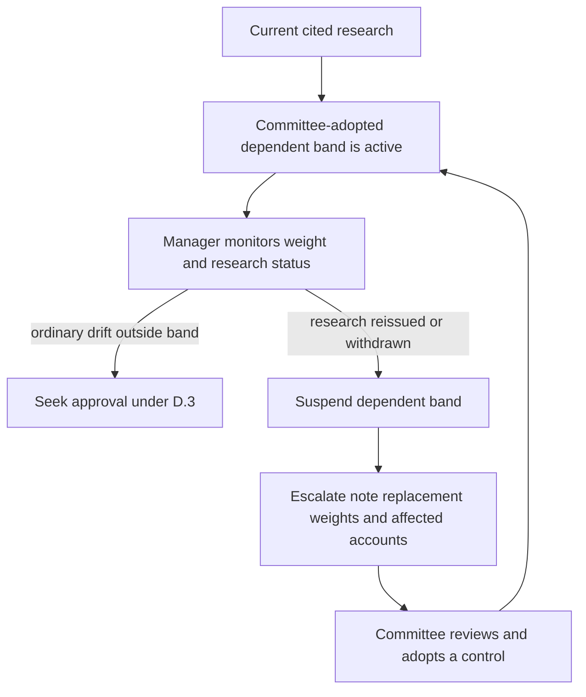

# Internal Guidance: Global Multi-Asset Bands

This guidance is the committee's strategic default for a global balanced mandate. It translates selected research inputs into portfolio controls; it is not research and does not replace client-specific suitability, eligibility, or approval requirements.

## Standing and ownership

The Investment Policy Committee owns the strategic weights and the decision to convert research into a binding weight or band. Portfolio managers operate within the stated bands; an exception to a band requires approval under the [discretion and escalation guidance](/openwiki/guidance/authority/discretion-and-escalation.md). The mandate-specific bands below govern where they are tighter.

Keep the committee decision separate from its research input. In particular, the rates-regime note recommends reviewing bands but does not set them. A manager must not turn a replacement research recommendation into a live band.

## Committee strategic allocation

| Sleeve | Strategic weight | Operating treatment |
| --- | ---: | --- |
| Global equities | 45% | Rebalanced within a ±5 percentage-point tolerance band. |
| Global fixed income | 35% | Rebalanced within a ±5 percentage-point tolerance band. |
| Real assets | 10% | Rebalanced within a ±3 percentage-point tolerance band. |
| Private markets | 10% for eligible clients | Managed through commitment pacing, not an ordinary tradable tolerance band. |

The weights total 100%. For a client who is not eligible for private markets, reallocate the 10% private-markets allocation pro rata across the liquid sleeves: global equities, global fixed income, and real assets. This produces 50%, 38.89%, and 11.11%, respectively, subject to rounding in implementation.

## Bands, underwriting, and ordinary exceptions

The 5-point equity and fixed-income bands and 3-point real-assets band are the committee controls. A weight outside its stated band requires approval; do not treat a suspension-driven condition as an ordinary drift breach.

The committee underwrites duration's diversification credit at the reduced level recommended in section R.3 of the current rates-regime research, rather than at the level suggested by the post-2010 correlation sample. It adopted that underwriting in March 2026, and it is the basis for the current 5-point equity band rather than the prior 7-point band. The committee will assess the strategic weights against the research note's real-short-rate working assumption at its 2026 annual review; the strategic weights have not themselves been changed for that assumption.

### Research-dependent control lifecycle

This flow distinguishes an ordinary out-of-band exception from the suspension path triggered by a research change.

If a cited research note is reissued, superseded, or withdrawn, suspend every band or weight derived from that note rather than silently carrying it forward or calculating a replacement. Escalate the cited note, any replacement, each dependent weight or band, and affected accounts to the committee. Only the committee can re-adopt the control. A research reissue therefore suspends the current 5-point equity band to the extent it depends on the reduced-duration underwriting; it does not reinstate the former 7-point band.

## Private markets: eligibility, pacing, and liquidity

Private markets are not managed through ordinary rebalancing because the allocation cannot be traded back readily. Manage the 10% strategic allocation through commitment pacing. A denominator-effect increase above strategic weight is not a band breach and is not traded; an increase caused by over-commitment is a pacing failure that must be escalated.

Before any private-markets commitment, obtain the eligibility determination required by the [private-markets eligibility guidance](/openwiki/guidance/suitability/private-markets-eligibility.md), then seek the approval required for every private-markets commitment. Eligibility is a regulatory determination, outside portfolio-manager discretion, and cannot be cured by approval. It is necessary but not sufficient: suitability and the liquidity constraint also apply.

The liquidity constraint is binding: underwrite unfunded commitments against the client's spending requirement, and do not allow unfunded commitments to exceed two years of liquid-portfolio spending. This implements the private-markets research framework's recommendation as a limit, rather than as a return-seeking preference.

## Review and operating record

Review this guidance annually and out of cycle whenever either cited research note is reissued or withdrawn. For a suspension escalation, record the superseded research, replacement if available, all dependent weights or bands, and affected accounts. For any cleared escalation, also record the condition, clearing authority, facts relied upon, and date; without a recorded basis it is treated as unapproved in audit.

The current research inputs are [Private Markets](/openwiki/research/multi-asset/private-markets.md), which informs pacing and liquidity treatment, and [Rates Regime](/openwiki/research/multi-asset/rates-regime.md), which informs duration diversification underwriting. Their analytical recommendations remain distinct from the committee's adopted weights and controls.
