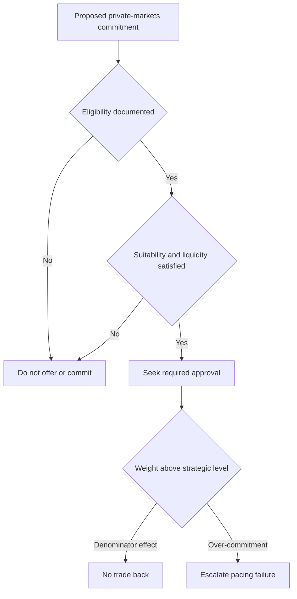

## Scope and ownership

This is the Investment Policy Committee's strategic default for a global balanced mandate, not a research recommendation or client-specific investment advice. The committee owns the weights and bands. Multi-Asset Research supplies inputs; its rates-regime note expressly does **not** set bands, and its private-markets view does not determine client eligibility. [Global bands guide](repo://guidelines/allocation/gl-multi-asset-bands.md#L7-L11) [Rates-regime research](repo://research/MA/GL/RATES-REGIME/2026-02.md#L28-L30) [Private-markets research](repo://research/MA/GL/PRIVATE-MARKETS/2025-12.md#L20-L22)

The strategic schedule is reviewed annually and also when a cited research note is re-issued or withdrawn. A portfolio manager must not convert a replacement research recommendation into a binding weight; that is a committee decision. [Global bands guide](repo://guidelines/allocation/gl-multi-asset-bands.md#L37-L39) [Discretion matrix](repo://guidelines/authority/discretion-matrix.md#L31-L37)

## Strategic allocation and liquid-asset bands

| Sleeve | Strategic weight | Ordinary tolerance band | Management treatment |
|---|---:|---:|---|
| Global equities | 45% | ±5 percentage points | Tradable sleeve subject to the stated band. |
| Global fixed income | 35% | ±5 percentage points | Tradable sleeve subject to the stated band. |
| Real assets | 10% | ±3 percentage points | Tradable sleeve subject to the stated band. |
| Private markets | 10% for eligible clients | No ordinary trading band | Managed through commitment pacing and liquidity controls. |

For a client who is not eligible for private markets, the 10% private-markets weight is reallocated pro rata across the liquid sleeves rather than invested in private markets. [Global bands guide](repo://guidelines/allocation/gl-multi-asset-bands.md#L13-L19)

A weight outside a stated tolerance band requires approval. The mandate-specific bands govern where they are tighter than the cross-mandate discretion matrix. [Global bands guide](repo://guidelines/allocation/gl-multi-asset-bands.md#L7-L10) [Discretion matrix](repo://guidelines/authority/discretion-matrix.md#L7-L11) [Discretion matrix](repo://guidelines/authority/discretion-matrix.md#L17-L29)

## Rates regime: adopted underwriting, pending strategic review

The committee adopted reduced duration-diversification underwriting in March 2026: when setting the equity band, duration's diversification credit is underwritten at the lower level recommended in R.3 of the rates-regime research. This is the stated basis for the current ±5-point equity band, replacing the prior ±7-point band. [Global bands guide](repo://guidelines/allocation/gl-multi-asset-bands.md#L21-L25) [Rates-regime research](repo://research/MA/GL/RATES-REGIME/2026-02.md#L24-L30)

The committee has accepted the research desk's R.1 assumption as a working assumption: real short rates are expected to remain in a 0%–1.5% range through the cycle, rather than follow the persistently negative post-2010 pattern. It will test the strategic weights against that assumption at the 2026 annual review; the weights themselves have not yet changed because of it. The research identifies both a demand-shock return to the prior regime and fiscal dominance as invalidation risks. [Global bands guide](repo://guidelines/allocation/gl-multi-asset-bands.md#L27-L29) [Rates-regime research](repo://research/MA/GL/RATES-REGIME/2026-02.md#L16-L18) [Rates-regime research](repo://research/MA/GL/RATES-REGIME/2026-02.md#L32-L34)

## Private markets: pace commitments, do not trade a denominator effect

Private markets cannot be rebalanced in the ordinary way. Manage the allocation by commitment pacing:

- A rise above the strategic weight caused by a denominator effect is not a breach and is not traded back.
- A rise caused by over-commitment is a pacing failure and must be escalated under the discretion matrix.
- Unfunded commitments are subject to a binding limit: they may not exceed two years of the client's liquid-portfolio spending requirement.

[Global bands guide](repo://guidelines/allocation/gl-multi-asset-bands.md#L31-L35) [Private-markets research](repo://research/MA/GL/PRIVATE-MARKETS/2025-12.md#L36-L42)

This control flow distinguishes the eligibility gate, commitment approval, and the two causes of private-markets drift. [Discretion matrix](repo://guidelines/authority/discretion-matrix.md#L17-L35) [Discretion matrix](repo://guidelines/authority/discretion-matrix.md#L39-L47) [Private-markets eligibility guide](repo://guidelines/suitability/private-markets-eligibility.md#L7-L9) [Global bands guide](repo://guidelines/allocation/gl-multi-asset-bands.md#L31-L35)

The research view supports a 10%–20% strategic allocation only for eligible clients with a genuine ten-year horizon and expresses preferences within that allocation: secondaries and private credit are favored, while primary buyout is underweight. These are research inputs to implementation, not a substitute for the committee's 10% strategic default or its client gates. [Private-markets research](repo://research/MA/GL/PRIVATE-MARKETS/2025-12.md#L16-L18) [Private-markets research](repo://research/MA/GL/PRIVATE-MARKETS/2025-12.md#L24-L34) [Global bands guide](repo://guidelines/allocation/gl-multi-asset-bands.md#L13-L16)

## Eligibility, suitability, and approval gates

Eligibility is a regulatory determination, not portfolio-manager discretion. Before a strategy is offered, determine and document eligibility under the private-markets eligibility guide. A qualified-client determination uses either the assets-under-management or net-worth test in SEC Order IA-7104; the guide deliberately directs staff to that order rather than restating changeable thresholds. Accredited-investor status is separate, so one status does not establish the other. [Private-markets eligibility guide](repo://guidelines/suitability/private-markets-eligibility.md#L7-L15) [Private-markets eligibility guide](repo://guidelines/suitability/private-markets-eligibility.md#L23-L25)

A properly made pre-effective-date qualified-client determination may be carried forward only with the prior-threshold basis recorded; it cannot support a new subscription on or after the order's effective date. Every determination records its pathway, evidence, decision maker, and date. [Private-markets eligibility guide](repo://guidelines/suitability/private-markets-eligibility.md#L17-L21) [Private-markets eligibility guide](repo://guidelines/suitability/private-markets-eligibility.md#L27-L29)

Eligibility is necessary but insufficient: suitability and the spending-based liquidity limit must also be met. Every private-markets commitment requires approval, and no authority tier may approve a commitment for an ineligible client. [Private-markets eligibility guide](repo://guidelines/suitability/private-markets-eligibility.md#L31-L35) [Discretion matrix](repo://guidelines/authority/discretion-matrix.md#L17-L29) [Discretion matrix](repo://guidelines/authority/discretion-matrix.md#L39-L47)

## Exception and research-change handling

If a research note supporting a band is superseded or withdrawn, the bands guide provides that the affected band is suspended and returns to the prior committee-adopted level pending review. The discretion matrix requires the manager to escalate rather than re-derive the weight, carry the prior research-derived weight forward, or directly adopt a replacement recommendation. The escalation must identify the superseded and replacement notes, affected weights and accounts; a cleared escalation also needs the condition, authority, factual basis, and date recorded. [Global bands guide](repo://guidelines/allocation/gl-multi-asset-bands.md#L9-L11) [Discretion matrix](repo://guidelines/authority/discretion-matrix.md#L31-L37) [Discretion matrix](repo://guidelines/authority/discretion-matrix.md#L49-L51)
