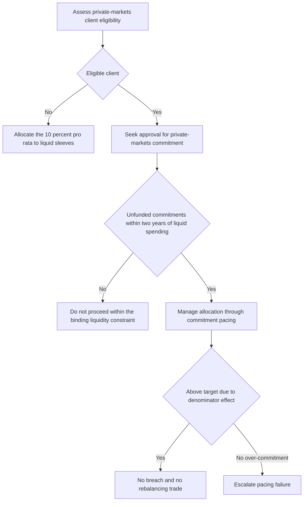

# Internal Guidance: Global Multi-Asset Bands

## Purpose and authority

This is internal allocation guidance for global balanced mandates, not research or client investment advice. The Investment Policy Committee last revised it on 2026-03-04. It establishes the strategic default, tradeable tolerance bands, and the operating boundary between portfolio-manager discretion and committee decisions.

The committee owns binding weights and bands. The Multi-Asset Research notes cited below are inputs: the rates note provides a regime and correlation framework but explicitly does not set bands, while the private-markets note supplies the supporting allocation and liquidity analysis. Portfolio managers must not convert a replacement research view into a binding weight themselves.

## Strategic allocation

| Sleeve | Strategic weight | Applicability and implementation |
|---|---:|---|
| Global equities | 45% | Strategic default for the global balanced mandate. |
| Global fixed income | 35% | Strategic default for the global balanced mandate. |
| Real assets | 10% | Strategic default for the global balanced mandate. |
| Private markets | 10% | Only for eligible clients; for an ineligible client, reallocate this weight pro rata across the liquid sleeves. |

These are the currently committee-adopted strategic weights. The rates-regime note recommends reviewing the bands against its framework, and the committee plans to review the weights at the 2026 annual review; the note has **not** changed the weights above.

## Tradeable bands and exception boundary

| Sleeve | Ordinary tolerance band | Control |
|---|---:|---|
| Global equities | 45% ± 5 percentage points | A weight outside the band requires approval. |
| Global fixed income | 35% ± 5 percentage points | A weight outside the band requires approval. |
| Real assets | 10% ± 3 percentage points | A weight outside the band requires approval. |
| Private markets | No ordinary tradeable band | Manage through commitment pacing rather than rebalancing. |

The mandate-specific bands govern where they are tighter than general authority guidance. Any stated-band exception requires committee approval; senior portfolio managers cannot clear it. The authority matrix also requires approval for every private-markets commitment, following the applicable eligibility determination.

## Reduced-duration underwriting

The committee adopted reduced duration-diversification underwriting in March 2026. It underwrites duration's contribution to the equity-band setting at a lower level than a post-2010 correlation sample would imply. This committee decision reduced the equity tolerance band from the previous seven percentage points to five percentage points.

The supporting research is deliberately narrower than the decision: it observes that stock-bond correlation has been unstable and can remain positive for extended periods, and recommends materially lower underwriting of duration's diversification benefit. It also asks that the bands be reviewed; it does not prescribe or adopt the five-point band.

## Private-markets pacing and liquidity

Private markets are an illiquid commitment program, not a sleeve that can reliably be brought back to target by trading.

- A drift above the strategic weight caused by a denominator effect is not a band breach and is not traded back.
- A drift caused by over-commitment is a pacing failure and must be escalated under the superseded-note escalation process.
- Unfunded commitments are subject to the guide's binding liquidity constraint: they must not exceed two years of the client's liquid-portfolio spending requirement. The research input frames the same measure as underwriting against spending needs rather than expected return.
- Eligibility is a regulatory/client constraint, not an allocation view. A commitment for an ineligible client cannot be approved; this is why the strategic table substitutes a pro-rata liquid-sleeve allocation for such clients.

This flow distinguishes client eligibility, pre-commitment approval, the liquidity limit, and post-commitment pacing treatment.

## Research-note lifecycle and review

A band that rests on a research note is suspended if that note is superseded or withdrawn and returns to its prior committee-adopted level pending review. The guide is reviewed annually and also out of cycle when a cited research note is reissued or withdrawn.

On discovering a superseded or withdrawn cited note, the portfolio manager must escalate rather than re-derive a weight or directly adopt the replacement note. The escalation record identifies the superseded note, any replacement, every derived weight, and affected accounts. The committee, rather than the manager, decides whether and how to turn the replacement research into a binding allocation.

## Operating checklist

1. Start from the strategic weights and use the ordinary bands only for liquid, tradeable sleeves.
2. Obtain committee approval before placing a trade or allocation outside a stated band; do not treat senior discretion as an exception mechanism.
3. For private markets, determine eligibility and obtain commitment approval before pacing commitments; test unfunded commitments against the spending-based liquidity limit.
4. Classify an overweight private-markets outcome correctly: denominator drift is not a tradeable breach, while over-commitment is a pacing escalation.
5. When a cited research note changes status, preserve the escalation record and obtain committee review rather than substituting an analyst view for a committee decision.
