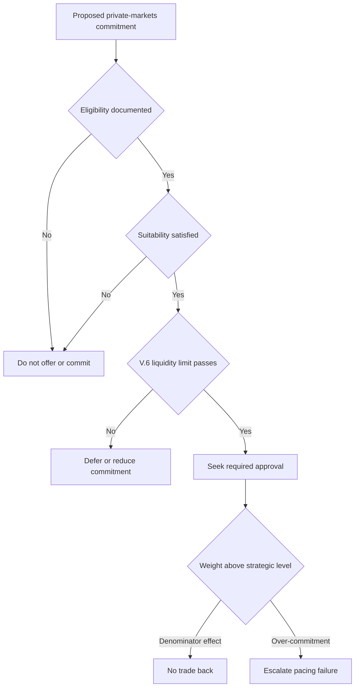

## Scope and ownership

This is binding Investment Policy Committee guidance: the strategic default for a global balanced mandate, not a research recommendation or client-specific investment advice. The committee owns the weights and bands. Multi-Asset Research supplies inputs only: the rates-regime note explicitly does **not** set bands, and the private-markets note does not determine client eligibility. [Global bands guide](repo://internal_guidelines/allocation/gl-multi-asset-bands.md#L7-L11) [Rates-regime research](repo://internal_research/MA/GL/RATES-REGIME/2026-02.md#L28-L30) [Private-markets research](repo://internal_research/MA/GL/PRIVATE-MARKETS/2025-12.md#L20-L22)

Review this guide annually and out of cycle when a research note it cites is re-issued or withdrawn. A portfolio manager cannot convert a replacement research recommendation into a binding weight; that adoption remains a committee act. [Global bands guide](repo://internal_guidelines/allocation/gl-multi-asset-bands.md#L37-L39) [Discretion matrix](repo://internal_guidelines/authority/discretion-matrix.md#L31-L37)

## Strategic allocation and liquid-asset bands

| Sleeve | Strategic weight | Ordinary tolerance band | Management treatment |
|---|---:|---:|---|
| Global equities | 45% | ±5 percentage points | Tradable sleeve subject to the stated band. |
| Global fixed income | 35% | ±5 percentage points | Tradable sleeve subject to the stated band. |
| Real assets | 10% | ±3 percentage points | Tradable sleeve subject to the stated band. |
| Private markets | 10% for eligible clients | No ordinary trading band | Managed through commitment pacing and liquidity controls. |

For a client ineligible for private markets, reallocate the 10% private-markets weight pro rata across the liquid sleeves; do not invest it in private markets. Eligibility constrains this allocation choice. [Global bands guide](repo://internal_guidelines/allocation/gl-multi-asset-bands.md#L13-L19) [Private-markets eligibility guide](repo://internal_guidelines/suitability/private-markets-eligibility.md#L7-L9)

A weight outside its stated tolerance band requires approval, except that a breach arising from a suspended band follows the superseded-note escalation process. Mandate-specific bands govern when tighter than the cross-mandate discretion matrix; authority constrains a manager from exceeding those limits without the required approval. [Global bands guide](repo://internal_guidelines/allocation/gl-multi-asset-bands.md#L7-L11) [Discretion matrix](repo://internal_guidelines/authority/discretion-matrix.md#L7-L11) [Discretion matrix](repo://internal_guidelines/authority/discretion-matrix.md#L17-L29)

## Rates regime: adopted underwriting, pending strategic review

The committee adopted reduced duration-diversification underwriting in March 2026. When setting the equity band, it underwrites duration's diversification credit at the lower level recommended in R.3 of the rates-regime research, rather than at the level implied by the post-2010 correlation sample. This is the stated basis for the current ±5-point equity band, which replaced the prior ±7-point band. [Global bands guide](repo://internal_guidelines/allocation/gl-multi-asset-bands.md#L21-L25) [Rates-regime research](repo://internal_research/MA/GL/RATES-REGIME/2026-02.md#L24-L30)

The committee accepted R.1's real-short-rate regime as a working assumption: 0%–1.5% through the cycle rather than the persistently negative post-2010 pattern. It will test the strategic weights against that assumption at the 2026 annual review; the strategic weights have not yet changed because of it. The research identifies a demand-shock return to the earlier regime and fiscal dominance as invalidation risks. [Global bands guide](repo://internal_guidelines/allocation/gl-multi-asset-bands.md#L27-L29) [Rates-regime research](repo://internal_research/MA/GL/RATES-REGIME/2026-02.md#L16-L18) [Rates-regime research](repo://internal_research/MA/GL/RATES-REGIME/2026-02.md#L32-L34)

## Private markets: binding liquidity limit, then pace commitments

Private markets have no ordinary trading band because the allocation cannot be rebalanced in the ordinary way. The V.6 liquidity condition is a **binding pre-commitment limit** in this guidance, not a research target and not a tolerance band: projected unfunded commitments must not exceed **two years of the client's liquid-portfolio spending requirement**. Underwrite the limit against spending, rather than the allocation's expected return. A proposed commitment that would exceed it does not pass the liquidity gate and must not be made; defer or reduce the commitment through pacing instead of treating the excess as ordinary drift. [Global bands guide B.6](repo://internal_guidelines/allocation/gl-multi-asset-bands.md#L31-L35) [Private-markets research V.6](repo://internal_research/MA/GL/PRIVATE-MARKETS/2025-12.md#L36-L38) [Private-markets eligibility guide P.6](repo://internal_guidelines/suitability/private-markets-eligibility.md#L31-L35)

Keep the three distinct controls separate:

- **Ineligibility reallocation:** for a client who is not eligible, reallocate the strategic 10% sleeve pro rata across the liquid sleeves; do not offer or commit to private markets.
- **Commitment pacing and liquidity:** for an eligible client, test suitability and the binding V.6 limit before each commitment. A commitment-created excess is an over-commitment pacing failure and must be escalated.
- **Ordinary tradable-band drift:** only the liquid sleeves use the stated tolerance bands. A deviation outside a liquid sleeve's band requires approval.

After a commitment, a rise above the private-markets strategic weight caused by a denominator effect is neither a breach nor a trade instruction. It does not convert into over-commitment merely because the reported weight is higher. [Global bands guide B.2–B.3, B.6](repo://internal_guidelines/allocation/gl-multi-asset-bands.md#L13-L19) [Global bands guide B.6](repo://internal_guidelines/allocation/gl-multi-asset-bands.md#L31-L35) [Private-markets research V.7](repo://internal_research/MA/GL/PRIVATE-MARKETS/2025-12.md#L40-L42) [Discretion matrix D.3](repo://internal_guidelines/authority/discretion-matrix.md#L17-L29)

This flow shows the ordered pre-commitment gates, including the binding liquidity limit, and the separate post-commitment responses to denominator-driven drift and over-commitment. [Private-markets eligibility guide P.1, P.6](repo://internal_guidelines/suitability/private-markets-eligibility.md#L7-L9) [Private-markets eligibility guide P.6](repo://internal_guidelines/suitability/private-markets-eligibility.md#L31-L35) [Discretion matrix D.3](repo://internal_guidelines/authority/discretion-matrix.md#L17-L29) [Global bands guide B.6](repo://internal_guidelines/allocation/gl-multi-asset-bands.md#L31-L35)

The private-markets research supports a 10%–20% strategic allocation only for eligible clients with a genuine ten-year horizon. Within that allocation it favors secondaries and private credit and underweights primary buyout. These are research inputs to implementation, not substitutes for the committee's binding 10% default or its client gates. [Private-markets research](repo://internal_research/MA/GL/PRIVATE-MARKETS/2025-12.md#L16-L18) [Private-markets research](repo://internal_research/MA/GL/PRIVATE-MARKETS/2025-12.md#L24-L34) [Global bands guide](repo://internal_guidelines/allocation/gl-multi-asset-bands.md#L13-L16)

## Eligibility, suitability, and approval gates

Eligibility is a documented regulatory determination, not portfolio-manager discretion. Before a private-markets strategy is offered, determine and document eligibility under the eligibility guide. A qualified-client determination follows either the assets-under-management or net-worth pathway in SEC Order IA-7104; accredited-investor status is determined separately. Eligibility constrains whether the strategy may be offered, rather than whether it is suitable. [Private-markets eligibility guide](repo://internal_guidelines/suitability/private-markets-eligibility.md#L7-L15) [Private-markets eligibility guide](repo://internal_guidelines/suitability/private-markets-eligibility.md#L23-L25)

A correctly made pre-effective-date qualified-client determination may be carried forward only if the prior-threshold basis is recorded. It cannot support a new subscription entered into on or after the order's effective date. Record the pathway, evidence, decision maker, and date for every determination; an undocumented determination is treated as absent in audit. [Private-markets eligibility guide](repo://internal_guidelines/suitability/private-markets-eligibility.md#L17-L21) [Private-markets eligibility guide](repo://internal_guidelines/suitability/private-markets-eligibility.md#L27-L29)

Eligibility is necessary but insufficient: suitability and the spending-based liquidity limit must also be met. Every private-markets commitment requires approval, and no authority tier may approve one for an ineligible client. Authority constrains approvals; approval does not create a regulatory exception. [Private-markets eligibility guide](repo://internal_guidelines/suitability/private-markets-eligibility.md#L31-L35) [Discretion matrix](repo://internal_guidelines/authority/discretion-matrix.md#L17-L29) [Discretion matrix](repo://internal_guidelines/authority/discretion-matrix.md#L39-L47)

## Exception and research-change handling

If a research note supporting a band is superseded or withdrawn, suspend the affected band and return it to the prior committee-adopted level pending review. Escalate rather than re-derive the weight, carry forward a research-derived weight, or directly adopt a replacement recommendation. The escalation records the superseded note, replacement if any, every derived weight, and all affected accounts. Once cleared, record the condition, authority level, specific factual basis, and date; without a recorded basis it is treated as an unapproved position in audit. [Global bands guide](repo://internal_guidelines/allocation/gl-multi-asset-bands.md#L7-L11) [Discretion matrix](repo://internal_guidelines/authority/discretion-matrix.md#L31-L37) [Discretion matrix](repo://internal_guidelines/authority/discretion-matrix.md#L49-L51)
