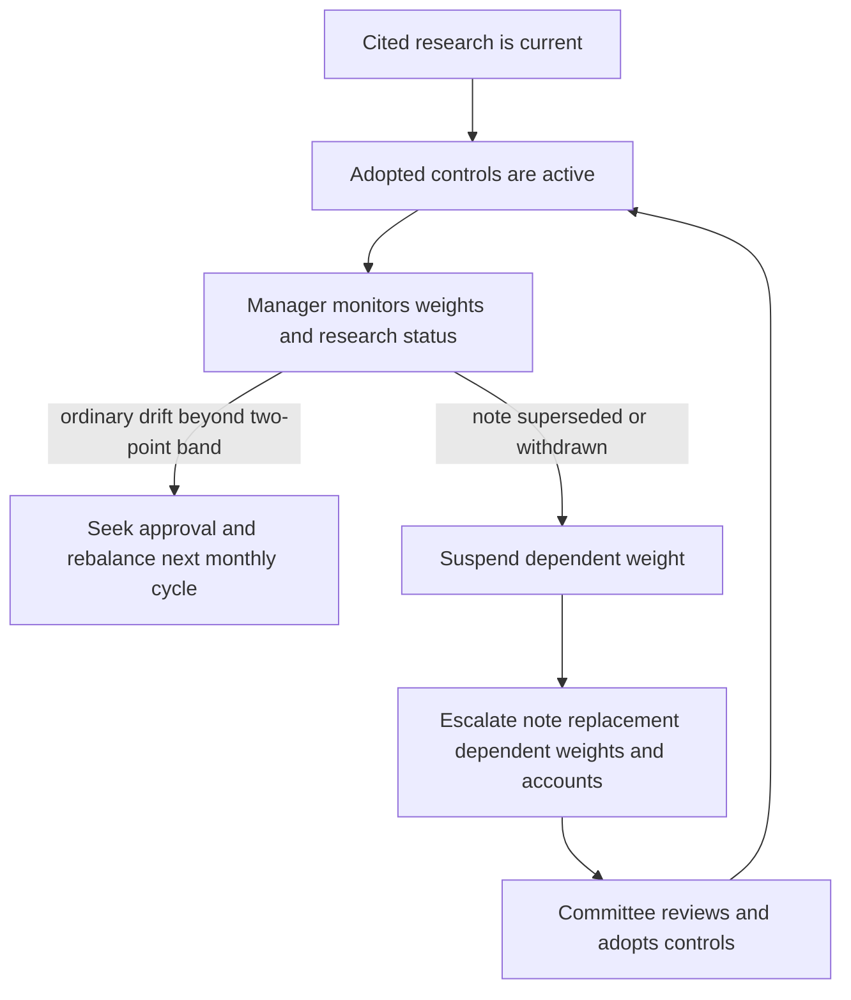

# Internal Guidance: US Taxable Fixed Income

> **Binding internal guidance — not research and not client investment advice.** This page records the Investment Policy Committee's adopted controls for United States taxable client accounts. It translates, but does not replace, the underlying research. Client mandate, suitability, tax, eligibility, regulatory, and approval requirements continue to apply.

## Scope, ownership, and sources

This guidance governs the US taxable fixed-income sleeve: US Treasuries, agency mortgage-backed securities, investment-grade corporate credit, and municipal credit. Non-US developed sovereign and emerging-market debt belong to the multi-asset sleeve and are outside this guidance. The Committee owns the adopted weights and any decision to turn a research recommendation into a binding control; portfolio managers implement the controls only within their stated authority.

The adopted municipal and corporate positions compose the allocation guide with the municipal-credit and investment-grade-spreads research notes. The municipal note supports the top-bracket, after-tax rationale and private-activity implementation; the corporate note supports an approximately four-percentage-point corporate underweight funded into another sleeve position. Research is an input, not authority for a manager to set a replacement weight. [Sources](#sources): Allocation Guide A.1–A.8; Municipal Credit M.1–M.8; IG Spreads G.1–G.6.

## Binding sleeve weights

| Component | Client scope | Target | Neutral | Binding implementation |
| --- | --- | ---: | ---: | --- |
| Municipal credit | Top federal marginal-bracket clients | 22% | 18% | A 4-percentage-point overweight, concentrated in the private-activity segment. |
| Municipal credit | Clients below the top federal bracket | 18% | 18% | No private-activity concentration. |
| Investment-grade corporate credit | Taxable fixed-income sleeve | 28% | 32% | A 4-percentage-point underweight that funds the top-bracket municipal overweight. |

The municipal overweight is an **after-tax** position rather than a standalone credit view. The supporting note states that its private-activity advantage appears only after tax and only for top federal-bracket holders; its credit fundamentals alone support no more than a neutral-to-modest overweight. The corporate underweight reflects valuation rather than credit deterioration and is carry-negative if spreads remain range-bound. [Sources](#sources): Allocation Guide A.3, A.5; Municipal Credit M.1–M.3, M.7; IG Spreads G.1–G.6.

The two four-point active positions are a paired funding control. If the municipal overweight is suspended, suspend the corporate underweight with it and return both positions to neutral; do not leave the sleeve structurally underweight credit without the stated municipal use of proceeds. [Sources](#sources): Allocation Guide A.5; Municipal Credit M.1; IG Spreads G.5.

## Municipal implementation limits

Within the municipal allocation, the research preferences are binding limits:

- Hold no more than **35% of the municipal allocation in any one** preferred sector: qualifying non-profit hospital systems, qualifying private higher education, or qualifying airport special-facility paper.
- Do not hold standalone senior living, single-asset student housing, or single-obligor industrial-development paper without approval. This restriction applies regardless of rating.
- Express the municipal overweight in the **8–15 year** portion of the curve. An extension beyond 15 years requires approval and cannot be approved on a portfolio-wide basis.
- A tax-loss-harvest replacement must comply with the sector limit when it settles. Testing only the sold position is insufficient; a replacement that puts a preferred sector above 35% is a limit breach on settlement.

[Sources](#sources): Allocation Guide A.4, A.7; Municipal Credit M.5–M.6.

## Tolerance, rebalancing, and exceptions

Every target in this guidance has a **±2 percentage-point** tolerance band, measured on market value at month end. Ordinary market-value drift beyond that band is rebalanced in the next monthly cycle. A weight outside its band requires approval under the discretion matrix, subject to the applicable authority tier. [Sources](#sources): Allocation Guide A.1, A.6; Discretion Matrix D.1, D.3.

A suspension-driven condition is deliberately different from ordinary drift: it is **not** automatically rebalanced. The correct successor weight is a Committee decision, rather than a mechanical rebalance calculation. [Sources](#sources): Allocation Guide A.6; Discretion Matrix D.3–D.4.

## Research-change suspension and escalation

This control flow separates ordinary tolerance treatment from the research-change suspension path.

When a cited note is superseded or withdrawn, suspend every weight derived from it rather than carrying it forward, deriving a new weight, or automatically rebalancing it. Escalate to the Committee with the superseded note, replacement if available, all dependent weights, and affected accounts. A portfolio manager may not directly adopt the replacement note's recommendation; only the Committee may re-adopt a binding control. [Sources](#sources): Allocation Guide A.1, A.6, A.8; Discretion Matrix D.4.

Review this guidance quarterly and out of cycle whenever either research input is reissued or withdrawn. A cleared escalation must record the condition, clearing authority, specific facts, and date; absent a recorded basis, it is treated as unapproved in audit. [Sources](#sources): Allocation Guide A.8; Discretion Matrix D.6.

## Sources

- **Allocation Guide** — `guidelines/allocation/us-taxable-fixed-income.md`, sections A.1–A.8: binding scope, weights, limits, tolerance treatment, harvesting, and review.
- **Discretion Matrix** — `guidelines/authority/discretion-matrix.md`, sections D.1–D.6: authority tiers, approvals, superseded-note escalation, and documentation.
- **Municipal Credit** — `research/FI/US/MUNI-CREDIT/2025-11.md`, sections M.1–M.8: municipal rationale, funding source, tax dependency, sector preferences, duration, risks, and review trigger.
- **IG Spreads** — `research/FI/US/IG-SPREADS/2025-09.md`, sections G.1–G.6: corporate underweight rationale, approximate size, funding use, and risks.
