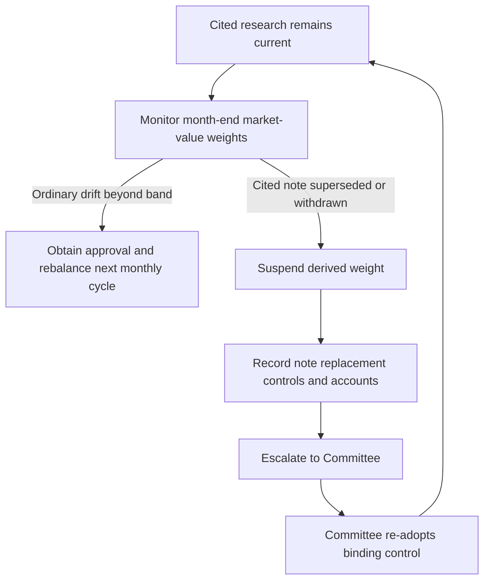

# US Taxable Account Fixed Income Allocation Guidance

> **Binding internal guidance — not research and not client investment advice.** This guide translates published research into default portfolio weights for United States taxable client accounts; it may not assert a view unsupported by the research corpus. [Allocation Guide A.1–A.2](repo://guidelines/allocation/us-taxable-fixed-income.md#L1-L15)

## Scope and control boundary

The taxable fixed-income sleeve comprises US Treasuries, agency mortgage-backed securities, investment-grade corporate credit, and municipal credit. Non-US developed sovereign and emerging-market debt belong to the multi-asset sleeve and are governed by the global bands guide, not this guide. [Allocation Guide A.2](repo://guidelines/allocation/us-taxable-fixed-income.md#L13-L15)

The Investment Policy Committee owns the binding allocation decision. A portfolio manager may apply the stated default weight without escalation, but a research recommendation does not authorize the manager to select a replacement binding weight. [Allocation Guide A.1](repo://guidelines/allocation/us-taxable-fixed-income.md#L7-L11) [Discretion Matrix D.4](repo://guidelines/authority/discretion-matrix.md#L31-L37)

## Binding targets and paired funding

| Component | Account scope | Target | Neutral | Binding treatment |
| --- | --- | ---: | ---: | --- |
| Municipal credit | Top federal marginal-bracket clients | 22% | 18% | Four-point overweight concentrated in private activity bonds. |
| Municipal credit | Clients below the top federal bracket | 18% | 18% | No private-activity concentration. |
| Investment-grade corporate credit | Taxable fixed-income sleeve | 28% | 32% | Four-point underweight that funds the municipal overweight. |

The municipal targets and corporate target are binding guide controls. The top-bracket municipal overweight, its private-activity concentration, and the below-top-bracket neutral treatment are specified by the guide; the corporate underweight funds that active municipal position. [Allocation Guide A.3 and A.5](repo://guidelines/allocation/us-taxable-fixed-income.md#L17-L23) [Allocation Guide A.5](repo://guidelines/allocation/us-taxable-fixed-income.md#L33-L37)

This guidance **constrains** implementation of Municipal Credit 2025-06 M.1–M.2 and IG Spreads 2025-09 G.5: the research calls for a two-to-four-point municipal increase funded from investment-grade corporates and an approximately four-point corporate underweight with proceeds deployed elsewhere in the sleeve, while the guide fixes the adopted four-point expression and client eligibility. [Municipal Credit M.1–M.2](repo://research/FI/US/MUNI-CREDIT/2025-06.md#L16-L30) [IG Spreads G.5](repo://research/FI/US/IG-SPREADS/2025-09.md#L32-L34) [Allocation Guide A.3 and A.5](repo://guidelines/allocation/us-taxable-fixed-income.md#L17-L23) [Allocation Guide A.5](repo://guidelines/allocation/us-taxable-fixed-income.md#L33-L37)

The municipal active weight is an after-tax, top-bracket position rather than a credit-only call: private-activity paper has the stated advantage only after tax and for top-bracket holders, while the fundamental case alone supports neutral to modest overweight. The corporate view is valuation-driven rather than a forecast of credit deterioration, and can be carry-negative if spreads stay range-bound. [Municipal Credit M.2–M.3](repo://research/FI/US/MUNI-CREDIT/2025-06.md#L22-L36) [IG Spreads G.3 and G.6](repo://research/FI/US/IG-SPREADS/2025-09.md#L24-L26) [IG Spreads G.6](repo://research/FI/US/IG-SPREADS/2025-09.md#L36-L38)

The active positions are paired: if the municipal overweight is suspended, suspend the corporate underweight and return both to neutral. Retaining the corporate underweight would leave the sleeve structurally short credit without its stated municipal funding use. [Allocation Guide A.5](repo://guidelines/allocation/us-taxable-fixed-income.md#L33-L37)

## Municipal implementation limits

The guide **constrains** the implementation of Municipal Credit 2025-06 M.5–M.6 as follows:

- No more than **35% of the municipal allocation** may be held in any one preferred sector. The research names qualifying nonprofit hospital systems, qualifying private higher education, and qualifying airport special-facility paper as the preferred sectors. [Allocation Guide A.4](repo://guidelines/allocation/us-taxable-fixed-income.md#L25-L31) [Municipal Credit M.5](repo://research/FI/US/MUNI-CREDIT/2025-06.md#L44-L50)
- A position in standalone senior living, single-asset student housing, or single-obligor industrial-development paper requires approval regardless of rating. [Allocation Guide A.4](repo://guidelines/allocation/us-taxable-fixed-income.md#L25-L31) [Municipal Credit M.5](repo://research/FI/US/MUNI-CREDIT/2025-06.md#L44-L50) [Discretion Matrix D.3](repo://guidelines/authority/discretion-matrix.md#L17-L27)
- Express municipal duration in the **8–15-year** band. An extension beyond 15 years requires approval and cannot be granted portfolio-wide. [Allocation Guide A.4](repo://guidelines/allocation/us-taxable-fixed-income.md#L25-L31) [Municipal Credit M.6](repo://research/FI/US/MUNI-CREDIT/2025-06.md#L52-L54) [Discretion Matrix D.3](repo://guidelines/authority/discretion-matrix.md#L17-L27)
- A municipal tax-loss-harvest replacement must satisfy the sector limit on settlement; a replacement that takes a preferred sector above the limit is a breach on that date. [Allocation Guide A.7](repo://guidelines/allocation/us-taxable-fixed-income.md#L45-L47)

## Bands, monitoring, and escalation

Each target has a **±2-percentage-point** market-value tolerance measured at month end. Ordinary drift beyond the band is rebalanced in the next monthly cycle; any weight outside its stated tolerance band requires approval, except for a suspension-driven condition. [Allocation Guide A.6](repo://guidelines/allocation/us-taxable-fixed-income.md#L39-L43) [Discretion Matrix D.3](repo://guidelines/authority/discretion-matrix.md#L17-L23)

This flow distinguishes ordinary band drift from the research-change control state.

When a cited note is superseded or withdrawn, suspend every weight derived from it rather than carrying it forward, re-deriving it, automatically rebalancing it, or directly adopting a replacement recommendation. Escalate the superseded note, replacement if available, dependent weights, and affected accounts to the Committee; only the Committee may re-adopt the binding control. [Allocation Guide A.1](repo://guidelines/allocation/us-taxable-fixed-income.md#L7-L11) [Discretion Matrix D.4](repo://guidelines/authority/discretion-matrix.md#L31-L37)

Review this guide quarterly and out of cycle when either cited research note is reissued or withdrawn. For every cleared escalation, record the condition, clearing authority, specific facts relied on, and date; without that record, audit treats the position as unapproved. [Allocation Guide A.8](repo://guidelines/allocation/us-taxable-fixed-income.md#L49-L51) [Discretion Matrix D.6](repo://guidelines/authority/discretion-matrix.md#L49-L51)

## Source basis

- [Allocation Guide](repo://guidelines/allocation/us-taxable-fixed-income.md) — binding scope, weights, limits, bands, rebalancing, suspension, and review.
- [Discretion Matrix](repo://guidelines/authority/discretion-matrix.md) — approval boundary, superseded-note escalation, and audit documentation.
- [Municipal Credit 2025-06](repo://research/FI/US/MUNI-CREDIT/2025-06.md) — after-tax municipal rationale, sector preferences, and duration expression.
- [IG Spreads 2025-09](repo://research/FI/US/IG-SPREADS/2025-09.md) — corporate-underweight rationale and funding role.
