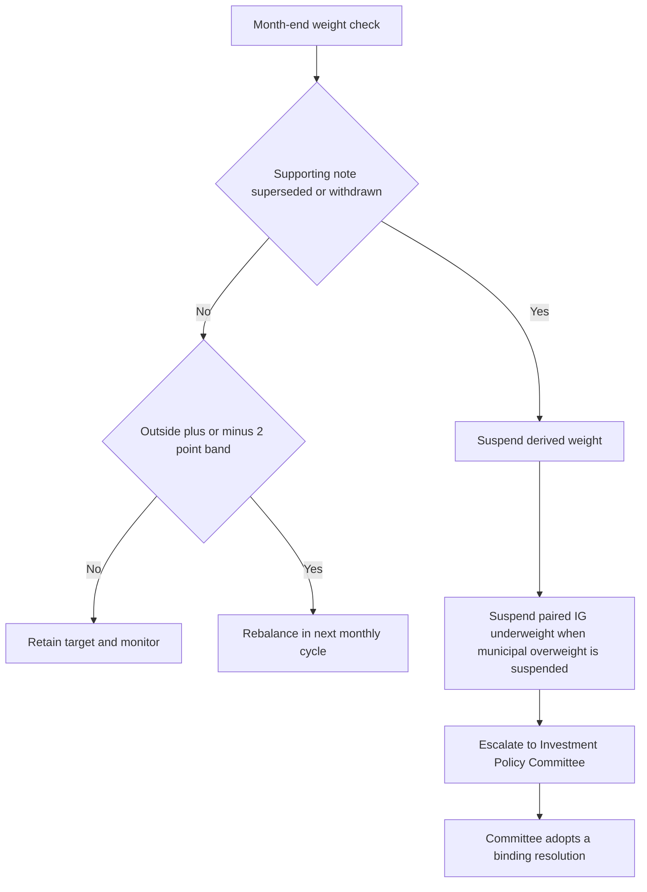

# Internal Guidance: US Taxable Fixed Income Allocation

## Scope and authority

This is **allocation guidance**, not research and not client-specific investment advice. It governs the US taxable fixed-income sleeve: US Treasuries, agency mortgage-backed securities, investment-grade (IG) corporate credit, and municipal credit. Non-US developed sovereign and emerging-market debt belong to the multi-asset sleeve and are outside this guide.

The targets and limits below are binding defaults for portfolio managers. A mandate-specific restriction may be tighter, but this guide does not expand authority granted by the firm-wide discretion matrix. The research notes explain the underlying views; only the Investment Policy Committee turns those views into binding weights or limits.

## Binding sleeve targets

| Allocation | Client condition | Target | Neutral | Policy treatment |
|---|---:|---:|---:|---|
| Municipal credit | Top federal marginal-bracket client | 22% | 18% | 4 percentage-point overweight, concentrated in private activity bonds |
| Municipal credit | Client below the top federal bracket | 18% | 18% | No private-activity concentration |
| IG corporate credit | All accounts in scope | 28% | 32% | 4 percentage-point underweight |

The municipal overweight is specifically an after-tax allocation decision. The municipal research supports an overweight of two to four percentage points funded from IG credit, and says that the after-tax pickup in private activity paper is for top-bracket holders; the allocation guide adopts the four-point expression only for that client category. The research characterizes fundamentals alone as supporting neutral to modest overweight, while the additional allocation depends on the tax premise.

The IG underweight is paired with the municipal overweight: it funds that position. Do not treat it as an independent structural short-credit call. If the municipal overweight is suspended, the paired corporate underweight is suspended as well and both allocations return to neutral (18% municipal and 32% IG corporate). This prevents retaining an unexplained corporate underweight after its funding use has ceased.

The guide establishes no replacement municipal overweight if the supporting municipal premise or note is no longer usable. In particular, a manager must not calculate a different municipal weight from the research range, continue the old weight, or apply a replacement research recommendation directly. The unresolved weight is a Committee decision through the escalation process.

## Municipal implementation limits

The following are binding limits on implementation of the municipal allocation, rather than research preferences:

- **Sector concentration:** No more than 35% of the municipal allocation may be in any one preferred private-activity sector.
- **Preferred sectors:** The underlying research names nonprofit hospital systems meeting its pricing-power and operating-margin conditions, private higher education with endowment coverage above four times annual operating expense, and airport special-facility paper at large hub airports with signatory-carrier agreements beyond 2035.
- **Restricted sectors:** Standalone senior living, single-asset student housing, and industrial-development paper secured by a single corporate obligor require approval before a position may be taken, regardless of rating.
- **Duration:** Express municipal exposure in the 8–15 year band. An extension past 15 years requires approval and cannot be approved portfolio-wide.
- **Tax-loss harvesting:** Test the replacement position, not only the security sold, against the sector limit. A replacement that exceeds the 35% cap is a limit breach on settlement.

The source research also identifies a potential change to AMT phase-out treatment as the principal risk to its after-tax case and calls for immediate review and re-issue if federal tax treatment changes. That risk explains the review sensitivity; it does not authorize a manager to alter the binding municipal weight.

## Tolerance, rebalance, and suspension control flow

Each target has a ±2 percentage-point tolerance, measured on market value at month-end. Ordinary market drift outside a band is rebalanced in the next monthly cycle. Any position outside a stated band otherwise requires approval under the discretion matrix.

*Decision flow for ordinary tolerance drift and for a change in a note that supports a binding allocation.*

A suspension-triggered band breach is not ordinary drift and must not be mechanically rebalanced. The manager escalates the issue to the Committee, identifying the superseded or withdrawn note, a replacement if available, every derived weight, and affected accounts. A portfolio manager may neither retain the prior weight pending review nor promote a replacement desk view into a binding allocation.

## Approval, documentation, and review

Under the discretion matrix, a senior portfolio manager may clear one escalation condition for an account; matters beyond senior discretion, more than one condition, or an exception to a stated band require Committee approval. The matrix separately requires approval for a binding underweight-sector position and for an extension beyond the municipal duration band. Cleared escalations must record the condition, clearing authority, facts relied on, and date; without that recorded basis, audit treats the position as unapproved.

Review this guide quarterly and out of cycle whenever either supporting research note is re-issued or withdrawn. The standing sources identified by the guide are `FI-US-MUNI-CREDIT 2025-06` and `FI-US-IG-SPREADS 2025-09`. The municipal note labels itself current and says it has not been re-issued since publication; it also has a 12-month review cycle plus an immediate federal-tax-treatment trigger. Research currency must be checked at the point of action rather than inferred from this page.

## Source basis

- `internal_guidelines/allocation/us-taxable-fixed-income.md` §§A.1–A.8 — binding targets, limits, tolerance, suspension, harvesting, and review requirements.
- `internal_guidelines/authority/discretion-matrix.md` §§D.1, D.3–D.6 — approval tiers, superseded-note escalation, and documentation.
- `internal_research/FI/US/MUNI-CREDIT/2025-06.md` §§M.1–M.8 — municipal after-tax rationale, sectors, duration, risks, and review trigger.
- `internal_research/FI/US/IG-SPREADS/2025-09.md` §§G.1–G.6 — valuation-driven IG underweight and approximate four-point funding role.
