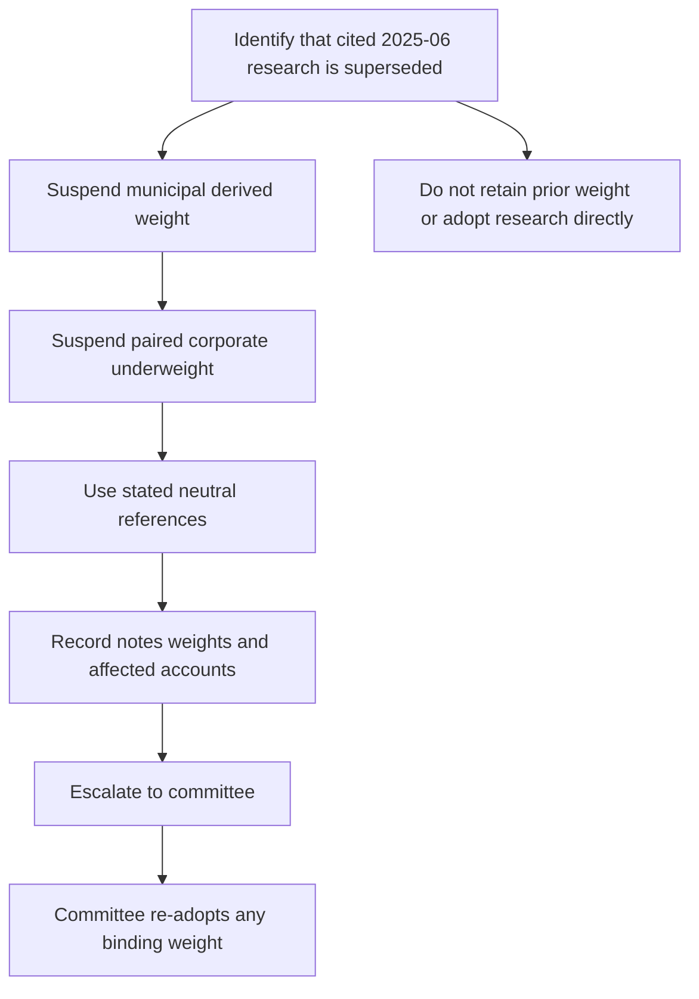

## Scope and authority

The US Taxable Account Fixed Income Allocation Guide is binding internal guidance for portfolio-manager holdings in US taxable client accounts, rather than research or client-specific advice. It covers US Treasuries, agency mortgage-backed securities, investment-grade corporate credit, and municipal credit; non-US developed sovereign and emerging-market debt belong to the multi-asset sleeve. A mandate-specific tighter band prevails over the discretion matrix and the matrix cannot broaden this guide's limits. [Allocation guide A.1–A.2](repo://guidelines/allocation/us-taxable-fixed-income.md#L7-L15) [Discretion matrix D.1](repo://guidelines/authority/discretion-matrix.md#L7-L11)

The guide requires quarterly review and an out-of-cycle review when a cited research note is re-issued or withdrawn. Its A.8 text still names FI-US-MUNI-CREDIT 2025-06 and FI-US-IG-SPREADS 2025-09 as its research basis. [Allocation guide A.8](repo://guidelines/allocation/us-taxable-fixed-income.md#L49-L51)

## Municipal basis: superseded and suspended

FI-US-MUNI-CREDIT 2026-04 **supersedes** FI-US-MUNI-CREDIT 2025-06 in its entirety for positions taken on or after 2026-05-01; the former edition remains the basis of record for positions taken while it stood. The 2026-04 note moves the desk view from overweight to neutral, withdraws the private-activity concentration, and retains only a narrower qualified-501(c)(3) preference. [Municipal research 2026-04 M.1](repo://research/FI/US/MUNI-CREDIT/2026-04.md#L20-L27) [Municipal research 2025-06 notice](repo://research/FI/US/MUNI-CREDIT/2025-06.md#L3-L5)

The former note's municipal overweight was an after-tax position for top-bracket holders, not a credit-only position. It identified the AMT phase-out threshold as its load-bearing assumption and said that a reduction drawing materially more such holders into AMT would invalidate the recommendation; its credit fundamentals alone supported only neutral to modest overweight. [Municipal research 2025-06 M.2–M.3](repo://research/FI/US/MUNI-CREDIT/2025-06.md#L26-L40)

Revenue Procedure 2025-41 applies to taxable years beginning on or after 2026-01-01. It sets AMT exemption phase-out thresholds of $500,000 for an unmarried individual and $1,000,000 for joint filers, and says those thresholds are not indexed before 2030-01-01. Specified private-activity-bond interest remains an AMT preference item, while qualified 501(c)(3) bond interest remains excluded from alternative minimum taxable income. [Revenue Procedure N.3–N.5](repo://bulletins/IRS/2025-08-rev-proc-2025-41-amt-thresholds.md#L18-L34)

FI-US-MUNI-CREDIT 2026-04 **attributes** the failure of the prior after-tax premise to those thresholds: its modelling says that more of the top-bracket client base becomes subject to AMT and the prior advantage falls inside transaction costs. The 2026-04 note therefore withdraws the overweight rather than supporting it on the prior edition's fundamentals. This is the analytical reason for the research re-issue, not a committee-adopted portfolio instruction. [Municipal research 2026-04 M.2](repo://research/FI/US/MUNI-CREDIT/2026-04.md#L29-L53)

## Required control response

Because the live guide cites the superseded 2025-06 note, **A.1 suspends** the municipal weight derived from that note: it may not be carried forward until the committee re-adopts a weight against the replacement. The printed 22% municipal target for top-bracket clients, its 18% neutral reference, and the associated private-activity concentration describe the former committee implementation; they are not an executable replacement target while the basis is suspended. [Allocation guide A.1](repo://guidelines/allocation/us-taxable-fixed-income.md#L7-L11) [Allocation guide A.3](repo://guidelines/allocation/us-taxable-fixed-income.md#L17-L23)

**A.5 couples** the municipal suspension to corporate credit: the four-point corporate underweight is suspended with the municipal overweight and both return to their stated neutral weights. Accordingly, the former 28% investment-grade-corporate target returns to its 32% neutral reference with the municipal allocation at its 18% neutral reference; leaving the corporate underweight in place would retain a structural credit short without the paired municipal trade. [Allocation guide A.5](repo://guidelines/allocation/us-taxable-fixed-income.md#L33-L37)

This is the required supersession path for the municipal/corporate pair; it is distinct from an ordinary tolerance-band drift. [Allocation guide A.5–A.6](repo://guidelines/allocation/us-taxable-fixed-income.md#L33-L43) [Discretion matrix D.4](repo://guidelines/authority/discretion-matrix.md#L31-L37)

The manager must escalate to the committee rather than re-derive a weight, retain the previous weight, or directly adopt the 2026-04 recommendation. The escalation record identifies the superseded note, replacement note where one exists, every derived weight, and affected accounts. For a cleared escalation, also record the condition, clearing authority level, facts relied upon, and date. [Discretion matrix D.4](repo://guidelines/authority/discretion-matrix.md#L31-L37) [Discretion matrix D.6](repo://guidelines/authority/discretion-matrix.md#L49-L51)

The 2026-04 research view is not a binding transition instruction. In particular, its neutral recommendation, narrower 501(c)(3) preference, no-new-position view for non-501(c)(3) private-activity paper, and orderly-reduction observation remain research content until the committee expressly adopts binding guidance. [Municipal research 2026-04 M.1, M.3–M.4](repo://research/FI/US/MUNI-CREDIT/2026-04.md#L20-L24) [Municipal research 2026-04 M.3–M.4](repo://research/FI/US/MUNI-CREDIT/2026-04.md#L55-L78) [Discretion matrix D.4](repo://guidelines/authority/discretion-matrix.md#L33-L35)

## Remaining live controls

The guide applies a ±2-percentage-point market-value tolerance band to each target at month end and sends ordinary drift beyond the band to the next monthly rebalance. A suspension-caused condition is expressly not ordinary drift and must not be mechanically rebalanced. [Allocation guide A.6](repo://guidelines/allocation/us-taxable-fixed-income.md#L39-L43)

The guide also sets municipal implementation controls: no preferred sector may exceed 35% of the municipal allocation; positions in standalone senior living, single-asset student housing, or single-obligor industrial-development paper require approval; and municipal duration is held in the eight-to-fifteen-year band, with an extension beyond 15 years requiring approval that cannot be granted portfolio-wide. Tax-loss-harvesting replacements must satisfy the sector limit on settlement. [Allocation guide A.4](repo://guidelines/allocation/us-taxable-fixed-income.md#L25-L31) [Allocation guide A.7](repo://guidelines/allocation/us-taxable-fixed-income.md#L45-L47) [Discretion matrix D.3](repo://guidelines/authority/discretion-matrix.md#L17-L27)

Do not use the remaining controls to infer an unadopted 2026-04 implementation. The replacement research says the 2025-06 duration view is unchanged, retains the qualified-501(c)(3) hospital and private-higher-education preference, and withdraws the airport preference; it does not amend the live allocation guide. [Municipal research 2026-04 M.3–M.4](repo://research/FI/US/MUNI-CREDIT/2026-04.md#L62-L78) [Municipal research 2026-04 M.6](repo://research/FI/US/MUNI-CREDIT/2026-04.md#L86-L89)

## Operator checklist

1. Treat FI-US-MUNI-CREDIT 2025-06 as historical basis of record, but treat its municipal derived weight as suspended for current action because the guide cites a superseded note. [Municipal research 2025-06 notice](repo://research/FI/US/MUNI-CREDIT/2025-06.md#L3-L5) [Allocation guide A.1](repo://guidelines/allocation/us-taxable-fixed-income.md#L7-L11)
2. Apply the paired response: suspend the municipal overweight and corporate underweight and use the guide's stated neutral references pending committee action. [Allocation guide A.5](repo://guidelines/allocation/us-taxable-fixed-income.md#L33-L37)
3. Prepare the D.4 escalation package and retain the D.6 cleared-escalation record. Do not submit a manager-derived target or an automatic implementation of 2026-04 research. [Discretion matrix D.4](repo://guidelines/authority/discretion-matrix.md#L31-L37) [Discretion matrix D.6](repo://guidelines/authority/discretion-matrix.md#L49-L51)
4. Continue to apply ordinary bands, municipal limits, duration approval, and replacement-bond checks where applicable; do not misclassify the suspension as a monthly-drift rebalance. [Allocation guide A.4, A.6–A.7](repo://guidelines/allocation/us-taxable-fixed-income.md#L25-L31) [Allocation guide A.6–A.7](repo://guidelines/allocation/us-taxable-fixed-income.md#L39-L47)
