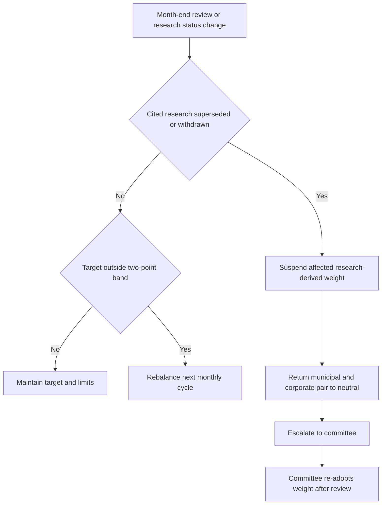

## Scope, authority, and dependencies

**A.1 governs** the fixed-income holdings a portfolio manager may maintain without escalation in US taxable client accounts; it is binding internal Investment Policy Committee guidance, not research or client-specific investment advice. **D.1 constrains** that authority: a mandate-specific band governs when tighter than the discretion matrix, and the matrix cannot be used to broaden this guide's limits. [Allocation guide A.1](repo://guidelines/allocation/us-taxable-fixed-income.md#L7-L11) [Discretion matrix D.1](repo://guidelines/authority/discretion-matrix.md#L7-L11)

**A.2 defines** this sleeve as US Treasuries, agency mortgage-backed securities, investment-grade corporate credit, and municipal credit. Non-US developed sovereign and emerging-market debt belong to the multi-asset sleeve rather than this guidance. [Allocation guide A.2](repo://guidelines/allocation/us-taxable-fixed-income.md#L13-L15)

**A.8 requires** a quarterly review and an out-of-cycle review when either cited research note is re-issued or withdrawn. **M.1–M.8 underpin** the municipal provisions; **G.1–G.6 underpin** the corporate underweight. Research supplies the analytical basis, but the committee—not the research desk—makes the binding allocation decision. [Allocation guide A.8](repo://guidelines/allocation/us-taxable-fixed-income.md#L49-L51) [Municipal research M.1–M.8](repo://research/FI/US/MUNI-CREDIT/2025-06.md#L16-L70) [IG-spreads research G.1–G.6](repo://research/FI/US/IG-SPREADS/2025-09.md#L16-L38) [Discretion matrix D.4](repo://guidelines/authority/discretion-matrix.md#L31-L35)

## Binding targets and paired funding

**A.3 sets** municipal credit at a 22% target of the fixed-income sleeve for clients in the top federal marginal bracket, versus an 18% neutral weight. **A.5 sets** investment-grade corporate credit at 28%, versus 32% neutral. The respective four-percentage-point municipal overweight and corporate underweight are a single paired trade: corporate credit funds the municipal allocation rather than leaving proceeds in cash. [Allocation guide A.3](repo://guidelines/allocation/us-taxable-fixed-income.md#L17-L23) [Allocation guide A.5](repo://guidelines/allocation/us-taxable-fixed-income.md#L33-L37) [Municipal research M.1](repo://research/FI/US/MUNI-CREDIT/2025-06.md#L16-L20) [IG-spreads research G.5](repo://research/FI/US/IG-SPREADS/2025-09.md#L32-L34)

For clients below the top federal bracket, **A.3 requires** the 18% municipal neutral weight and prohibits applying the private-activity concentration that supports the top-bracket overweight. The municipal research characterizes its advantage as after-tax—not pre-tax spread or credit—and only for top-bracket holders; credit fundamentals alone support only neutral to modest overweight. [Allocation guide A.3](repo://guidelines/allocation/us-taxable-fixed-income.md#L19-L23) [Municipal research M.2–M.3](repo://research/FI/US/MUNI-CREDIT/2025-06.md#L22-L36)

| Holding / client condition | Binding target | Neutral reference | Required relationship |
|---|---:|---:|---|
| Municipal credit, top federal marginal bracket | 22% | 18% | Four-point overweight, concentrated in the private-activity segment. |
| Investment-grade corporate credit | 28% | 32% | Four-point underweight funds the municipal overweight. |
| Municipal credit, below top federal bracket | 18% | 18% | No private-activity concentration. |

## Municipal implementation limits and AMT overlay

**A.4 converts M.5 into limits**: no preferred municipal sector may exceed 35% of the municipal allocation. A position in standalone senior living, single-asset student housing, or single-obligor industrial-development paper requires approval, regardless of rating. The preferred sectors are qualifying non-profit hospitals, private higher education, and large-hub airport special-facility paper, subject to the research's stated characteristics. [Allocation guide A.4](repo://guidelines/allocation/us-taxable-fixed-income.md#L25-L31) [Municipal research M.5](repo://research/FI/US/MUNI-CREDIT/2025-06.md#L44-L50) [Discretion matrix D.3](repo://guidelines/authority/discretion-matrix.md#L17-L27)

**A.4 requires** municipal duration in the eight-to-fifteen-year band. An extension beyond 15 years needs approval and may not be granted portfolio-wide. [Allocation guide A.4](repo://guidelines/allocation/us-taxable-fixed-income.md#L29-L31) [Municipal research M.6](repo://research/FI/US/MUNI-CREDIT/2025-06.md#L52-L54) [Discretion matrix D.3](repo://guidelines/authority/discretion-matrix.md#L17-L27)

**M.2 makes the AMT overlay load-bearing** for the top-bracket municipal overweight. Interest on specified post-1986 private-activity bonds is an AMT preference item, whereas qualified 501(c)(3) bonds are excluded from that preference treatment. The research identifies an AMT phase-out-threshold reduction as the principal risk that would invalidate its after-tax case and requires immediate review and re-issue upon an announced change to federal tax treatment of municipal interest. [Municipal research M.2](repo://research/FI/US/MUNI-CREDIT/2025-06.md#L22-L30) [Municipal research M.5](repo://research/FI/US/MUNI-CREDIT/2025-06.md#L44-L50) [Municipal research M.7–M.8](repo://research/FI/US/MUNI-CREDIT/2025-06.md#L56-L70)

**Revenue Procedure 2025-41 N.2–N.3 updates** the overlay for taxable years beginning on or after 2026-01-01: the AMT exemption is $90,100 for an unmarried individual (other than a surviving spouse) and $140,200 for joint filers or surviving spouses, with phase-out beginning at $500,000 and $1,000,000 respectively. **N.4–N.6 preserve** the specified-private-activity-bond preference treatment and the qualified-501(c)(3) and other statutory exceptions. These regulatory facts are an input to the research review, not manager discretion to recompute or change the 22% target. [Revenue Procedure N.2–N.6](repo://bulletins/IRS/2025-08-rev-proc-2025-41-amt-thresholds.md#L14-L38) [Municipal research M.8](repo://research/FI/US/MUNI-CREDIT/2025-06.md#L68-L70) [Discretion matrix D.4](repo://guidelines/authority/discretion-matrix.md#L31-L35)

## Bands, harvesting, and exception control

**A.6 applies** a ±2-percentage-point tolerance band to every target, measured on market value at month end. Ordinary market-value drift outside the band is rebalanced in the next monthly cycle; any weight outside its stated band requires approval under **D.3**. [Allocation guide A.6](repo://guidelines/allocation/us-taxable-fixed-income.md#L39-L43) [Discretion matrix D.3](repo://guidelines/authority/discretion-matrix.md#L17-L23)

**A.7 applies the municipal sector cap to a tax-loss-harvesting replacement**, not only the bond sold. A replacement that takes a preferred sector above 35% breaches the limit on settlement; harvesting therefore cannot be used to create an otherwise prohibited concentration. [Allocation guide A.7](repo://guidelines/allocation/us-taxable-fixed-income.md#L45-L47) [Allocation guide A.4](repo://guidelines/allocation/us-taxable-fixed-income.md#L25-L31)

This control flow separates mechanical drift rebalancing from suspension: a superseded or withdrawn research basis is an escalation event, not a band breach.

**A.1 suspends** a weight derived from a superseded or withdrawn cited note; a manager may not carry it forward until the committee re-adopts it against the replacement. **A.5 couples** that result for the municipal/corporate pair: suspend the municipal overweight, suspend the four-point corporate underweight, and return both to neutral. [Allocation guide A.1](repo://guidelines/allocation/us-taxable-fixed-income.md#L7-L11) [Allocation guide A.5](repo://guidelines/allocation/us-taxable-fixed-income.md#L33-L37)

**A.6 distinguishes** this suspension from ordinary drift: do not automatically rebalance it. **D.4 requires** escalation to the committee rather than manager re-derivation or direct adoption of a replacement recommendation; the record identifies the superseded and replacement notes, every affected weight, and affected accounts. A cleared escalation must additionally record the condition, authority level, facts relied on, and date. [Allocation guide A.6](repo://guidelines/allocation/us-taxable-fixed-income.md#L39-L43) [Discretion matrix D.4](repo://guidelines/authority/discretion-matrix.md#L31-L37) [Discretion matrix D.6](repo://guidelines/authority/discretion-matrix.md#L49-L51)

## Operating checklist

At each month end, measure targets on market value and queue ordinary breaches for the next monthly rebalance. Before any municipal purchase or tax-loss-harvesting replacement, test the resulting municipal-sector allocation and duration; seek the specified approval before entering a restricted sector or extending duration. Separately, monitor the status of both research notes and federal tax-treatment changes. A re-issue or withdrawal triggers the suspension-and-escalation path; the AMT change is a required research-review dependency and must not be translated directly into a manager-selected weight. [Allocation guide A.4](repo://guidelines/allocation/us-taxable-fixed-income.md#L25-L31) [Allocation guide A.6–A.8](repo://guidelines/allocation/us-taxable-fixed-income.md#L39-L51) [Municipal research M.8](repo://research/FI/US/MUNI-CREDIT/2025-06.md#L68-L70)
