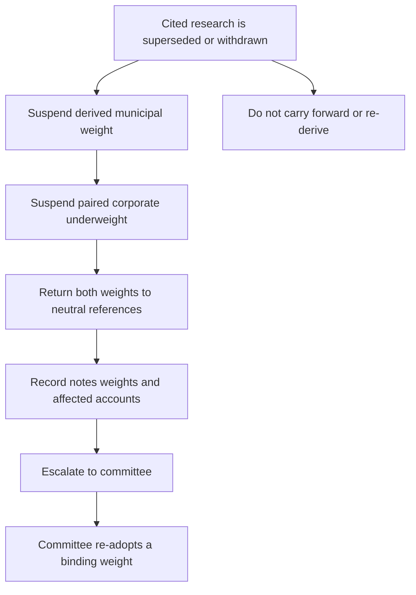

## Scope, standing, and authority

This is the firm's **binding allocation guidance** for United States taxable client accounts. It is not research, a tax determination, or client-specific investment advice. It governs holdings a portfolio manager may make without escalation in the taxable fixed-income sleeve: United States Treasuries, agency mortgage-backed securities, investment-grade corporate credit, and municipal credit. Non-US developed sovereign and emerging-market debt belong to the multi-asset sleeve and are governed by the global bands guide. [Allocation guide A.1–A.2](repo://internal_guidelines/allocation/us-taxable-fixed-income.md#L7-L15)

The guide supplies default weights. A mandate may impose a tighter band than the discretion matrix, but cannot grant broader discretion; the tighter mandate rule governs. The matrix determines base and senior portfolio-manager authority and committee triggers. [Allocation guide A.1](repo://internal_guidelines/allocation/us-taxable-fixed-income.md#L7-L11) [Discretion matrix D.1](repo://internal_guidelines/authority/discretion-matrix.md#L7-L11)

## Binding municipal and corporate allocation

For an account in the top federal marginal bracket, municipal credit has a **22%** target weight of the fixed-income sleeve against an **18%** neutral weight. The four-point overweight is concentrated in private-activity bonds and was adopted as an after-tax position from FI-US-MUNI-CREDIT 2025-06, rather than as a credit-only position. For accounts below the top federal bracket, municipal credit remains at the **18%** neutral weight and the private-activity concentration does not apply. [Allocation guide A.3](repo://internal_guidelines/allocation/us-taxable-fixed-income.md#L17-L23)

Investment-grade corporate credit has a **28%** target against a **32%** neutral weight. This four-point underweight funds the municipal overweight, so the weights are a deliberate pair, not independent tilts. The separate IG-spreads research also describes an approximately four-point corporate underweight whose proceeds fund a higher-conviction sleeve position rather than cash. [Allocation guide A.5](repo://internal_guidelines/allocation/us-taxable-fixed-income.md#L33-L37) [IG-spreads research G.5](repo://internal_research/FI/US/IG-SPREADS/2025-09.md#L32-L34)

## AMT-sensitive research basis: current guidance and unresolved review

FI-US-MUNI-CREDIT 2025-06 remains marked **Current** and “Not re-issued since publication.” It calls for a two-to-four-point municipal increase funded from investment-grade corporate credit, but identifies its incremental after-tax advantage as available only to top-bracket holders. Its credit fundamentals alone support neutral to modest overweight. Therefore, the guide’s binding 22%/28% pair remains its current stated implementation; the historical note must not be read as independently establishing a new weight. [Municipal research status and M.1–M.3](repo://internal_research/FI/US/MUNI-CREDIT/2025-06.md#L12-L16) [Municipal research M.1–M.3](repo://internal_research/FI/US/MUNI-CREDIT/2025-06.md#L18-L38) [Allocation guide A.3 and A.5](repo://internal_guidelines/allocation/us-taxable-fixed-income.md#L17-L23) [Allocation guide A.5](repo://internal_guidelines/allocation/us-taxable-fixed-income.md#L33-L37)

The 2025-06 after-tax arithmetic used much higher then-effective AMT phase-out amounts and identifies a lower threshold that draws materially more top-bracket holders into AMT as the exposure that takes out its recommendation. Revenue Procedure 2025-41 applies to taxable years beginning on or after **2026-01-01** and sets phase-out thresholds of **$500,000** of AMTI for an unmarried individual and **$1,000,000** for a joint return; it also says taxpayers above those thresholds receive the stated treatment even when they did not under prior thresholds. This constrains the note’s load-bearing threshold premise and leaves the research-basis disposition unresolved; it is not a portfolio-manager authorization to calculate a replacement target. [Municipal research M.2](repo://internal_research/FI/US/MUNI-CREDIT/2025-06.md#L24-L32) [Revenue Procedure 2025-41 N.1 and N.3](repo://external_sources/IRS/2025-08-rev-proc-2025-41-amt-thresholds.md#L8-L12) [Revenue Procedure 2025-41 N.3](repo://external_sources/IRS/2025-08-rev-proc-2025-41-amt-thresholds.md#L18-L22)

The tax change does not eliminate the relevant bond distinctions. Interest on specified post-1986 private-activity bonds remains an AMT preference item included in AMTI, while qualified section 145 501(c)(3) bond interest remains outside both the preference treatment and AMTI. The municipal note identifies nonprofit hospitals and private higher education as predominantly 501(c)(3) issuance, unlike predominantly non-501(c)(3) airport special-facility paper. Do not generalize the private-activity exposure across those categories. [Revenue Procedure 2025-41 N.4–N.5](repo://external_sources/IRS/2025-08-rev-proc-2025-41-amt-thresholds.md#L24-L34) [Municipal research M.5](repo://internal_research/FI/US/MUNI-CREDIT/2025-06.md#L46-L52)

The note requires immediate review and re-issue on an announced change to the federal tax treatment described in its after-tax case, rather than waiting for its twelve-month review. Record the applicable taxable year, filing status, bond classification, and effect on the documented premise for the research and governance review. This review requirement does not itself select a replacement research view or alter a binding guide weight. [Municipal research M.8](repo://internal_research/FI/US/MUNI-CREDIT/2025-06.md#L70-L72) [Revenue Procedure 2025-41 N.2–N.5](repo://external_sources/IRS/2025-08-rev-proc-2025-41-amt-thresholds.md#L14-L34)

## Municipal implementation limits

Within the municipal allocation, the FI-US-MUNI-CREDIT 2025-06 sector preferences are binding limits. No preferred sector may exceed **35%** of the municipal allocation. A position in standalone senior living, single-asset student housing, or single-obligor industrial-development paper requires approval regardless of rating. Municipal duration must remain between **eight and fifteen years**; any extension beyond 15 years requires approval and may not be approved portfolio-wide. [Allocation guide A.4](repo://internal_guidelines/allocation/us-taxable-fixed-income.md#L25-L31) [Discretion matrix D.3](repo://internal_guidelines/authority/discretion-matrix.md#L17-L27)

Tax-loss harvesting does not bypass these limits. Test the replacement bond, not just the bond sold: a replacement that takes a preferred sector above its 35% limit is a limit breach on settlement. [Allocation guide A.7](repo://internal_guidelines/allocation/us-taxable-fixed-income.md#L45-L47)

## Tolerance bands and approvals

Each target has a **±2 percentage-point** market-value tolerance band, measured at month end. Ordinary drift beyond that band is rebalanced in the next monthly cycle. A weight outside its stated tolerance band requires approval under D.3; committee approval is required for an exception to a stated band. [Allocation guide A.1 and A.6](repo://internal_guidelines/allocation/us-taxable-fixed-income.md#L7-L10) [Allocation guide A.6](repo://internal_guidelines/allocation/us-taxable-fixed-income.md#L39-L43) [Discretion matrix D.1 and D.3](repo://internal_guidelines/authority/discretion-matrix.md#L7-L11) [Discretion matrix D.3](repo://internal_guidelines/authority/discretion-matrix.md#L17-L23)

## Supersession control: conditional suspend, pair, and escalate

The guide is reviewed quarterly and out of cycle whenever a cited note is re-issued or withdrawn. The AMT-sensitive review above is separate from the D.4 control: D.4 applies **only if** a guide-cited research note is superseded or withdrawn. The repository currently identifies the municipal note as current and not re-issued, and the Revenue Procedure supersedes a section of a prior revenue procedure—not the municipal note or this guide. Accordingly, neither the AMT overlay nor its constraint on the historical premise is an automatic D.4 suspension. [Allocation guide A.8](repo://internal_guidelines/allocation/us-taxable-fixed-income.md#L49-L51) [Municipal research status](repo://internal_research/FI/US/MUNI-CREDIT/2025-06.md#L12-L16) [Revenue Procedure 2025-41 N.1 and N.7](repo://external_sources/IRS/2025-08-rev-proc-2025-41-amt-thresholds.md#L10-L12) [Revenue Procedure 2025-41 N.7](repo://external_sources/IRS/2025-08-rev-proc-2025-41-amt-thresholds.md#L40-L42)

If that condition later occurs, suspend the derived weight rather than carrying it forward until the committee re-adopts a weight against replacement research. For the municipal/corporate pair, suspension of the municipal overweight also suspends the corporate underweight and returns both to their neutral references. This is a future conditional control path, not a conclusion that the current municipal target is suspended.

This diagram shows the D.4 path only after its superseded-or-withdrawn condition is met. [Allocation guide A.1 and A.5](repo://internal_guidelines/allocation/us-taxable-fixed-income.md#L7-L11) [Allocation guide A.5](repo://internal_guidelines/allocation/us-taxable-fixed-income.md#L33-L37) [Discretion matrix D.4](repo://internal_guidelines/authority/discretion-matrix.md#L31-L37)

A suspension-caused band condition is not ordinary drift and must not be mechanically rebalanced. Escalate to the committee instead of re-deriving a weight, retaining the prior weight, or adopting replacement research directly. The escalation identifies the superseded note, a replacement if one exists, every derived weight, and affected accounts. A cleared escalation records the condition, clearing authority level, facts relied on, and date. [Allocation guide A.6](repo://internal_guidelines/allocation/us-taxable-fixed-income.md#L39-L43) [Discretion matrix D.4](repo://internal_guidelines/authority/discretion-matrix.md#L31-L37) [Discretion matrix D.6](repo://internal_guidelines/authority/discretion-matrix.md#L49-L51)

## Operating checklist

1. Confirm the account is in this sleeve and apply a mandate-specific limit if it is tighter than the matrix. [Allocation guide A.2](repo://internal_guidelines/allocation/us-taxable-fixed-income.md#L13-L15) [Discretion matrix D.1](repo://internal_guidelines/authority/discretion-matrix.md#L7-L11)
2. Apply the client’s federal-bracket classification to the current 22% top-bracket municipal target or 18% below-top-bracket neutral target, and maintain the linked 28% corporate target while the municipal overweight remains active. [Allocation guide A.3](repo://internal_guidelines/allocation/us-taxable-fixed-income.md#L17-L23) [Allocation guide A.5](repo://internal_guidelines/allocation/us-taxable-fixed-income.md#L33-L37)
3. For a taxable year beginning on or after 2026-01-01, document the AMT-overlay facts and the impact on the municipal note’s stated premise for research/governance review. Do not infer a replacement allocation from that review. [Revenue Procedure 2025-41 N.1–N.3](repo://external_sources/IRS/2025-08-rev-proc-2025-41-amt-thresholds.md#L8-L22) [Municipal research M.2 and M.8](repo://internal_research/FI/US/MUNI-CREDIT/2025-06.md#L24-L32) [Municipal research M.8](repo://internal_research/FI/US/MUNI-CREDIT/2025-06.md#L70-L72)
4. Test municipal sector, restricted-sector, duration, and tax-loss-harvesting replacement controls before execution or settlement. [Allocation guide A.4 and A.7](repo://internal_guidelines/allocation/us-taxable-fixed-income.md#L25-L31) [Allocation guide A.7](repo://internal_guidelines/allocation/us-taxable-fixed-income.md#L45-L47)
5. At month end, distinguish ordinary drift from a genuine future D.4 supersession or withdrawal. Rebalance ordinary drift in the next monthly cycle with required approval for an out-of-band weight; if D.4 is actually triggered, suspend, document, and escalate rather than selecting a replacement weight. [Allocation guide A.6](repo://internal_guidelines/allocation/us-taxable-fixed-income.md#L39-L43) [Discretion matrix D.3–D.4](repo://internal_guidelines/authority/discretion-matrix.md#L17-L35)
