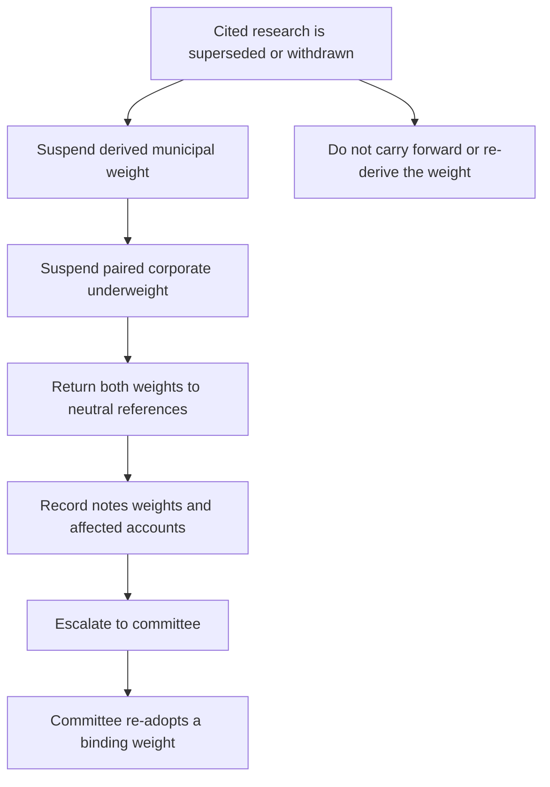

## Scope, standing, and authority

This is binding allocation guidance for United States taxable client accounts, not a research conclusion or client-specific investment advice. It governs holdings a portfolio manager may make without escalation in the taxable fixed-income sleeve: United States Treasuries, agency mortgage-backed securities, investment-grade corporate credit, and municipal credit. Non-US developed sovereign and emerging-market debt are assigned to the multi-asset sleeve and governed by the global bands guide. [Allocation guide A.1–A.2](repo://internal_guidelines/allocation/us-taxable-fixed-income.md#L7-L15)

The guide supplies the applicable default weights. A mandate may impose a tighter band than the discretion matrix, but cannot grant broader discretion; where the mandate guide is tighter, it governs. Base and senior portfolio-manager authority, and the committee triggers, are determined under the matrix. [Allocation guide A.1](repo://internal_guidelines/allocation/us-taxable-fixed-income.md#L7-L11) [Discretion matrix D.1](repo://internal_guidelines/authority/discretion-matrix.md#L7-L11)

## Binding municipal and corporate allocation

For an account in the top federal marginal bracket, municipal credit has a **22%** target weight of the fixed-income sleeve, compared with an **18%** neutral weight. The four-point overweight is concentrated in private-activity bonds and is an after-tax position adopted from FI-US-MUNI-CREDIT 2025-06, not a credit-only position. For accounts below the top federal bracket, municipal credit remains at the **18%** neutral weight and the private-activity concentration does not apply. [Allocation guide A.3](repo://internal_guidelines/allocation/us-taxable-fixed-income.md#L17-L23)

The cited municipal note is currently marked **Current** and states that it has not been re-issued since publication. Its desk view is an overweight expressed as a two-to-four-point municipal increase funded from investment-grade corporate credit. It identifies the benefit as an after-tax advantage available only to top-bracket holders; its credit fundamentals alone support neutral to modest overweight. [Municipal research status and M.1](repo://internal_research/FI/US/MUNI-CREDIT/2025-06.md#L12-L22) [Municipal research M.2–M.3](repo://internal_research/FI/US/MUNI-CREDIT/2025-06.md#L24-L38)

Investment-grade corporate credit has a **28%** target against a **32%** neutral weight. This four-point underweight is the funding source for the municipal overweight, so the two weights are a deliberate pair rather than independent tilts. The separate IG-spreads research also describes an approximately four-point corporate underweight whose proceeds fund a higher-conviction sleeve position rather than cash. [Allocation guide A.5](repo://internal_guidelines/allocation/us-taxable-fixed-income.md#L33-L37) [IG-spreads research G.5](repo://internal_research/FI/US/IG-SPREADS/2025-09.md#L32-L34)

## Municipal implementation limits

Within the municipal allocation, the FI-US-MUNI-CREDIT 2025-06 sector preferences are binding limits. No preferred sector may exceed **35%** of the municipal allocation. A position in standalone senior living, single-asset student housing, or single-obligor industrial-development paper requires approval regardless of rating. Municipal duration must remain between **eight and fifteen years**; any extension beyond 15 years requires approval and may not be approved portfolio-wide. [Allocation guide A.4](repo://internal_guidelines/allocation/us-taxable-fixed-income.md#L25-L31) [Discretion matrix D.3](repo://internal_guidelines/authority/discretion-matrix.md#L17-L27)

Tax-loss harvesting does not bypass these limits. Test the replacement bond, not just the bond sold: a replacement that takes a preferred sector above its 35% limit is a limit breach on settlement. [Allocation guide A.7](repo://internal_guidelines/allocation/us-taxable-fixed-income.md#L45-L47)

## Tolerance bands and approvals

Each target has a **±2 percentage-point** market-value tolerance band, measured at month end. Ordinary drift beyond that band is rebalanced in the next monthly cycle. A weight outside its stated tolerance band requires approval under D.3; committee approval is required for an exception to a stated band. [Allocation guide A.1, A.6](repo://internal_guidelines/allocation/us-taxable-fixed-income.md#L7-L10) [Allocation guide A.6](repo://internal_guidelines/allocation/us-taxable-fixed-income.md#L39-L43) [Discretion matrix D.1, D.3](repo://internal_guidelines/authority/discretion-matrix.md#L7-L11) [Discretion matrix D.3](repo://internal_guidelines/authority/discretion-matrix.md#L17-L23)

## Future research supersession: suspend, pair, and escalate

The live guide names FI-US-MUNI-CREDIT 2025-06 and FI-US-IG-SPREADS 2025-09 as its current research basis and requires quarterly review, plus an out-of-cycle review whenever a cited note is re-issued or withdrawn. The municipal note separately requires immediate review and re-issue if federal tax treatment described in its after-tax case changes. [Allocation guide A.8](repo://internal_guidelines/allocation/us-taxable-fixed-income.md#L49-L51) [Municipal research M.8](repo://internal_research/FI/US/MUNI-CREDIT/2025-06.md#L70-L74)

If a cited note is later superseded or withdrawn, the weight derived from it is suspended rather than carried forward until the committee re-adopts a weight against the replacement note. For the municipal/corporate pair, suspension of the municipal overweight also suspends the corporate underweight, returning both to their stated neutral references. This is a conditional control path; it does **not** mean that the current municipal weight is suspended. [Allocation guide A.1](repo://internal_guidelines/allocation/us-taxable-fixed-income.md#L7-L11) [Allocation guide A.5](repo://internal_guidelines/allocation/us-taxable-fixed-income.md#L33-L37) [Municipal research status](repo://internal_research/FI/US/MUNI-CREDIT/2025-06.md#L12-L16)

This flow shows the required response only if a cited research dependency changes; it is separate from ordinary tolerance-band drift. [Allocation guide A.1, A.5–A.6](repo://internal_guidelines/allocation/us-taxable-fixed-income.md#L7-L11) [Allocation guide A.5–A.6](repo://internal_guidelines/allocation/us-taxable-fixed-income.md#L33-L43) [Discretion matrix D.4](repo://internal_guidelines/authority/discretion-matrix.md#L31-L37)

A suspension-caused band condition is not ordinary drift and must not be mechanically rebalanced. The manager must escalate to the committee instead of re-deriving a weight, retaining the prior weight, or adopting replacement research directly. The escalation identifies the superseded note, replacement note if one exists, every derived weight, and affected accounts. A cleared escalation must record the condition, the clearing authority level, facts relied on, and date. [Allocation guide A.6](repo://internal_guidelines/allocation/us-taxable-fixed-income.md#L39-L43) [Discretion matrix D.4](repo://internal_guidelines/authority/discretion-matrix.md#L31-L37) [Discretion matrix D.6](repo://internal_guidelines/authority/discretion-matrix.md#L49-L51)

## Operating checklist

1. Confirm the account is in this sleeve and apply the mandate-specific limit if it is tighter than the matrix. [Allocation guide A.2](repo://internal_guidelines/allocation/us-taxable-fixed-income.md#L13-L15) [Discretion matrix D.1](repo://internal_guidelines/authority/discretion-matrix.md#L7-L11)
2. Apply the client’s federal-bracket classification to the 22% top-bracket municipal target or 18% below-top-bracket neutral target; maintain the linked 28% corporate target for the active municipal overweight. [Allocation guide A.3](repo://internal_guidelines/allocation/us-taxable-fixed-income.md#L17-L23) [Allocation guide A.5](repo://internal_guidelines/allocation/us-taxable-fixed-income.md#L33-L37)
3. Test municipal sector, restricted-sector, duration, and tax-loss-harvesting replacement controls before execution or settlement. [Allocation guide A.4, A.7](repo://internal_guidelines/allocation/us-taxable-fixed-income.md#L25-L31) [Allocation guide A.7](repo://internal_guidelines/allocation/us-taxable-fixed-income.md#L45-L47)
4. At month end, distinguish ordinary drift from a future research-basis suspension. Rebalance ordinary drift in the next monthly cycle with required approval for an out-of-band weight; suspend, document, and escalate the latter rather than selecting a replacement weight. [Allocation guide A.6](repo://internal_guidelines/allocation/us-taxable-fixed-income.md#L39-L43) [Discretion matrix D.3–D.4](repo://internal_guidelines/authority/discretion-matrix.md#L17-L35)
