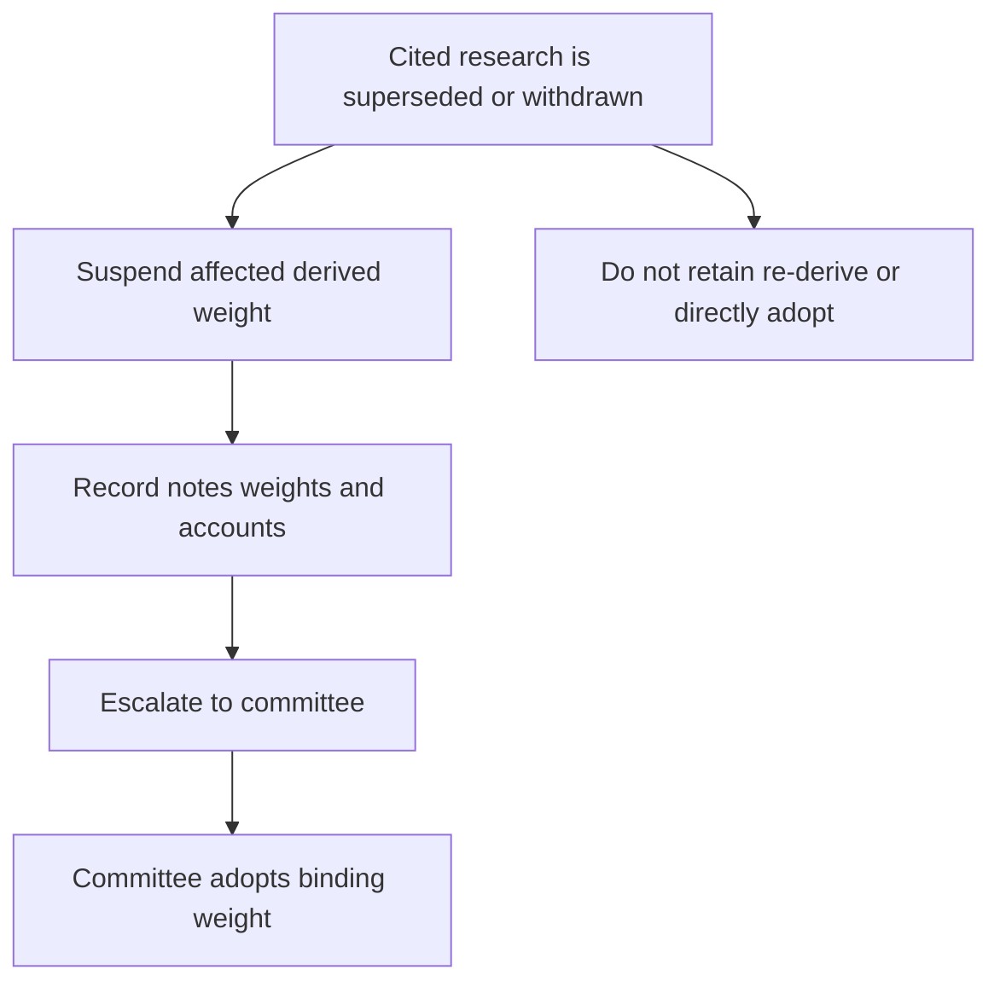

## Scope and governing boundary

The discretion matrix is the cross-mandate ceiling on discretionary authority. A mandate guide may set a tighter limit or band, but it cannot grant broader discretion. First identify the applicable mandate rule, then apply the matrix to determine the authority and escalation path. This matters for both the [global multi-asset bands](../allocation/global-multi-asset-bands.md) and the [US taxable fixed-income guide](../allocation/us-taxable-fixed-income.md): their mandate-specific bands govern when tighter, while the matrix supplies the cross-mandate authority boundary. [Discretion matrix D.1](repo://internal_guidelines/authority/discretion-matrix.md#L7-L11) [Global bands B.1–B.3](repo://internal_guidelines/allocation/gl-multi-asset-bands.md#L7-L19) [Taxable fixed-income guide A.1, A.6](repo://internal_guidelines/allocation/us-taxable-fixed-income.md#L7-L11)

Keep these outcomes separate:

1. **Within discretion** — the action is within both the applicable mandate limit and the manager's authority.
2. **Approval condition** — the action may proceed only after the required clearance and record are obtained.
3. **Condition that may not be cleared by approval** — do not offer, trade, or establish the position. No authority tier can cure the prohibition. [Discretion matrix D.3–D.6](repo://internal_guidelines/authority/discretion-matrix.md#L17-L51)

## Authority tiers and account-level triggers

| Authority | Permitted scope or required trigger |
|---|---|
| Portfolio manager | Base discretion; a single-issuer position up to 3% of account market value. |
| Senior portfolio manager | Expanded discretion; a single-issuer position up to 5% and clearance of one escalation condition per account. |
| Committee | Required for issuer exposure above 5%, an account with more than one escalation condition, and any exception to a stated band. An above-5% position also requires a written concentration rationale and is subject to the concentrated-position guide. |

The issuer-size threshold does not replace mandate limits or suitability controls. Separately, a concentrated position is one above 15% of liquid portfolio value, or above 10% if it is an employer or affiliate security. Its acquisition and each annual review require a documented suitability determination. [Discretion matrix D.1–D.2](repo://internal_guidelines/authority/discretion-matrix.md#L7-L15) [Concentrated-position guide C.1–C.2](repo://internal_guidelines/suitability/concentrated-positions.md#L7-L13)

## Approval conditions

The following require approval regardless of size:

- a weight outside its stated tolerance band, except a breach caused by a research-basis suspension, which follows the separate D.4 escalation path;
- a position in a research-underweight sector where the mandate makes that research preference binding;
- a hedge of a concentrated position;
- an extension of municipal duration beyond the taxable fixed-income band; this may not be granted portfolio-wide; and
- a private-markets commitment, after the separate eligibility determination is completed. [Discretion matrix D.3](repo://internal_guidelines/authority/discretion-matrix.md#L17-L29)

The mandate guides specify the concrete limits that feed these triggers. For example, the taxable fixed-income guide makes specified municipal sector preferences binding, requires D.3 approval for its underweight sectors, and requires written consideration of tax consequences before a concentrated-position hedge is executed. [Taxable fixed-income guide A.4](repo://internal_guidelines/allocation/us-taxable-fixed-income.md#L25-L31) [Concentrated-position guide C.4](repo://internal_guidelines/suitability/concentrated-positions.md#L21-L23)

## Research supersession: prospective suspend-and-escalate path

This is a conditional control path; this page does **not** assert that a note currently cited by a mandate guide has been superseded or withdrawn. If a manager finds that a cited note has been superseded or withdrawn, suspend the weight derived from that note under the applicable mandate guide and escalate to the committee. The manager may not carry the prior weight forward, re-derive a replacement weight, or directly adopt the replacement note's recommendation. Adopting a research view as a binding weight is a committee act. The escalation identifies the superseded note, a replacement if one exists, every derived weight, and every affected account. [Discretion matrix D.4](repo://internal_guidelines/authority/discretion-matrix.md#L31-L37)

This flow shows the prospective D.4 path; it is not ordinary tolerance-band drift and is not a manager-selected replacement process. [Discretion matrix D.4](repo://internal_guidelines/authority/discretion-matrix.md#L31-L37)

The immediate suspension treatment is mandate-specific. A global multi-asset band based on affected research returns to its prior committee-adopted level pending review. In taxable fixed income, suspension of the municipal overweight also suspends the paired corporate underweight and returns both to neutral; a resulting band condition is not mechanically rebalanced because the committee must determine the replacement weight. [Global bands B.1](repo://internal_guidelines/allocation/gl-multi-asset-bands.md#L7-L11) [Taxable fixed-income guide A.1, A.5–A.6](repo://internal_guidelines/allocation/us-taxable-fixed-income.md#L7-L11) [Taxable fixed-income guide A.5–A.6](repo://internal_guidelines/allocation/us-taxable-fixed-income.md#L33-L43)

## Conditions that may not be cleared by approval

No authority tier may clear:

- trading employer securities on firm discretion during an applicable blackout period;
- a private-markets commitment for a client who is ineligible under P.1; or
- a position that would breach a stated regulatory requirement. [Discretion matrix D.5](repo://internal_guidelines/authority/discretion-matrix.md#L39-L47)

For employer securities, retain applicable trading windows, blackout periods, pre-clearance requirements, and any Rule 10b5-1 plan in the file. The blackout restriction remains a prohibition rather than an exception. [Concentrated-position guide C.5](repo://internal_guidelines/suitability/concentrated-positions.md#L25-L29)

Private-markets eligibility is a documented regulatory determination required before a strategy is offered; it is not within portfolio-manager discretion. It is separate from accredited-investor status and is necessary but insufficient: suitability and the applicable liquidity constraint must also be satisfied before commitment. Every determination must record its pathway, evidence, decision maker, and date; without that basis, audit treats it as no determination. See also the [private-markets eligibility guide](../suitability/private-markets-eligibility.md). [Eligibility guide P.1, P.4–P.6](repo://internal_guidelines/suitability/private-markets-eligibility.md#L7-L9) [Eligibility guide P.4–P.6](repo://internal_guidelines/suitability/private-markets-eligibility.md#L23-L35)

## Required record and operator checklist

Every **cleared escalation** must record the condition, clearing authority level, specific facts relied on, and date. Without that recorded basis, audit treats the position as unapproved and charges it back to the clearing manager's file review. This recordkeeping requirement applies to an approvable escalation; it never turns a non-clearable condition into an approvable one. [Discretion matrix D.5–D.6](repo://internal_guidelines/authority/discretion-matrix.md#L39-L51)

Before executing or maintaining an exception-sensitive position:

1. Identify the governing mandate limit, any tighter mandate rule, and any cited research dependency.
2. Check issuer size and the number of escalation conditions for the account, then select the matrix authority tier.
3. If cited research is superseded or withdrawn, follow D.4: suspend, document the affected notes, weights, and accounts, and escalate to the committee.
4. Test D.5 before requesting approval. Stop if the condition is non-clearable.
5. For an approvable matter, obtain the required clearance and retain the D.6 basis. For private markets, retain the separate eligibility determination as well.
