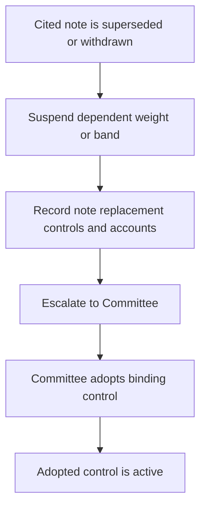

# Portfolio Manager Discretion and Escalation

> **Binding internal authority guidance — not research and not client investment advice.** The discretion matrix sets the maximum authority across discretionary mandates. A mandate guide may impose a tighter limit, but cannot grant broader discretion. [Discretion Matrix D.1](repo://guidelines/authority/discretion-matrix.md#L7-L11)

## Authority boundary

Portfolio managers hold base discretion. Senior portfolio managers hold expanded discretion and may clear **one escalation condition per account**. Committee approval is required for a matter beyond senior discretion, an account with more than one escalation condition, and any exception to a stated band. [Discretion Matrix D.1](repo://guidelines/authority/discretion-matrix.md#L7-L11)

For a proposed single-issuer position, the applicable authority is based on account market value:

| Proposed position | Authority and continuing control |
| --- | --- |
| Up to 3% | Portfolio-manager discretion |
| Above 3% through 5% | Senior portfolio-manager discretion |
| Above 5% | Committee approval and a written concentration rationale; the position is thereafter subject to the concentrated-position guide |

[Discretion Matrix D.2](repo://guidelines/authority/discretion-matrix.md#L13-L15)

This size threshold is not the definition of a concentrated position. A position is concentrated above 15% of liquid portfolio market value, or above 10% when it is the client’s employer or an affiliate; a concentrated position requires a documented suitability determination at acquisition and each annual review. [Concentrated Positions C.1–C.2](repo://guidelines/suitability/concentrated-positions.md#L7-L13)

## Required approval entrypoints

The following actions require approval regardless of size. “Approval” is an authority decision under the matrix; it does not displace an applicable mandate limit, suitability determination, eligibility gate, liquidity constraint, or regulatory requirement.

- **Ordinary out-of-band weight.** A weight outside its stated tolerance band requires approval. A band exception is a Committee matter; do not classify a research-change suspension as ordinary drift. [Discretion Matrix D.1 and D.3](repo://guidelines/authority/discretion-matrix.md#L7-L11) [Discretion Matrix D.3](repo://guidelines/authority/discretion-matrix.md#L17-L22)
- **Binding underweight-sector limit.** A position in a sector that governing research underweights and the mandate guide makes binding requires approval. In the taxable municipal sleeve, this includes standalone senior living, single-asset student housing, and single-obligor industrial-development paper. [Discretion Matrix D.3](repo://guidelines/authority/discretion-matrix.md#L17-L25) [Taxable Fixed Income A.4](repo://guidelines/allocation/us-taxable-fixed-income.md#L25-L31)
- **Concentrated-position hedge.** Any hedge requires approval, and the tax consequences of collars, prepaid forwards, and exchange funds must be addressed in writing before execution. [Discretion Matrix D.3](repo://guidelines/authority/discretion-matrix.md#L23-L25) [Concentrated Positions C.4](repo://guidelines/suitability/concentrated-positions.md#L21-L23)
- **Municipal duration extension.** The municipal-duration band is 8–15 years. An extension beyond 15 years requires approval and cannot be granted portfolio-wide. [Taxable Fixed Income A.4](repo://guidelines/allocation/us-taxable-fixed-income.md#L25-L31) [Discretion Matrix D.3](repo://guidelines/authority/discretion-matrix.md#L25-L29)
- **Private-markets commitment.** Every commitment requires approval, but only after the required eligibility determination has been documented. Approval is not a substitute for eligibility, suitability, or liquidity. [Discretion Matrix D.3](repo://guidelines/authority/discretion-matrix.md#L27-L29) [Private-Markets Eligibility P.1 and P.6](repo://guidelines/suitability/private-markets-eligibility.md#L7-L10) [Private-Markets Eligibility P.6](repo://guidelines/suitability/private-markets-eligibility.md#L31-L35)

## Research-change escalation

A cited research note being superseded or withdrawn changes the state of every guide control derived from that note: suspend the dependent weight or band and escalate to the Committee. A manager must not re-derive a weight, carry the suspended derived weight forward, automatically rebalance it, or directly adopt the replacement recommendation. Turning research into a binding successor control is a Committee act. [Discretion Matrix D.4](repo://guidelines/authority/discretion-matrix.md#L31-L37) [Taxable Fixed Income A.1 and A.6](repo://guidelines/allocation/us-taxable-fixed-income.md#L7-L11) [Taxable Fixed Income A.6](repo://guidelines/allocation/us-taxable-fixed-income.md#L39-L43)

This flow shows the research-change escalation path; a manager does not select a successor weight.

The escalation record must identify the superseded note, a replacement if one exists, every derived weight, and every affected account. [Discretion Matrix D.4](repo://guidelines/authority/discretion-matrix.md#L31-L35)

Interim treatment comes from the applicable mandate guide, not from a new manager-selected allocation. For global multi-asset bands, a suspended research-dependent control returns to its prior Committee-adopted level pending review. For US taxable fixed income, a suspension-driven band condition is not a drift breach and must not be mechanically rebalanced because the correct weight remains a Committee decision. [Global Multi-Asset Bands B.1](repo://guidelines/allocation/gl-multi-asset-bands.md#L7-L11) [Taxable Fixed Income A.6](repo://guidelines/allocation/us-taxable-fixed-income.md#L39-L43)

## Private markets: gates and pacing

No private-markets strategy may be offered until eligibility is determined and documented; eligibility is a regulatory determination outside portfolio-manager discretion. A properly made pre-effective-date determination remains valid, but the file must identify it as made under prior thresholds, and it cannot support a new subscription made on or after the effective date. [Private-Markets Eligibility P.1](repo://guidelines/suitability/private-markets-eligibility.md#L7-L10) [SEC Order IA-7104 Q.4](repo://bulletins/SEC/2026-04-order-ia-7104-qualified-client.md#L24-L28)

Eligibility is necessary but not sufficient: separately satisfy suitability and the liquidity constraint before committing. The global multi-asset guide makes the research framework’s liquidity recommendation binding: underwrite unfunded commitments against the client’s spending requirement and do not allow them to exceed two years of liquid-portfolio spending. [Private-Markets Eligibility P.6](repo://guidelines/suitability/private-markets-eligibility.md#L31-L35) [Global Multi-Asset Bands B.6](repo://guidelines/allocation/gl-multi-asset-bands.md#L31-L35) [Private Markets V.6](repo://research/MA/GL/PRIVATE-MARKETS/2025-12.md#L36-L38)

Private-markets exposure is managed through commitment pacing rather than ordinary rebalancing. A denominator-effect increase above the strategic weight is not a breach and is not traded, while over-commitment is a pacing failure that must be escalated. [Global Multi-Asset Bands B.6](repo://guidelines/allocation/gl-multi-asset-bands.md#L31-L35)

## Conditions that cannot be cleared

These are prohibitions or regulatory gates, not escalation conditions. No authority tier or Committee approval may clear them:

- Trading employer securities on firm discretion during a blackout period. The file must record applicable trading windows, blackout periods, pre-clearance requirements, and any Rule 10b5-1 plan. [Concentrated Positions C.5](repo://guidelines/suitability/concentrated-positions.md#L25-L29)
- A private-markets commitment for a client who is not eligible under the eligibility guide. [Discretion Matrix D.5](repo://guidelines/authority/discretion-matrix.md#L39-L47) [Private-Markets Eligibility P.1](repo://guidelines/suitability/private-markets-eligibility.md#L7-L10)
- A position that breaches a stated regulatory requirement. [Discretion Matrix D.5](repo://guidelines/authority/discretion-matrix.md#L39-L47)

## Audit record: keep distinct controls distinct

For every cleared escalation, retain the condition, clearing authority level, specific facts relied on, and date. If the basis is not recorded, audit treats the position as unapproved and charges it back to the clearing manager’s file review. [Discretion Matrix D.6](repo://guidelines/authority/discretion-matrix.md#L49-L51)

That clearance record is distinct from the records demanded by the underlying control. For concentration, retain the acquisition and annual-review suitability determination, including the client’s reason for holding, tax cost of unwinding, and restrictions; a preference to hold alone is insufficient. For private markets, retain the eligibility pathway, evidence, determiner, and date; without a recorded basis, audit treats it as no determination. [Concentrated Positions C.2–C.3](repo://guidelines/suitability/concentrated-positions.md#L11-L19) [Private-Markets Eligibility P.5](repo://guidelines/suitability/private-markets-eligibility.md#L27-L29)

## Related guidance

- [US taxable fixed-income guidance](/openwiki/guidance/allocation/taxable-fixed-income.md) — sleeve limits, bands, suspension handling, and monthly operations.
- [Concentrated-positions guidance](/openwiki/guidance/suitability/concentrated-positions.md) — suitability, hedge, employer-security, and unwind controls.
- [Private-markets eligibility guidance](/openwiki/guidance/suitability/private-markets-eligibility.md) — eligibility pathways and the separate suitability gate.
- [Supersession and escalation](/openwiki/position-assembly/supersession-and-escalation.md) — procedure for preserving a historical research basis while escalating the current binding control.
