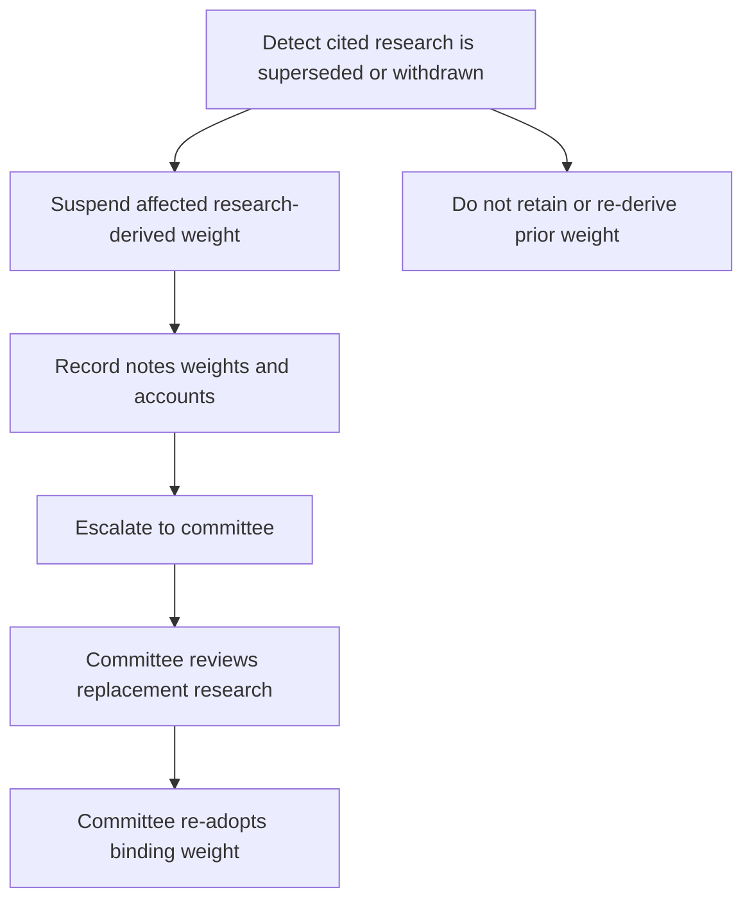

## Scope and governing boundary

The discretion matrix is the cross-mandate ceiling on a portfolio manager's authority for discretionary mandates. A mandate guide can impose a tighter limit or band, but cannot expand the discretion granted by the matrix. Use the governing mandate guide to identify the applicable limit—such as the taxable fixed-income bands in **A.6** or global multi-asset bands in **B.3**—then use the matrix to determine whether approval or escalation is required. [Discretion matrix D.1](repo://guidelines/authority/discretion-matrix.md#L7-L11) [Taxable fixed-income guide A.1, A.6](repo://guidelines/allocation/us-taxable-fixed-income.md#L7-L11) [Global multi-asset bands B.1–B.3](repo://guidelines/allocation/gl-multi-asset-bands.md#L7-L19)

This page distinguishes three outcomes that must not be conflated:

1. **Within discretion:** execute within the manager's applicable authority and mandate limits.
2. **Approvable exception or escalation:** obtain the authority required by the matrix and preserve the recorded basis before treating the position as cleared.
3. **Non-clearable condition:** do not execute or offer the strategy. Approval does not cure a regulatory, eligibility, or blackout prohibition. [Discretion matrix D.3–D.6](repo://guidelines/authority/discretion-matrix.md#L17-L51)

## Authority tiers and aggregation

| Authority level | Authority and trigger |
|---|---|
| Portfolio manager | Base discretion; may take a single-issuer position up to 3% of account market value. |
| Senior portfolio manager | Expanded discretion; may take a single-issuer position up to 5% and may clear one escalation condition for one account. |
| Committee | Required above 5% issuer exposure, for an account with more than one escalation condition, and for an exception to a stated band. A position above 5% also needs a written concentration rationale and remains subject to the concentrated-position suitability requirement. |

These tiers do not displace tighter mandate rules. A concentration is defined separately as more than 15% of liquid portfolio value, or more than 10% for employer or affiliate securities; its acquisition and annual review require a documented suitability determination. [Discretion matrix D.1–D.2](repo://guidelines/authority/discretion-matrix.md#L7-L15) [Concentrated-position guide C.1–C.2](repo://guidelines/suitability/concentrated-positions.md#L7-L13)

## Approvable conditions

**D.3** makes the following conditions approval triggers regardless of size:

- a weight outside its stated tolerance band, except when the apparent breach results from a research-basis suspension;
- a position in a research-underweight sector when the mandate guide makes that preference a binding limit;
- a hedge of a concentrated position;
- municipal duration beyond the taxable fixed-income guide's stated band; this cannot be granted portfolio-wide; and
- any private-markets commitment, after the **P.1** eligibility determination has been completed.

For example, the taxable fixed-income guide makes specified municipal sector preferences binding limits and directs restricted-sector positions to **D.3**; hedges require written consideration of tax consequences before execution. [Discretion matrix D.3](repo://guidelines/authority/discretion-matrix.md#L17-L29) [Taxable fixed-income guide A.4](repo://guidelines/allocation/us-taxable-fixed-income.md#L25-L31) [Concentrated-position guide C.4](repo://guidelines/suitability/concentrated-positions.md#L21-L23)

An ordinary taxable fixed-income target drift beyond its ±2-point market-value band is rebalanced in the next monthly cycle. That operational treatment does not convert a research suspension into an ordinary band exception. [Taxable fixed-income guide A.6](repo://guidelines/allocation/us-taxable-fixed-income.md#L39-L43)

## Superseded or withdrawn research: suspend, then escalate

A research note cited by a mandate guide is a dependency of the weight derived from it. When that note is superseded or withdrawn, the affected weight is suspended; the portfolio manager must escalate to the committee rather than re-derive a weight, carry forward the prior research-derived weight, or adopt the replacement recommendation directly. Making a research view binding in a mandate is a committee act. The escalation record identifies the superseded note, replacement note if one exists, every affected weight, and every affected account. [Discretion matrix D.4](repo://guidelines/authority/discretion-matrix.md#L31-L37)

The mandate guides define the immediate portfolio treatment. The global multi-asset guide returns a suspended research-based band to its prior committee-adopted level pending review. The taxable fixed-income guide suspends the research-derived weight and requires escalation; when its municipal overweight is suspended, the paired corporate underweight is also suspended and both return to neutral. A suspension-caused apparent band breach is not mechanically rebalanced because the replacement weight requires a committee decision. [Global multi-asset bands B.1](repo://guidelines/allocation/gl-multi-asset-bands.md#L7-L11) [Taxable fixed-income guide A.1, A.5–A.6](repo://guidelines/allocation/us-taxable-fixed-income.md#L7-L11) [Taxable fixed-income guide A.5–A.6](repo://guidelines/allocation/us-taxable-fixed-income.md#L33-L43)

This flow shows the mandatory committee path for a suspended research basis; it is distinct from ordinary drift management and from a discretionary approval request. [Discretion matrix D.4](repo://guidelines/authority/discretion-matrix.md#L31-L37) [Taxable fixed-income guide A.6](repo://guidelines/allocation/us-taxable-fixed-income.md#L39-L43)

## Conditions that approval may not clear

**D.5** identifies conditions that are prohibitions, not exceptions. No authority tier may clear:

- a discretionary trade in employer securities during an applicable blackout period;
- a private-markets commitment for a client not eligible under **P.1**; or
- a position that would breach a stated regulatory requirement.

Employer-security files must record applicable trading windows, blackout periods, pre-clearance requirements, and any Rule 10b5-1 plan; the blackout restriction is explicitly non-clearable. Private-markets eligibility must be determined and documented before the strategy is offered, is regulatory rather than portfolio-manager discretion, and is necessary but not sufficient: suitability and the applicable liquidity constraint remain required before commitment. [Discretion matrix D.5](repo://guidelines/authority/discretion-matrix.md#L39-L47) [Concentrated-position guide C.5](repo://guidelines/suitability/concentrated-positions.md#L25-L29) [Private-markets eligibility guide P.1, P.6](repo://guidelines/suitability/private-markets-eligibility.md#L7-L9) [Private-markets eligibility guide P.6](repo://guidelines/suitability/private-markets-eligibility.md#L31-L35)

A qualified-client determination is not interchangeable with accredited-investor status. The eligibility guide also treats a missing recorded basis as no determination in audit; therefore an approval record cannot substitute for the underlying eligibility record. [Private-markets eligibility guide P.4–P.5](repo://guidelines/suitability/private-markets-eligibility.md#L23-L29)

## Audit record and operating checklist

For every **cleared escalation**, record the condition, the authority level that cleared it, the specific facts relied upon, and the date. An escalation cleared without this basis is treated in audit as an unapproved position and charged back to the clearing manager's file review. This documentation standard applies to an approvable escalation; it does not create a pathway to clear a **D.5** prohibition. [Discretion matrix D.6](repo://guidelines/authority/discretion-matrix.md#L49-L51) [Discretion matrix D.5](repo://guidelines/authority/discretion-matrix.md#L39-L47)

Before execution or continued maintenance of an exception-sensitive position:

1. Identify the governing mandate limit and any research dependency.
2. Check account-level aggregation of escalation conditions and select the authority tier under **D.1**.
3. If a cited note is superseded or withdrawn, suspend the derived weight and prepare the **D.4** committee escalation; do not calculate a manager-selected replacement.
4. Test whether the condition is a **D.5** prohibition. If so, stop rather than request approval.
5. For an approvable matter, obtain the required clearance and retain the complete **D.6** basis. For private markets, retain the separate eligibility determination as well.
