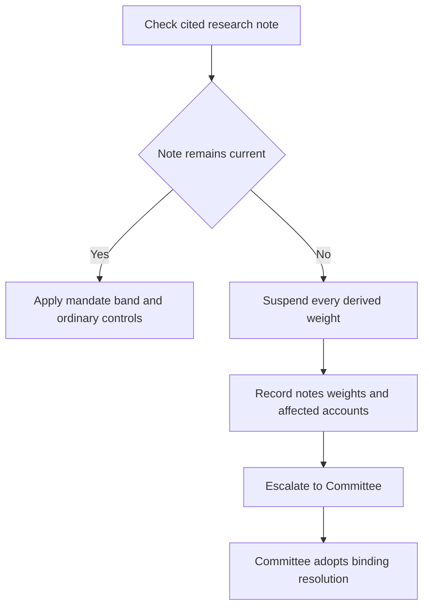

# Internal Guidance: Discretion, Escalation, and Non-Approvals

This guidance consolidates the firm-wide discretion matrix with the mandate and suitability controls that invoke it. It is internal operational guidance, not research or client-specific investment advice. A mandate may impose a tighter restriction, but it cannot expand the discretion granted here.

## Authority boundary and size limits

Portfolio managers have base discretion. Senior portfolio managers have expanded discretion and can clear **one escalation condition per account**. Committee approval is required when a matter exceeds senior discretion, an account has more than one escalation condition, or a stated tolerance band needs an exception.

The firm-wide single-issuer limits are measured against account market value:

| Authority | Single-issuer position allowed without further size escalation | What follows above the limit |
|---|---:|---|
| Portfolio manager | Up to 3% | Senior discretion may cover up to 5% |
| Senior portfolio manager | Up to 5% | Committee approval plus a written concentration rationale |
| Committee | Above 5% | The resulting position is also subject to the concentrated-position guide |

The 5% escalation threshold is not the same as the suitability definition of a concentrated position. A position becomes concentrated at more than 15% of liquid portfolio market value, or more than 10% if it is employer or affiliate stock. At acquisition and annual review, such a position needs a documented suitability determination stating the client’s reason for holding, tax cost of unwinding, and any restriction on unwinding. Client preference and low tax basis do not replace that determination.

## Approval triggers

Approval is required regardless of size for the following conditions:

- a weight outside its stated tolerance band, except a breach caused by suspension of supporting research;
- a position in a research-underweight sector where the mandate makes that preference a binding limit;
- a hedge of a concentrated position, including a collar, prepaid forward, or exchange fund; and
- an extension of municipal duration beyond the 8–15 year band.

A municipal-duration exception cannot be granted portfolio-wide. Before executing a concentrated-position hedge, the tax consequences must be addressed in writing.

Private-markets commitments have two distinct gates. They require approval, but an eligibility determination under the private-markets guide must be completed before approval is sought. Eligibility is a regulatory determination, while suitability and the applicable liquidity constraint remain separate requirements even for an eligible client.

### Mandate-specific controls remain tighter

The governing allocation guide supplies the actual band and limit where one exists. For US taxable fixed income, targets have a ±2 percentage-point month-end market-value band; ordinary drift outside it is rebalanced in the next monthly cycle. Its municipal implementation limits include a 35% cap in any one preferred sector, approval for positions in the named restricted sectors, and the 8–15 year municipal duration band. Global multi-asset mandates have ±5 percentage-point equity and fixed-income bands and a ±3 percentage-point real-assets band. Private markets is commitment-paced rather than ordinarily rebalanced: denominator-effect drift above its strategic weight is neither a breach nor traded, while drift from over-commitment is a pacing failure requiring escalation.

## Superseded research: suspend, record, and escalate

A binding allocation does not remain current merely because its prior rationale still appears defensible. When a cited research note is superseded or withdrawn, the weight derived from it is suspended rather than carried forward. The manager must escalate to the Committee instead of re-deriving a weight or adopting the replacement note’s recommendation directly; turning a research view into a binding weight is a Committee act.

*Control flow when research supporting a mandate allocation changes.*

The escalation record must identify the superseded note, replacement note if one exists, every guide-derived weight, and affected accounts. A suspension-caused band breach is not ordinary drift and must not be automatically rebalanced. This distinction matters in US taxable fixed income: suspension of the municipal overweight also suspends its paired investment-grade corporate underweight, and both return to neutral pending a Committee decision.

For global multi-asset bands, the same suspension rule returns an affected band to the prior Committee-adopted level pending review. Separately, a concentrated-position unwind plan must be reviewed annually; no change across three consecutive reviews is evidence it is not being applied and is escalated under the matrix.

## Absolute prohibitions: approval does not cure them

The following controls are prohibitions, not escalation paths. Their source wording is reproduced so that an approval is not mistaken for an exception:

> “A position in employer securities may not be traded on the firm's discretion during a blackout period. This is a prohibition and may not be cleared by approval.” — [Concentrated Position Suitability Guide, §C.5](repo://internal_guidelines/suitability/concentrated-positions.md#L25-L29)

> “Any private markets commitment for a client who is not eligible under P.1. Eligibility is a regulatory determination and approval is not a substitute for it.” — [Discretion and Escalation Matrix, §D.5](repo://internal_guidelines/authority/discretion-matrix.md#L39-L47)

> “Any position that would breach a stated regulatory requirement. Regulatory requirements are not investment discretion, and an approval cannot create an exception to them.” — [Discretion and Escalation Matrix, §D.5](repo://internal_guidelines/authority/discretion-matrix.md#L39-L47)

For employer securities, the file must also record applicable trading windows, blackout periods, pre-clearance requirements, and any Rule 10b5-1 plan. No authority tier changes a regulatory requirement, makes an ineligible client eligible, or converts a prohibited employer-security trade into a permitted one.

## Audit record and operating checklist

Every cleared escalation must record the condition, authority level that cleared it, specific facts relied on, and date. Audit treats an escalation cleared without a recorded basis as an unapproved position and charges it back to the clearing manager’s file review. Eligibility records have an analogous standard: they must record the pathway, evidence, decision maker, and date; without a recorded basis, audit treats the file as having no eligibility determination.

Use this sequence at the point of action:

1. Identify the governing mandate, its band or binding limit, and any client-specific restriction.
2. Check issuer size, concentration status, and all approval conditions for the account together; do not treat multiple conditions as independent senior approvals.
3. Verify that cited research remains current. If it does not, suspend the derived allocation and prepare the superseded-note escalation record rather than rebalancing or re-deriving it.
4. For private markets and employer securities, test the non-discretionary compliance gate before seeking or acting on an investment approval.
5. Record the decision basis and authority before execution; retain the required suitability, tax, eligibility, and trade-restriction documentation alongside it.

## Source basis

- [Portfolio Manager Discretion and Escalation Matrix, §§D.1–D.6](repo://internal_guidelines/authority/discretion-matrix.md#L1-L51)
- [US Taxable Account Fixed Income Allocation Guide, §§A.1, A.4, A.6](repo://internal_guidelines/allocation/us-taxable-fixed-income.md#L7-L47)
- [Global Multi-Asset Allocation Bands, §§B.1–B.7](repo://internal_guidelines/allocation/gl-multi-asset-bands.md#L7-L39)
- [Concentrated Position Suitability Guide, §§C.1–C.6](repo://internal_guidelines/suitability/concentrated-positions.md#L7-L33)
- [Private Markets Client Eligibility Determination Guide, §§P.1–P.6](repo://internal_guidelines/suitability/private-markets-eligibility.md#L7-L35)
