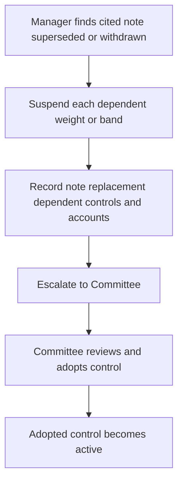

# Internal Guidance: Discretion and Escalation

> **Binding internal authority guidance — not research and not client investment advice.** This page defines the approval boundary for discretionary mandates. A mandate-specific guide may impose a tighter control, but cannot expand the discretion set here.

## Authority tiers and governing controls

Portfolio managers have base discretion. Senior portfolio managers have expanded discretion and may clear **one escalation condition per account**. Committee approval is required when an action exceeds senior discretion, when an account has more than one escalation condition, or when an exception to a stated band is requested.

Apply the more restrictive applicable control. The [global multi-asset bands](/openwiki/guidance/allocation/global-multi-asset-bands.md) govern their strategic weights and tolerance bands, while [US taxable fixed income](/openwiki/guidance/allocation/taxable-fixed-income.md) governs its sleeve bands and municipal limits. This authority guidance determines *who may clear an exception*; it does not change the mandate control itself.

### Position-size threshold

| Proposed single-issuer position | Required authority and follow-up |
| --- | --- |
| Up to 3% of account market value | Portfolio-manager base discretion |
| Above 3% through 5% | Senior portfolio-manager discretion |
| Above 5% | Committee approval and a written concentration rationale |

A position above 5% is also subject to the [concentrated-positions guidance](/openwiki/guidance/suitability/concentrated-positions.md). That guide defines a concentrated position separately: over 15% of liquid portfolio market value, or over 10% for employer securities. Its suitability determination, annual review, and unwind-plan requirements therefore remain applicable even where the position-size approval threshold has been met.

## Mandatory approval entrypoints

The following conditions require approval regardless of position size:

- A weight outside its stated tolerance band, except a suspension-driven condition, which follows the escalation process below rather than ordinary band-exception treatment. See the applicable [global multi-asset](/openwiki/guidance/allocation/global-multi-asset-bands.md) or [US taxable fixed-income](/openwiki/guidance/allocation/taxable-fixed-income.md) controls.
- A position in a research-underweight sector where the governing mandate makes that preference a binding limit. For US taxable municipal credit, this includes standalone senior living, single-asset student housing, and single-obligor industrial-development paper.
- A hedge of a concentrated position. Before execution, document the tax consequences of collars, prepaid forwards, or exchange funds as required by the concentrated-positions guide.
- Municipal duration beyond 15 years. This exception cannot be granted on a portfolio-wide basis; the US taxable fixed-income guide otherwise sets an 8–15 year municipal duration band.
- Every private-markets commitment. First obtain the documented eligibility determination required by the [private-markets eligibility guidance](/openwiki/guidance/suitability/private-markets-eligibility.md); approval is an additional requirement, not a substitute for eligibility, suitability, or the applicable liquidity constraint.

## Superseded-note escalation and no-carry-forward rule

A cited research note being superseded or withdrawn is a control-state change, not an invitation for a manager to choose a successor allocation. Suspend each weight or band derived from that note and escalate it to the Committee. Do not re-derive the control, carry the suspended derived weight forward, automatically rebalance it, or directly adopt the replacement note's recommendation.

This flow shows the required research-change path; only a Committee adoption returns a dependent control to active use.

The escalation record must identify the superseded note, a replacement if one exists, every weight or band derived from it, and every affected account. For a research-dependent control, Committee adoption—not the manager's view of the old or replacement research—creates the binding successor control.

Follow the mandate guide's prescribed interim treatment. For example, the global multi-asset guide says a suspended research-dependent band returns to its **prior Committee-adopted level** pending review. That is distinct from carrying forward the suspended derived band: the manager applies a separately adopted prior control specified by the guide, rather than treating the invalidated control as still approved. In US taxable fixed income, a suspension-driven condition is not an ordinary drift breach and must not be mechanically rebalanced.

## Conditions that approval cannot clear

Some conditions are prohibitions or regulatory gates, rather than escalation conditions. No authority tier and no Committee approval may clear them:

- Do not trade employer securities on firm discretion during a blackout period. The concentrated-positions guide also requires the file to record applicable trading windows, blackout periods, pre-clearance requirements, and any Rule 10b5-1 plan.
- Do not make a private-markets commitment for a client without eligibility determined and documented under the private-markets eligibility guide. Eligibility is a regulatory determination outside portfolio-manager discretion. A carried-forward pre-effective-date determination cannot support a new commitment made on or after the effective date addressed in that guide.
- Do not establish a position that breaches a stated regulatory requirement. Regulatory compliance is not investment discretion and cannot be made compliant by approval.

These prohibitions are separate from suitability and liquidity controls. In particular, private-markets eligibility is necessary but not sufficient: suitability and the research-framework liquidity constraint continue to apply; unfunded commitments may not exceed two years of liquid-portfolio spending.

## Audit documentation standard

For every cleared escalation, retain an auditable record of the condition, the authority level that cleared it, the specific facts relied on, and the date. A cleared escalation without a recorded basis is treated as an unapproved position in audit and is charged back to the clearing manager's file review.

For private-markets eligibility, retain the separate determination record: pathway, evidence, determiner, and date. A record without that basis is treated as no eligibility determination in audit. For concentration matters, retain the separate suitability determination and review record required by the concentrated-positions guide; approval of a trade does not replace either record.

## Source guides

- [Discretion matrix](repo://guidelines/authority/discretion-matrix.md) — authority tiers, position size, approval triggers, superseded-note escalation, non-clearable conditions, and escalation documentation.
- [Global multi-asset bands](repo://guidelines/allocation/gl-multi-asset-bands.md) — strategic-band exceptions, research-change suspension, private-markets pacing, and review.
- [US taxable fixed income](repo://guidelines/allocation/us-taxable-fixed-income.md) — sleeve-band exceptions, municipal sector and duration limits, research-change handling, and monthly rebalancing.
- [Concentrated positions](repo://guidelines/suitability/concentrated-positions.md) — concentration definition, suitability, hedging, employer-security, and unwind controls.
- [Private-markets eligibility](repo://guidelines/suitability/private-markets-eligibility.md) — eligibility boundary, carry-forward limits, documentation, and separate suitability requirement.
