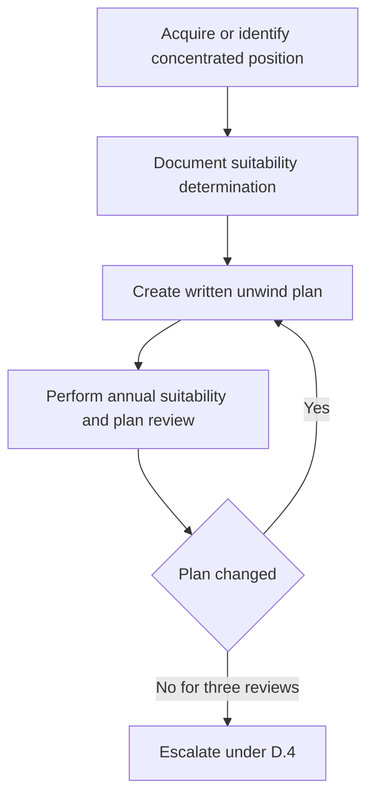

# Internal Guidance: Concentrated Positions

> **Binding internal compliance guidance — not research and not client investment advice.** Apply this guide to concentrated single-security positions in client accounts. It works alongside the [discretion and escalation guidance](/openwiki/guidance/authority/discretion-and-escalation.md): an approval required there does not replace the suitability, review, or documentation controls here.

## Identify a concentrated position

A position is concentrated when it exceeds either applicable threshold:

| Security | Concentration threshold |
| --- | --- |
| Any single security | More than **15%** of the client’s liquid portfolio market value |
| Client’s employer or an affiliate | More than **10%** of the client’s liquid portfolio market value |

The lower employer-security threshold applies because employer exposure may compound investment risk with employment-related financial exposure. Crossing a threshold activates this guide’s standing suitability and unwind-plan requirements; it is distinct from the discretion matrix’s separate approval threshold for a proposed single-issuer position above 5% of account market value.

## Standing suitability determination

Document a suitability determination both **at acquisition** and **at each annual review** of a concentrated position. The determination must record:

- the client’s stated reason for holding the position;
- the tax cost of unwinding it; and
- any restriction that prevents an unwind.

A preference to hold is not, by itself, a suitability determination. The file must also show that concentration risk was explained and that the client made an informed decision. Likewise, low tax basis may justify careful unwind planning, but it neither removes the determination requirement nor makes an unsuitable concentration suitable.

## Unwind-plan lifecycle

Every concentrated position must have a written unwind plan and that plan must be reviewed annually. Treat the plan as an active control over a continuing exposure, not merely as acquisition paperwork.

This flow shows the recurring documentation cycle and the escalation trigger for an unchanged plan.

A plan that has not changed in **three consecutive reviews** is evidence that it is not being applied and must be escalated under D.4 of the discretion matrix. Do not treat escalation as a substitute for the annual review: the review remains the mechanism that tests whether the existing plan is being applied.

## Hedging requires approval and tax documentation

A hedge of a concentrated position requires approval under D.3 of the discretion matrix **regardless of size**. This is an approval rule, not a general permission to hedge without the usual concentration controls.

Before execution, address in writing the tax consequences of the proposed strategy. The guide specifically identifies collars, prepaid forwards, and exchange funds. Retain this written tax analysis with the position’s suitability and hedge-approval records so that the basis for both the strategy and its consequences is clear.

## Employer securities: additional records and a non-clearable prohibition

For employer securities, the file must additionally record each applicable trading window, blackout period, and pre-clearance requirement, plus any Rule 10b5-1 plan in force. These facts constrain whether and how the position may be traded; they are not optional background notes.

Do not trade employer securities on the firm’s discretion during a blackout period. This is a prohibition: employer-security trading during blackout **may not be cleared by approval**. Keep that prohibition distinct from the hedge-approval rule above and from other escalations that an authority tier may clear.

## Relationship to discretion controls

Use the discretion matrix for authority decisions while using this guide for concentration suitability and maintenance:

- A proposed single-issuer position above 5% of account market value requires Committee approval and a written concentration rationale, and it is thereafter subject to this guide.
- Any concentrated-position hedge requires approval under D.3, regardless of its size.
- A blackout-period employer-security trade cannot be cleared at any authority level.
- A cleared escalation needs its own record of the condition, clearing authority, specific facts, and date. That audit record is separate from the suitability determination, annual review, unwind plan, and employer-security records required here.

## Source guides

- [Concentrated position suitability guide](repo://guidelines/suitability/concentrated-positions.md) — thresholds, suitability determination, hedging, employer-security, and unwind-plan controls.
- [Portfolio manager discretion and escalation matrix](repo://guidelines/authority/discretion-matrix.md) — position-size authority, hedge approval, D.4 escalation, non-clearable conditions, and audit documentation.
