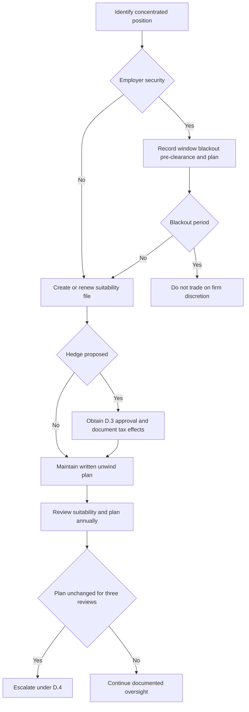

# Internal Guidance: Concentrated Position Suitability and Unwind Controls

This is internal compliance guidance for holding, hedging, and unwinding concentrated single-security positions in client accounts. It is not a research note or client-specific investment advice. The discretion matrix supplies the authority framework used by the hedge approval and unwind escalation controls.

## When the control applies

A position is concentrated when it exceeds **15% of the client's liquid portfolio market value**. The threshold is tighter—**more than 10%**—when the security is the client's employer or an affiliate. These are suitability thresholds, distinct from the discretion matrix's single-issuer size authorities: a portfolio manager may take up to 3% of account market value, a senior portfolio manager up to 5%, and a position above 5% needs Committee approval and a written concentration rationale before becoming subject to this guide.

## Suitability file: create and renew it

The account file needs a documented suitability determination at two lifecycle points:

1. **Acquisition** of a concentrated position.
2. **Each annual review** while the position remains concentrated.

The determination must record the client's stated reason for holding, the tax cost of unwinding, and any restriction that prevents an unwind. It must also record that concentration risk was explained and that the client's decision was informed. A stated preference to hold is not, by itself, a suitability determination.

Low tax basis informs how to design an unwind, but it does not remove the documentation requirement or make an unsuitable concentration suitable. The recurring file is therefore an active reassessment control, not a one-time client acknowledgment.

## Hedge approval is a gate, not a discretion-by-size exception

A hedge of a concentrated position requires approval under **§D.3 of the discretion matrix regardless of size**. Before execution, address the tax consequences in writing; the guide specifically identifies collars, prepaid forwards, and exchange funds as transactions with tax consequences.

Under the matrix, approval conditions must be assessed at the account level. Senior portfolio managers may clear one escalation condition per account; Committee approval is required when a matter exceeds senior discretion or an account carries more than one escalation condition. The cleared record must state the condition, clearing authority, facts relied on, and date; without a recorded basis, audit treats the escalation as an unapproved position.

## Employer securities: document restrictions and preserve the absolute bar

For employer securities, supplement the suitability file with applicable trading-window, blackout-period, and pre-clearance requirements, plus any Rule 10b5-1 plan in force. This documentation does not create permission to trade.

> “A position in employer securities may not be traded on the firm's discretion during a blackout period. This is a prohibition and may not be cleared by approval.” — Concentrated Position Suitability Guide, §C.5

This is an **absolute blackout prohibition**, not an approval condition: no portfolio-manager, senior-manager, or Committee approval can clear it. That differs from a concentrated-position hedge, which is an approval-required condition under §D.3 and may proceed only through the applicable authority process.

*Control flow from concentration identification through employer-security gating, hedge approval, and recurring unwind review.*

## Unwind-plan lifecycle and stale-plan escalation

Every concentrated position must carry a written unwind plan, reviewed annually. Treat the plan and the suitability determination as related but separate records: the determination supports the decision to hold; the plan documents the intended route for reducing or managing the concentration.

A plan unchanged in **three consecutive reviews** is evidence that it is not being applied. Escalate that condition under §D.4 of the discretion matrix rather than treating repeated unchanged language as proof of continuing review. The escalation mechanism requires a documented basis and applicable authority; it should preserve the three-review history and the current suitability and restriction facts needed for review.

## Operating checklist

- Measure the holding against liquid portfolio market value and apply the employer-or-affiliate threshold when relevant.
- At acquisition and annually, complete the suitability determination with the holding rationale, unwind tax cost, restrictions, explained risk, and informed decision.
- Maintain and annually review the written unwind plan; escalate after three consecutive unchanged reviews.
- If hedging is proposed, document tax consequences and obtain §D.3 approval regardless of position size.
- For employer securities, record applicable trade restrictions and Rule 10b5-1 plan information, then stop any firm-discretion trade during a blackout. Do not seek approval as a workaround.

## Source basis

- [Concentrated Position Suitability Guide, §§C.1–C.6](repo://internal_guidelines/suitability/concentrated-positions.md#L7-L33)
- [Portfolio Manager Discretion and Escalation Matrix, §§D.1–D.6](repo://internal_guidelines/authority/discretion-matrix.md#L7-L51)
