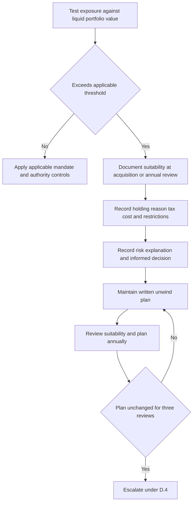

## Purpose and control boundary

This is internal compliance guidance for holding, hedging, and unwinding concentrated single-security positions in client accounts; it is not research or client-specific investment advice. Suitability answers whether the concentration may be held and what must be documented. It does not supply an investment thesis or replace mandate-specific limits and the discretion matrix. A mandate may be more restrictive than the matrix, but may not grant broader discretion. [Concentrated Position Suitability Guide, introduction](repo://internal_guidelines/suitability/concentrated-positions.md#L1-L5) [Discretion Matrix D.1](repo://internal_guidelines/authority/discretion-matrix.md#L7-L11)

## Classification and authority are separate tests

Classify a single-security position as concentrated when it **exceeds** the applicable percentage of the client’s liquid portfolio market value:

| Security | Threshold |
|---|---:|
| Any single security | More than 15% |
| Client’s employer or an affiliate | More than 10% |

Apply the lower employer/affiliate threshold when it applies. [Concentrated Position Suitability Guide C.1](repo://internal_guidelines/suitability/concentrated-positions.md#L7-L10)

Do not confuse this suitability classification with position-initiation authority. The matrix permits a portfolio manager to take a single-issuer position up to 3% of account market value and a senior portfolio manager up to 5%. Above 5% requires committee approval and a written concentration rationale; the position is then subject to the concentrated-position guide’s standing suitability requirement. The rationale and approval support authority; they do not substitute for the suitability record. [Discretion Matrix D.2](repo://internal_guidelines/authority/discretion-matrix.md#L13-L15) [Concentrated Position Suitability Guide C.2](repo://internal_guidelines/suitability/concentrated-positions.md#L11-L13)

## Standing suitability record

For every concentrated position, create a documented suitability determination at acquisition and at each annual review. Record:

- the client’s stated reason for holding;
- the tax cost of unwinding; and
- any restriction that prevents an unwind.

A stated preference to retain the security is not, by itself, a suitability determination. The file must show that concentration risk was explained and that the client’s decision was informed. Low tax basis can require careful unwind planning, but it neither removes the determination requirement nor makes an unsuitable concentration suitable. [Concentrated Position Suitability Guide C.2–C.3](repo://internal_guidelines/suitability/concentrated-positions.md#L11-L19)

## Review lifecycle

This lifecycle shows the documentation and recurring-review controls that apply after a position meets the concentration definition. [Concentrated Position Suitability Guide C.1–C.3, C.6](repo://internal_guidelines/suitability/concentrated-positions.md#L7-L19) [Concentrated Position Suitability Guide C.6](repo://internal_guidelines/suitability/concentrated-positions.md#L31-L33)

## Hedging: approval plus written tax treatment

A hedge of a concentrated position requires D.3 approval **regardless of size**. Before executing a collar, prepaid forward, or exchange fund, address its tax consequences in writing. This is an approval condition, not a conclusion about whether the investment rationale is sound. [Concentrated Position Suitability Guide C.4](repo://internal_guidelines/suitability/concentrated-positions.md#L21-L23) [Discretion Matrix D.3](repo://internal_guidelines/authority/discretion-matrix.md#L17-L29)

For a cleared escalation, record the condition, clearing authority level, specific facts relied on, and date. Without that recorded basis, audit treats the position as unapproved. This recordkeeping rule applies only to a condition that may be cleared; it cannot override a non-clearable prohibition. [Discretion Matrix D.5–D.6](repo://internal_guidelines/authority/discretion-matrix.md#L39-L51)

## Employer securities: file requirements and blackout stop

For an employer security, additionally record every applicable trading window, blackout period, pre-clearance requirement, and Rule 10b5-1 plan in force. [Concentrated Position Suitability Guide C.5](repo://internal_guidelines/suitability/concentrated-positions.md#L25-L27)

> A position in employer securities may not be traded on the firm's discretion during a blackout period. This is a prohibition and may not be cleared by approval.

This is a non-clearable stop, not an approval or escalation request: the suitability guide states the prohibition and the matrix says that no authority level may approve trading employer securities on firm discretion during a blackout period. [Concentrated Position Suitability Guide C.5](repo://internal_guidelines/suitability/concentrated-positions.md#L25-L29) [Discretion Matrix D.5](repo://internal_guidelines/authority/discretion-matrix.md#L39-L47)

## Unwind plan and recurring escalation

Maintain a written unwind plan for every concentrated position and review it annually. A plan that has not changed in three consecutive reviews is evidence that it is not being applied and must be escalated under D.4. [Concentrated Position Suitability Guide C.6](repo://internal_guidelines/suitability/concentrated-positions.md#L31-L33)

## Operator checklist

1. Measure each single-security exposure against liquid portfolio market value and apply the employer/affiliate threshold where relevant. [Concentrated Position Suitability Guide C.1](repo://internal_guidelines/suitability/concentrated-positions.md#L7-L10)
2. Separately apply the discretion matrix’s issuer-size authority tier; for exposure above 5%, obtain committee approval and a written concentration rationale. [Discretion Matrix D.2](repo://internal_guidelines/authority/discretion-matrix.md#L13-L15)
3. At acquisition and annually, complete the suitability record, including holding reason, unwind tax cost, restrictions, risk explanation, and informed client decision. [Concentrated Position Suitability Guide C.2–C.3](repo://internal_guidelines/suitability/concentrated-positions.md#L11-L19)
4. Maintain and annually review the unwind plan; escalate under D.4 after three consecutive unchanged reviews. [Concentrated Position Suitability Guide C.6](repo://internal_guidelines/suitability/concentrated-positions.md#L31-L33)
5. Before a concentrated-position hedge, obtain D.3 approval and document the required tax treatment. [Concentrated Position Suitability Guide C.4](repo://internal_guidelines/suitability/concentrated-positions.md#L21-L23) [Discretion Matrix D.3](repo://internal_guidelines/authority/discretion-matrix.md#L17-L29)
6. For employer securities, maintain the required trading-status record and stop firm-discretion trading during a blackout; do not seek approval to cure it. [Concentrated Position Suitability Guide C.5](repo://internal_guidelines/suitability/concentrated-positions.md#L25-L29) [Discretion Matrix D.5](repo://internal_guidelines/authority/discretion-matrix.md#L39-L47)
