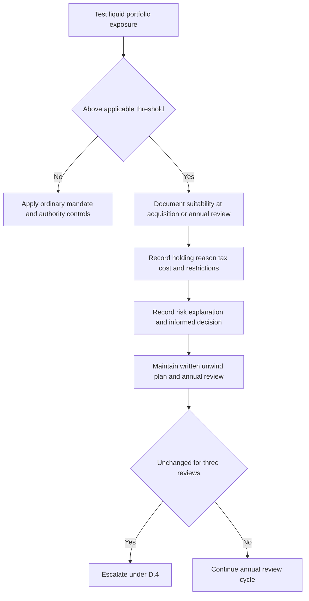

## Scope and threshold

This guidance governs the continued holding, hedging, and unwinding of concentrated single-security positions in client accounts. It is internal compliance guidance, not research or client-specific investment advice. [Concentrated Position Suitability Guide, introduction](repo://guidelines/suitability/concentrated-positions.md#L1-L5)

Treat a position as concentrated when it **exceeds** either applicable threshold:

| Security and measurement | Concentration threshold |
|---|---:|
| Any single security | More than 15% of the client’s liquid portfolio market value |
| Client’s employer or an affiliate | More than 10% of the client’s liquid portfolio market value |

The employer/affiliate threshold is lower, so classify that exposure using the 10% test rather than the general 15% test. These suitability thresholds are distinct from the discretion matrix’s authority limits: a portfolio manager may initiate a single-issuer position up to 3% of account market value, a senior portfolio manager up to 5%, and exposure above 5% requires committee approval and a written concentration rationale. An above-5% position is also subject to the C.2 suitability requirement. [Concentrated Position Suitability Guide C.1](repo://guidelines/suitability/concentrated-positions.md#L7-L10) [Discretion Matrix D.2](repo://guidelines/authority/discretion-matrix.md#L13-L15)

## Standing suitability record

Create a documented suitability determination both **at acquisition** and at **each annual review** for every concentrated position. The determination must record:

- the client’s stated reason for holding;
- the tax cost of unwinding; and
- any restriction that prevents an unwind.

A client’s preference to retain the security is not sufficient by itself. The file must also show that concentration risk was explained and that the client made an informed decision. Low tax basis may justify careful unwind planning, but it neither removes the determination requirement nor turns an unsuitable concentration into a suitable one. [Concentrated Position Suitability Guide C.2–C.3](repo://guidelines/suitability/concentrated-positions.md#L11-L19)

## Operating control flow

This flow shows the suitability and unwind-planning lifecycle once a holding crosses the applicable concentration threshold. [Concentrated Position Suitability Guide C.1–C.3, C.6](repo://guidelines/suitability/concentrated-positions.md#L7-L19) [Concentrated Position Suitability Guide C.6](repo://guidelines/suitability/concentrated-positions.md#L31-L33)

## Hedge decisions require approval

A hedge of a concentrated position requires approval under **D.3 regardless of size**. Do not treat a hedge as an ordinary within-discretion trade merely because its notional amount is small. Before executing a collar, prepaid forward, or exchange fund, address its tax consequences in writing. [Concentrated Position Suitability Guide C.4](repo://guidelines/suitability/concentrated-positions.md#L21-L23) [Discretion Matrix D.3](repo://guidelines/authority/discretion-matrix.md#L17-L29)

For any cleared hedge escalation, retain the condition, authority level that cleared it, specific facts relied on, and date. A cleared escalation without a recorded basis is treated in audit as an unapproved position. This documentation rule records a valid clearance; it does not create authority to override a prohibition. [Discretion Matrix D.6](repo://guidelines/authority/discretion-matrix.md#L49-L51) [Discretion Matrix D.5](repo://guidelines/authority/discretion-matrix.md#L39-L47)

## Employer securities: file requirements and blackout stop

For a concentrated employer-security position, additionally record every applicable trading window, blackout period, pre-clearance requirement, and any Rule 10b5-1 plan in force. [Concentrated Position Suitability Guide C.5](repo://guidelines/suitability/concentrated-positions.md#L25-L27)

> “A position in employer securities may not be traded on the firm's discretion during a blackout period. This is a prohibition and may not be cleared by approval.”

This is a non-clearable stop, not an escalation or approval request. The discretion matrix likewise lists trading employer securities on firm discretion during a blackout period among conditions that may not be approved at any level. [Concentrated Position Suitability Guide C.5](repo://guidelines/suitability/concentrated-positions.md#L25-L29) [Discretion Matrix D.5](repo://guidelines/authority/discretion-matrix.md#L39-L47)

## Unwind plan and recurring escalation

Every concentrated position must carry a written unwind plan, reviewed annually alongside the suitability determination. If that plan has not changed in **three consecutive reviews**, treat that as evidence that it is not being applied and escalate it under **D.4**. [Concentrated Position Suitability Guide C.6](repo://guidelines/suitability/concentrated-positions.md#L31-L33)

D.4 is the matrix’s committee-escalation path: it requires escalation rather than a portfolio manager independently carrying forward or deriving a replacement action when its trigger applies. Preserve the escalation record and route it to the committee rather than treating repeated unchanged plans as self-clearing. [Discretion Matrix D.4](repo://guidelines/authority/discretion-matrix.md#L31-L37)

## Review checklist

1. Measure each single-security exposure against liquid portfolio market value and apply the lower employer/affiliate threshold where relevant. [Concentrated Position Suitability Guide C.1](repo://guidelines/suitability/concentrated-positions.md#L7-L10)
2. At acquisition and annually, complete the suitability record, including holding rationale, unwind tax cost, restrictions, risk explanation, and informed client decision. [Concentrated Position Suitability Guide C.2–C.3](repo://guidelines/suitability/concentrated-positions.md#L11-L19)
3. Maintain and annually review the written unwind plan; escalate under D.4 after three consecutive unchanged reviews. [Concentrated Position Suitability Guide C.6](repo://guidelines/suitability/concentrated-positions.md#L31-L33)
4. Obtain D.3 approval and written tax analysis before executing any concentrated-position hedge. [Concentrated Position Suitability Guide C.4](repo://guidelines/suitability/concentrated-positions.md#L21-L23) [Discretion Matrix D.3](repo://guidelines/authority/discretion-matrix.md#L17-L29)
5. For employer securities, update required trading-status records and stop firm-discretion trading during a blackout; do not seek approval to cure the blackout. [Concentrated Position Suitability Guide C.5](repo://guidelines/suitability/concentrated-positions.md#L25-L29)
