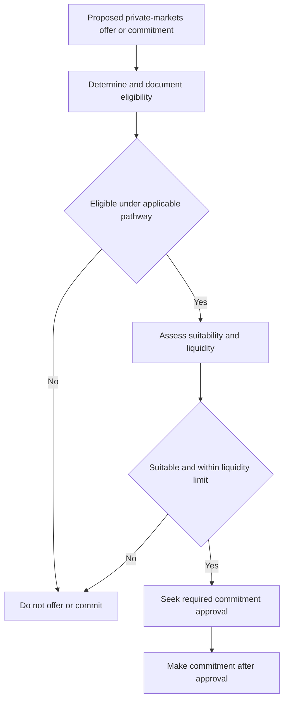

# Internal Guidance: Private Markets Eligibility and Suitability

> **Binding firm guidance — not research and not client investment advice.** Use this guide before offering a private-markets strategy and before seeking approval for a private-markets commitment. Eligibility is a regulatory determination outside portfolio-manager discretion; approval cannot cure an absent or failed determination.

## Control boundary: eligibility first, then separate decisions

No private-markets strategy may be offered until the client's eligibility has been determined and documented. Every private-markets commitment also requires approval, but the approval request comes **after** the documented eligibility determination and does not replace it. A commitment for a client who is not eligible is a condition that no authority level may clear.

Eligibility is necessary, not sufficient. After the regulatory gate is satisfied, assess client suitability and liquidity before committing. Keep these decisions and their records distinct: a client can clear eligibility yet fail the suitability or liquidity assessment.

This control flow shows that regulatory eligibility precedes both suitability assessment and the separate approval required for every commitment.

## SEC requirement: indexed qualified-purchaser thresholds

**SEC Release 2025-08 Q.2** sets the indexed qualified-purchaser thresholds. **“Effective for determinations made on or after 2026-01-01.”** For a determination in that period, the natural-person investments threshold is **$6.2 million** and the family-company threshold is **$31 million**. The release indexes the thresholds every five years using its adopting-text methodology.

This guide **implements** SEC Release 2025-08 Q.2: apply the release's threshold that corresponds to the client and determination date rather than treating a prior determination as a current one. The guide deliberately directs personnel to the release for the operative threshold, because a copied amount can become stale as indexation occurs.

### Carried-forward determinations and new commitments

SEC Release 2025-08 Q.4 preserves a qualified-purchaser determination properly made before 2026-01-01: it is not invalidated, and the client need not divest merely because the indexed threshold is no longer met. However, such a client may not be treated as a qualified purchaser for a new determination on or after that effective date.

Firm guidance makes the operational consequence explicit: **“A carried-forward determination may not be used as the basis for a new commitment made on or after the effective date.”** Obtain a new, documented determination under the indexed threshold before that new commitment. This restriction is a regulatory gate, not an exception that approval can clear.

## Accredited investor is a separate pathway

SEC Release 2025-08 Q.3 **preserves** the accredited-investor criteria without change, including the existing professional-certification pathway. Determine accredited-investor status separately from qualified-purchaser status. A client may be accredited without being a qualified purchaser, so the strategies that may be offered depend on the pathway actually satisfied; do not infer one status from the other.

## Determination record and audit treatment

For **every** eligibility determination, retain a record of:

- the eligibility pathway relied on;
- the supporting evidence;
- the person who made the determination; and
- the determination date.

The adviser must retain the basis for a determination. For a carried-forward determination, record specifically that it was made under the prior thresholds. A determination with no recorded basis is treated as no determination in audit. These eligibility records are separate from any commitment-approval record, which must document the cleared condition, authority level, facts relied upon, and date.

## Firm suitability and liquidity assessment

**Firm guidance** requires an eligible client also to meet the suitability standard and the liquidity constraint in the private-markets framework before commitment. Underwrite the allocation against the client's spending requirement, not its expected return. The binding liquidity limit is that unfunded commitments must not exceed **two years of liquid-portfolio spending**.

This suitability and liquidity control constrains a proposed commitment after eligibility; it does not change the SEC qualification test. Record the assessment with the commitment file so review can distinguish the client's regulatory pathway from the rationale that the illiquid exposure is appropriate.

## Research view: input, not an eligibility rule

**Research view — MA-GL-PRIVATE-MARKETS 2025-12, applicable to positions taken on or after 2026-01-01:** for eligible clients with a genuine ten-year horizon, Multi-Asset Research supports a strategic private-markets allocation of 10–20%, weighted toward secondaries and private credit and away from primary buyout at current entry multiples. It identifies illiquidity, prolonged exit closures, and denominator effects as relevant risks.

The research note explicitly treats qualified-purchaser and accredited-investor thresholds as regulatory constraints, not a research conclusion. Its allocation view neither determines eligibility nor overrides this guide's pre-offer determination, the approval requirement, or the binding liquidity limit.

## Relationship to allocation and authority guidance

For a global balanced mandate, the strategic private-markets sleeve is 10% **for eligible clients**. If the client is not eligible, reallocate that sleeve pro rata across global equities, global fixed income, and real assets. Manage private-markets exposure through commitment pacing rather than ordinary rebalancing: denominator-effect drift is not traded, whereas drift caused by over-commitment is a pacing failure requiring escalation.

Use the [discretion and escalation guidance](/openwiki/guidance/authority/discretion-and-escalation.md) to identify the authority required for the commitment. Do not submit an approval request as a workaround for eligibility, suitability, or liquidity: all three remain independent controls.

## Source materials

- [SEC Release 2025-08 — Qualified Purchaser Threshold Indexation](repo://bulletins/SEC/2025-08-qualified-purchaser-threshold.md) — effective date, indexed thresholds, accredited-investor treatment, prior determinations, and recordkeeping.
- [Private Markets Eligibility Determination Guide](repo://guidelines/suitability/private-markets-eligibility.md) — binding pre-offer gate, implementation, carry-forward limitation, determination record, and separate suitability requirement.
- [Private Markets Allocation Framework, MA-GL-PRIVATE-MARKETS 2025-12](repo://research/MA/GL/PRIVATE-MARKETS/2025-12.md) — research view, horizon, and liquidity analysis.
- [Global Multi-Asset Allocation Bands](repo://guidelines/allocation/gl-multi-asset-bands.md) — eligible-client sleeve, noneligible reallocation, pacing, and binding liquidity limit.
- [Portfolio Manager Discretion and Escalation Matrix](repo://guidelines/authority/discretion-matrix.md) — commitment approval, non-clearable eligibility condition, and approval record.
