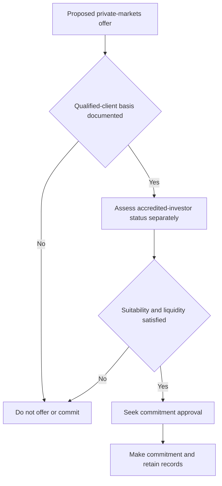

## Purpose and control boundary

This is firm operating guidance that implements, but does not replace, SEC Order IA-7104. The order is the authority for the Rule 205-3 dollar tests and transition; this guide defines the firm control sequence and record expected when using them. It is not research or client-specific investment advice. The underlying order is labelled a synthetic demonstration-corpus document and states that no reliance is possible. [Order notice](repo://external_sources/SEC/2026-04-order-ia-7104-qualified-client.md#L1-L8) [Eligibility guide P.1–P.2](repo://internal_guidelines/suitability/private-markets-eligibility.md#L7-L15)

No private-markets strategy may be offered until eligibility is determined and documented. Eligibility is a regulatory determination outside portfolio-manager discretion. A private-markets commitment requires approval regardless of size, but approval is requested only after eligibility is complete and cannot clear an ineligible client or another regulatory failure. [Eligibility guide P.1](repo://internal_guidelines/suitability/private-markets-eligibility.md#L7-L9) [Discretion matrix D.3, D.5](repo://internal_guidelines/authority/discretion-matrix.md#L17-L29) [Discretion matrix D.5](repo://internal_guidelines/authority/discretion-matrix.md#L39-L47)

This flow shows independent eligibility, investor-status, suitability/liquidity, and approval controls; a later gate never cures a failed earlier gate. [Eligibility guide P.1, P.4–P.6](repo://internal_guidelines/suitability/private-markets-eligibility.md#L7-L9) [Eligibility guide P.4–P.6](repo://internal_guidelines/suitability/private-markets-eligibility.md#L23-L35) [Discretion matrix D.3, D.5](repo://internal_guidelines/authority/discretion-matrix.md#L17-L29) [Discretion matrix D.5](repo://internal_guidelines/authority/discretion-matrix.md#L39-L47)

## Qualified-client test for a current entry

For an entry on or after the order's effective date, **2026-06-29**, use the adjusted Rule 205-3 tests in the order. A client qualifies through either path:

- at least **$1,400,000** under the investment adviser's management **immediately after entering into the advisory contract**; or
- the adviser's reasonable belief **immediately prior to entering into the advisory contract** that the client has net worth of **more than $2,700,000**. [Order Q.2](repo://external_sources/SEC/2026-04-order-ia-7104-qualified-client.md#L14-L18)

For the net-worth path, exclude the value of the primary residence and debt secured by it up to its fair-market value. A natural person's net worth may include assets held jointly with that person's spouse. Preserve the test selected and its entry-time timing evidence; a later balance is not the stated measurement point. [Order Q.3](repo://external_sources/SEC/2026-04-order-ia-7104-qualified-client.md#L20-L22) [Order Q.2](repo://external_sources/SEC/2026-04-order-ia-7104-qualified-client.md#L14-L18)

## Legacy entries are not reusable eligibility

The transition is entry-specific. A person who met the dollar test in force at entry remains a qualified client for an advisory contract entered into, or a private-fund investment made, before **2026-06-29**. Retain that carried-forward determination with the original entry and record that its basis used the prior thresholds. [Order Q.4](repo://external_sources/SEC/2026-04-order-ia-7104-qualified-client.md#L24-L28) [Eligibility guide P.3](repo://internal_guidelines/suitability/private-markets-eligibility.md#L17-L21)

> “A determination made before the effective date is preserved and is not disturbed by this order. Such a determination may not be relied upon for a contract entered into, or an investment made, on or after the effective date.” [Order Q.4](repo://external_sources/SEC/2026-04-order-ia-7104-qualified-client.md#L28-L28)

Accordingly, a legacy determination **may not be relied upon** for a new contract or subscription on or after **2026-06-29**. Make and document a current determination for that new entry under the adjusted amounts. [Order Q.4](repo://external_sources/SEC/2026-04-order-ia-7104-qualified-client.md#L24-L28) [Eligibility guide P.3](repo://internal_guidelines/suitability/private-markets-eligibility.md#L17-L21)

## Accredited-investor status is a separate test

Assess accredited-investor status independently from qualified-client status. IA-7104 adjusts only Rule 205-3 dollar tests; it does not adjust Regulation D accredited-investor standards or the qualified-purchaser definition. Neither a qualified-client conclusion nor approval establishes another status. [Order Q.6](repo://external_sources/SEC/2026-04-order-ia-7104-qualified-client.md#L34-L36) [Eligibility guide P.4](repo://internal_guidelines/suitability/private-markets-eligibility.md#L23-L25)

## Determination record and audit posture

For every determination, record the pathway, supporting evidence, decision maker, and date. Where relying on the order, retain the Rule 204-2(a)(8) record of the basis, including the dollar test used and determination date. A determination without a recorded basis is treated as no determination in audit. [Eligibility guide P.5](repo://internal_guidelines/suitability/private-markets-eligibility.md#L27-L29) [Order Q.5](repo://external_sources/SEC/2026-04-order-ia-7104-qualified-client.md#L30-L32)

The record should distinguish lifecycle state: a carried-forward record identifies the pre-effective-date entry and prior-threshold basis, while a current-entry record identifies the adjusted test, its timing, and its financial evidence. This prevents preserved historical status from being reused for a later entry. [Order Q.2, Q.4–Q.5](repo://external_sources/SEC/2026-04-order-ia-7104-qualified-client.md#L14-L18) [Order Q.4–Q.5](repo://external_sources/SEC/2026-04-order-ia-7104-qualified-client.md#L24-L32) [Eligibility guide P.3, P.5](repo://internal_guidelines/suitability/private-markets-eligibility.md#L17-L29)

## Separate suitability, liquidity, and pacing controls

Eligibility is necessary but insufficient. Before commitment, complete a separate suitability assessment and underwrite liquidity against the client's spending requirement, not expected return. Unfunded commitments may not exceed **two years of liquid-portfolio spending**. A commitment approval cannot clear a suitability or liquidity failure. [Eligibility guide P.6](repo://internal_guidelines/suitability/private-markets-eligibility.md#L31-L35) [Private-markets framework V.6](repo://internal_research/MA/GL/PRIVATE-MARKETS/2025-12.md#L36-L38) [Global bands B.6](repo://internal_guidelines/allocation/gl-multi-asset-bands.md#L31-L35)

Manage private-markets exposure through commitment pacing rather than ordinary rebalancing. A rise above strategic weight caused by a denominator effect is neither a breach nor a trade instruction; a rise caused by over-commitment is a pacing failure that must be escalated. Neither case relaxes the pre-commitment gates. [Global bands B.6](repo://internal_guidelines/allocation/gl-multi-asset-bands.md#L31-L35)

## Operator checklist

1. Identify the contract or investment entry date and classify the file as a legacy entry or a current entry.
2. For a current entry, document one qualified-client path with entry-time evidence; apply the residence exclusions for net worth.
3. For a legacy entry, retain its prior-threshold basis only for its original entry; do not reuse it for a new subscription on or after **2026-06-29**.
4. Determine accredited-investor status separately and retain its own basis.
5. Complete the suitability review and spending-based liquidity calculation; stop if the two-year limit would be exceeded.
6. Seek required commitment approval only after these gates pass, and retain the determination record. [Order Q.2–Q.5](repo://external_sources/SEC/2026-04-order-ia-7104-qualified-client.md#L14-L32) [Eligibility guide P.1, P.3–P.6](repo://internal_guidelines/suitability/private-markets-eligibility.md#L7-L9) [Eligibility guide P.3–P.6](repo://internal_guidelines/suitability/private-markets-eligibility.md#L17-L35) [Discretion matrix D.3, D.5](repo://internal_guidelines/authority/discretion-matrix.md#L17-L29) [Discretion matrix D.5](repo://internal_guidelines/authority/discretion-matrix.md#L39-L47)
