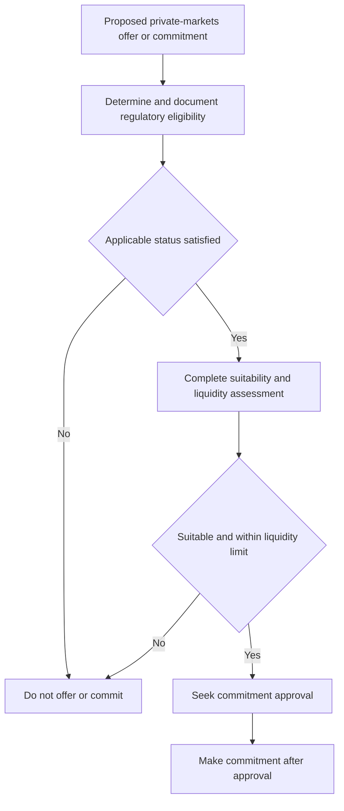

# Private Markets Client Eligibility and Suitability

> **Binding internal guidance — not research and not client investment advice.** This guide states the compliance entry gate for offering private-markets strategies and the separate controls required before a commitment. It does not decide whether a strategy is suitable for a particular client, set an allocation, or grant an approval exception.

## Control boundaries and operating sequence

Eligibility, suitability, liquidity, and approval answer different questions and require different records:

| Control | Decision | Owner and boundary |
| --- | --- | --- |
| **Eligibility** | May the strategy be offered under the applicable regulatory status? | Compliance determination; outside portfolio-manager discretion. |
| **Suitability** | Is illiquid exposure appropriate for this eligible client? | Client-specific assessment; eligibility alone is insufficient. |
| **Liquidity** | Can the client support the proposed unfunded commitments? | Underwrite against spending needs; the firm limit applies independently of eligibility. |
| **Approval** | Has the required authority cleared this private-markets commitment? | Every commitment requires approval; approval cannot cure an ineligible client or a regulatory breach. |

No private-markets strategy may be offered until eligibility is both determined and documented. For a proposed commitment, retain the eligibility determination, complete the separate suitability and liquidity assessment, and obtain the required approval. A client who fails eligibility must not be offered or committed to the strategy; this is a non-clearable condition, not an escalation that any authority tier can approve. [Eligibility Guide P.1](repo://guidelines/suitability/private-markets-eligibility.md#L7-L10) [Discretion Matrix D.3 and D.5](repo://guidelines/authority/discretion-matrix.md#L17-L29) [Discretion Matrix D.5](repo://guidelines/authority/discretion-matrix.md#L39-L47)

This sequence shows the independent gates: eligibility precedes an offer, while suitability, liquidity, and approval remain separate commitment controls.

## Qualified-client determination under SEC Order IA-7104

**SEC Order IA-7104** adjusts the dollar tests in Advisers Act Rule 205-3, effective **2026-06-29**. A client is a **qualified client** when it either has at least **$1,400,000** under management by the adviser immediately after entering the advisory contract, or the adviser reasonably believes immediately before the contract that the client has net worth of more than **$2,700,000**. The order is limited to those Rule 205-3 dollar tests. [Order IA-7104 Q.2](repo://bulletins/SEC/2026-04-order-ia-7104-qualified-client.md#L14-L18) [Order IA-7104 Q.6](repo://bulletins/SEC/2026-04-order-ia-7104-qualified-client.md#L34-L36)

The eligibility guide **implements** Order IA-7104 Q.2; it does not replace the order or make a copied amount independently operative. Apply the order's effective date and current test when making the determination. [Eligibility Guide P.2](repo://guidelines/suitability/private-markets-eligibility.md#L11-L15) [Order IA-7104 Q.2](repo://bulletins/SEC/2026-04-order-ia-7104-qualified-client.md#L14-L18)

For the net-worth route, exclude the value of the primary residence and debt secured by it up to fair market value. A natural person may include jointly held spousal assets. These calculation rules were not modified by the order. [Order IA-7104 Q.3](repo://bulletins/SEC/2026-04-order-ia-7104-qualified-client.md#L20-L22)

### Transition: preserve existing status, retest new business

A pre-effective-date determination is preserved for the advisory contract or private-fund investment entered into before 2026-06-29; the order does not require divestment solely because of the adjustment. It may **not** be relied upon for a contract or private-fund investment entered into on or after that date. The carried-forward file must state that the determination used prior thresholds. For a new post-effective-date subscription, obtain and document a determination at the adjusted amounts. [Order IA-7104 Q.4](repo://bulletins/SEC/2026-04-order-ia-7104-qualified-client.md#L24-L28) [Eligibility Guide P.3](repo://guidelines/suitability/private-markets-eligibility.md#L17-L21)

## Keep qualified client, accredited investor, and qualified purchaser distinct

A **qualified client** is the Rule 205-3 status adjusted by Order IA-7104. An **accredited investor** is a separate status under Regulation D; the order does not adjust it. A **qualified purchaser** is the separate Investment Company Act section 2(a)(51) definition; the order does not adjust it either. Do not infer one status from another, and check the status required by the particular strategy or offering. [Order IA-7104 Q.6](repo://bulletins/SEC/2026-04-order-ia-7104-qualified-client.md#L34-L36) [Eligibility Guide P.4](repo://guidelines/suitability/private-markets-eligibility.md#L23-L25)

The firm's guide requires accredited-investor status to be determined separately. A client can be accredited without being a qualified client, and available strategies vary by the status actually met. Neither the research allocation view nor commitment approval determines any of these regulatory statuses. [Eligibility Guide P.4](repo://guidelines/suitability/private-markets-eligibility.md#L23-L25) [Private Markets Framework V.2](repo://research/MA/GL/PRIVATE-MARKETS/2025-12.md#L20-L22)

## Documentation and audit treatment

For every eligibility determination, record the pathway, supporting evidence, determining person, and date. The adviser must retain the basis for a reliance under the order, including the dollar test used and determination date. A determination without a recorded basis is treated as no determination in audit. [Eligibility Guide P.5](repo://guidelines/suitability/private-markets-eligibility.md#L27-L29) [Order IA-7104 Q.5](repo://bulletins/SEC/2026-04-order-ia-7104-qualified-client.md#L30-L32)

Keep that eligibility record distinct from the approval record. A cleared approval must identify the cleared condition, authority level, specific facts relied on, and date; without a recorded basis, audit treats it as an unapproved position. [Discretion Matrix D.6](repo://guidelines/authority/discretion-matrix.md#L49-L51)

## Suitability and liquidity: a separate commitment gate

Eligibility is necessary but not sufficient. Before a commitment, the guide requires the eligible client to satisfy the suitability standard and the liquidity constraint in the private-markets framework. A file that records eligibility but not suitability is incomplete. [Eligibility Guide P.6](repo://guidelines/suitability/private-markets-eligibility.md#L31-L35)

Underwrite illiquid exposure against the client's spending requirement, not its expected return. The research framework recommends that unfunded commitments not exceed **two years of liquid-portfolio spending**; the global multi-asset guidance makes that recommendation binding as a firm limit. Do not allow a proposed commitment that would exceed that limit. [Private Markets Framework V.6](repo://research/MA/GL/PRIVATE-MARKETS/2025-12.md#L36-L38) [Global Multi-Asset Bands B.6](repo://guidelines/allocation/gl-multi-asset-bands.md#L31-L35)

The research view is an input after these regulatory and client controls, not an eligibility rule: for eligible clients with a genuine ten-year horizon, it supports a 10–20% strategic allocation, favors secondaries and private credit, and underweights primary buyout. The view applies to positions taken on or after 2026-01-01 and expressly leaves eligibility to regulatory thresholds. [Private Markets Framework](repo://research/MA/GL/PRIVATE-MARKETS/2025-12.md#L7-L18) [Private Markets Framework V.2](repo://research/MA/GL/PRIVATE-MARKETS/2025-12.md#L20-L22)

## Commitment pacing and related guidance

For global balanced mandates, the firm assigns a 10% private-markets sleeve only to eligible clients and reallocates the sleeve pro rata across liquid sleeves for ineligible clients. Manage private-markets exposure by commitment pacing rather than ordinary rebalancing: denominator-effect drift is not traded, but drift caused by over-commitment is a pacing failure that must be escalated. [Global Multi-Asset Bands B.2](repo://guidelines/allocation/gl-multi-asset-bands.md#L13-L19) [Global Multi-Asset Bands B.6](repo://guidelines/allocation/gl-multi-asset-bands.md#L31-L35)

See the [global multi-asset bands](/openwiki/guidance/allocation/global-multi-asset-bands.md) for mandate allocation and pacing, the [discretion and escalation guidance](/openwiki/guidance/authority/discretion-and-escalation.md) for approval authority, the [SEC qualified-purchaser overlay](/openwiki/regulatory/sec-qualified-purchaser.md) for the separate qualified-purchaser topic, and the [private-markets research view](/openwiki/research/multi-asset/private-markets.md) for research rationale.
