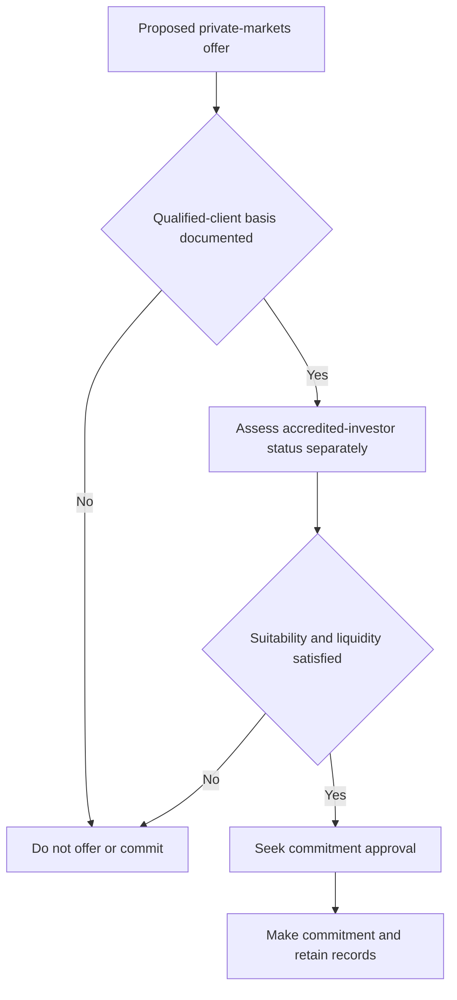

## Purpose and control boundary

This page translates the firm's private-markets eligibility controls into an operating process; the regulatory tests themselves are governed by SEC Order IA-7104. It is internal compliance guidance, not research or client-specific investment advice. Do not offer a private-markets strategy until eligibility has been determined and documented. Eligibility is a regulatory determination rather than portfolio-manager discretion, and approval cannot cure ineligibility. [Eligibility guide P.1](repo://guidelines/suitability/private-markets-eligibility.md#L1-L9) [Discretion matrix D.3, D.5](repo://guidelines/authority/discretion-matrix.md#L17-L29) [Discretion matrix D.5](repo://guidelines/authority/discretion-matrix.md#L39-L47)

The gates have a fixed order: complete the eligibility record before offering; then assess suitability and the binding liquidity limit before committing; then seek the required approval for the commitment. A private-markets commitment is an approval trigger regardless of size, but the approval process is separate from—and cannot substitute for—the regulatory eligibility determination. [Eligibility guide P.1, P.6](repo://guidelines/suitability/private-markets-eligibility.md#L7-L9) [Eligibility guide P.6](repo://guidelines/suitability/private-markets-eligibility.md#L31-L35) [Discretion matrix D.3, D.5](repo://guidelines/authority/discretion-matrix.md#L17-L29) [Discretion matrix D.5](repo://guidelines/authority/discretion-matrix.md#L39-L47)

This flow shows that a documented qualified-client basis, separate accredited-investor assessment, suitability and liquidity review, and commitment approval are distinct controls. [Eligibility guide P.1, P.4–P.6](repo://guidelines/suitability/private-markets-eligibility.md#L7-L9) [Eligibility guide P.4–P.6](repo://guidelines/suitability/private-markets-eligibility.md#L23-L35) [Discretion matrix D.3, D.5](repo://guidelines/authority/discretion-matrix.md#L17-L29) [Discretion matrix D.5](repo://guidelines/authority/discretion-matrix.md#L39-L47)

## Qualified-client determination for a new entry

For a determination made on or after **2026-06-29**, use the dollar tests in SEC Order IA-7104 rather than a locally copied threshold. The order provides two alternative qualified-client paths: at least **$1,400,000** under management by the adviser immediately after entering the advisory contract, or the adviser’s reasonable belief immediately before entering the contract that the client has net worth of more than **$2,700,000**. [SEC Order IA-7104 Q.2](repo://bulletins/SEC/2026-04-order-ia-7104-qualified-client.md#L14-L18)

For the net-worth path, exclude the primary residence’s value and debt secured by it up to fair market value; a natural person may include jointly held spousal assets. The order’s effective date and its measurement timing are part of the test, so record them rather than inferring them from a later account value. [SEC Order IA-7104 Q.2–Q.3](repo://bulletins/SEC/2026-04-order-ia-7104-qualified-client.md#L14-L22)

## Carried-forward determinations versus new subscriptions

A qualified-client determination properly made before **2026-06-29** remains valid for the contract or private-fund investment entered into before that date: the order preserves the earlier determination and the rule 205-3(c) transition treatment. The client file must identify that it is a carried-forward determination and that it was made under the prior thresholds. [SEC Order IA-7104 Q.4](repo://bulletins/SEC/2026-04-order-ia-7104-qualified-client.md#L24-L28) [Eligibility guide P.3](repo://guidelines/suitability/private-markets-eligibility.md#L17-L21)

Do **not** reuse that legacy determination for a contract or a new subscription made on or after **2026-06-29**. For the new entry, make and document a determination under the adjusted order amounts. This distinction preserves an existing entry without converting its historical determination into a reusable current eligibility record. [SEC Order IA-7104 Q.4](repo://bulletins/SEC/2026-04-order-ia-7104-qualified-client.md#L24-L28) [Eligibility guide P.3](repo://guidelines/suitability/private-markets-eligibility.md#L17-L21)

## Accredited investor is a separate assessment

Assess accredited-investor status independently from qualified-client status. IA-7104 adjusts only the rule 205-3 dollar tests; it expressly does not adjust the Regulation D accredited-investor standards or the qualified-purchaser definition. Accordingly, a qualified-client result is not evidence that the client meets another standard, and an accredited-client result does not by itself establish qualified-client status. [SEC Order IA-7104 Q.6](repo://bulletins/SEC/2026-04-order-ia-7104-qualified-client.md#L34-L36) [Eligibility guide P.4](repo://guidelines/suitability/private-markets-eligibility.md#L23-L25)

## Documentation record and audit test

Maintain a determination record for every proposed offer. The firm’s record must state the pathway relied upon, underlying evidence, decision maker, and determination date. For a qualified-client determination, also retain the dollar test relied upon and the date, as required by the order’s recordkeeping provision. A determination lacking a recorded basis is treated as no determination in audit. [Eligibility guide P.5](repo://guidelines/suitability/private-markets-eligibility.md#L27-L29) [SEC Order IA-7104 Q.5](repo://bulletins/SEC/2026-04-order-ia-7104-qualified-client.md#L30-L32)

For a carried-forward file, the pathway and evidence should make the prior-threshold basis and pre-effective-date entry explicit. For a new file, identify the current test, its timing, and the evidence supporting that test. This documentation distinguishes preserved legacy eligibility from an impermissible reliance on it for a new subscription. [Eligibility guide P.3, P.5](repo://guidelines/suitability/private-markets-eligibility.md#L17-L29) [SEC Order IA-7104 Q.4–Q.5](repo://bulletins/SEC/2026-04-order-ia-7104-qualified-client.md#L24-L32)

## Separate suitability and liquidity gate

Eligibility is necessary but insufficient. Before a commitment, complete the separate suitability assessment and underwrite liquidity against the client’s spending requirement—not the allocation’s expected return. The applicable limit is that unfunded private-markets commitments may not exceed **two years of liquid-portfolio spending**. [Eligibility guide P.6](repo://guidelines/suitability/private-markets-eligibility.md#L31-L35) [Private-markets framework V.6](repo://research/MA/GL/PRIVATE-MARKETS/2025-12.md#L36-L38) [Global multi-asset bands B.6](repo://guidelines/allocation/gl-multi-asset-bands.md#L31-L35)

Operationally, manage private-markets exposure through commitment pacing rather than ordinary rebalancing. A drift above the strategic weight caused by a denominator effect is not a breach and is not traded; drift caused by over-commitment is a pacing failure that must be escalated. Neither treatment relaxes the pre-commitment eligibility, suitability, or liquidity controls. [Global multi-asset bands B.6](repo://guidelines/allocation/gl-multi-asset-bands.md#L31-L35) [Discretion matrix D.4](repo://guidelines/authority/discretion-matrix.md#L31-L37)

## Pre-offer checklist

1. Determine whether the entry is a preserved pre-**2026-06-29** contract/investment or a new subscription; do not carry a legacy determination into the latter. [SEC Order IA-7104 Q.4](repo://bulletins/SEC/2026-04-order-ia-7104-qualified-client.md#L24-L28)
2. For a new entry, apply and document one current qualified-client path with evidence and timing; apply the net-worth exclusions where that path is used. [SEC Order IA-7104 Q.2–Q.3](repo://bulletins/SEC/2026-04-order-ia-7104-qualified-client.md#L14-L22)
3. Determine accredited-investor status separately and retain its own basis. [SEC Order IA-7104 Q.6](repo://bulletins/SEC/2026-04-order-ia-7104-qualified-client.md#L34-L36) [Eligibility guide P.4–P.5](repo://guidelines/suitability/private-markets-eligibility.md#L23-L29)
4. Complete and retain the suitability review and spending-based liquidity calculation; stop if unfunded commitments would exceed the two-year limit. [Eligibility guide P.6](repo://guidelines/suitability/private-markets-eligibility.md#L31-L35) [Global multi-asset bands B.6](repo://guidelines/allocation/gl-multi-asset-bands.md#L31-L35)
5. Only then seek the required commitment approval. Do not submit an ineligible client for approval as if approval were an exception mechanism. [Discretion matrix D.3, D.5](repo://guidelines/authority/discretion-matrix.md#L17-L29) [Discretion matrix D.5](repo://guidelines/authority/discretion-matrix.md#L39-L47)
