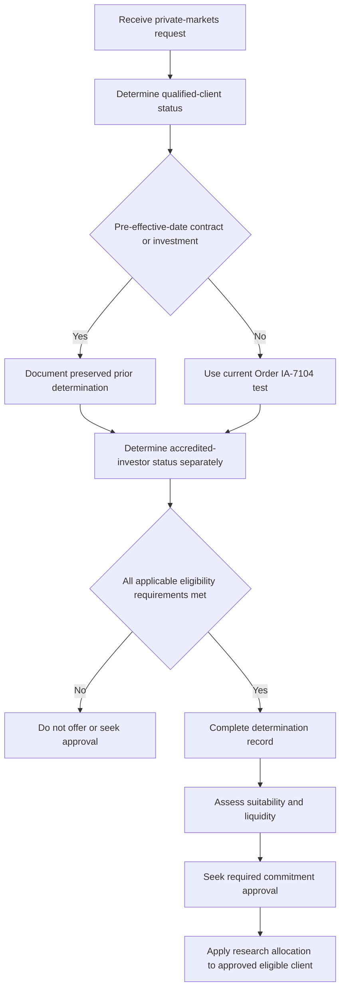

# Internal Guidance: Private Markets Eligibility and File Standard

This is internal compliance guidance for deciding whether a client may be offered a private-markets strategy and for maintaining the supporting file. It is not research and not client-specific investment advice. Eligibility determines whether the offering process may begin; it does not determine whether a commitment is suitable or should be made.

## Control boundary: eligibility precedes approval and allocation

No private-markets strategy may be offered until eligibility has been determined and documented. The determination is a regulatory control outside portfolio-manager discretion. Every private-markets commitment also requires approval, but the eligibility determination must be complete **before approval is sought**. An approval therefore cannot cure a missing or failed eligibility determination:

> “Any private markets commitment for a client who is not eligible under P.1. Eligibility is a regulatory determination and approval is not a substitute for it.” — [Portfolio Manager Discretion and Escalation Matrix, §D.5](repo://internal_guidelines/authority/discretion-matrix.md#L39-L47)

Use the Multi-Asset Research allocation only after this gate has passed. The research note’s 10–20% strategic allocation is expressly for eligible clients, and its view does not determine qualified-client or accredited-investor status. Treat research as an input to the later suitability and commitment decision, never as evidence of eligibility.

*Eligibility-first control flow from a request through the separate suitability, approval, and research-allocation stages.*

## Qualified-client determination and transition handling

For a current determination, apply the assets-under-management or net-worth pathway in [SEC Order IA-7104, Q.2](repo://external_sources/SEC/2026-04-order-ia-7104-qualified-client.md#L14-L22). This guidance intentionally does not reproduce the adjusted amounts; consult the order so the determination uses the controlling current test. For the net-worth pathway, the order specifies the primary-residence exclusions and permits, for a natural person, inclusion of jointly held spousal assets.

The order’s effective-date provision is controlling:

> “It is hereby ordered that, effective 2026-06-29, the dollar amount of the assets-under-management test set forth in rule 205-3(d)(1)(i) is $1,400,000, and the dollar amount of the net worth test set forth in rule 205-3(d)(1)(ii) is $2,700,000.” — [SEC Order IA-7104, Q.2](repo://external_sources/SEC/2026-04-order-ia-7104-qualified-client.md#L14-L18)

For a contract entered into or private-fund investment made before that date, preserve a properly made determination under the test then in force. The transition is contract- and investment-specific, not a reusable client credential. The order provides:

> “This order does not apply to an advisory contract entered into, or to an investment in a private fund made, before 2026-06-29. The transition provisions of rule 205-3(c) continue to apply, and a person who satisfied the dollar amount test in effect at the time of that person's entry continues to be a qualified client with respect to that contract or investment.” — [SEC Order IA-7104, Q.4](repo://external_sources/SEC/2026-04-order-ia-7104-qualified-client.md#L24-L28)

Accordingly, label the file as a carried-forward determination, identify the prior test and determination date, and tie it to the earlier contract or investment. Do not reuse it for a new contract or subscription on or after the effective date: the order says a pre-effective-date determination “may not be relied upon” for that later entry.

## Separate eligibility and suitability tests

Accredited-investor status must be determined independently of qualified-client status. Order IA-7104 adjusts only the Rule 205-3 dollar tests; it does not adjust Regulation D accredited-investor standards or the qualified-purchaser definition. Do not infer accredited status from a qualified-client determination, or the reverse. Record each applicable pathway and its supporting evidence separately.

Eligibility is necessary but insufficient. Before a commitment, perform the separate suitability assessment and liquidity underwriting. The applicable research framework requires a ten-year horizon for the strategic view and recommends that unfunded private-markets commitments not exceed two years of liquid portfolio spending. The client’s spending requirement—not expected return—is the basis for that liquidity assessment. An eligible file without this suitability and liquidity work is incomplete.

## Determination record: required contents and retention

Create a determination record for every eligibility decision, including a decision not to proceed. At minimum, the file must state:

- the client, proposed strategy or investment, and relevant contract or subscription;
- the qualified-client pathway relied on, the evidence used, the determination date, and the person making the determination;
- whether the determination is current or carried forward, and, for a carried-forward determination, the prior threshold basis and the contract or investment to which it is limited;
- accredited-investor status as a separate determination, with its pathway and evidence;
- the separate suitability and liquidity assessment, including spending requirement, liquid portfolio spending capacity, horizon, and unfunded-commitment analysis; and
- the required commitment approval record, kept distinct from the regulatory determination.

The order’s recordkeeping direction controls retention of the qualified-client determination:

> “An investment adviser relying on a determination under this order shall retain the records required by rule 204-2(a)(8) documenting the basis for that determination, including the dollar amount test relied upon and the date of the determination.” — [SEC Order IA-7104, Q.5](repo://external_sources/SEC/2026-04-order-ia-7104-qualified-client.md#L30-L32)

The internal file standard additionally requires the pathway, evidence, decision maker, and date. In audit, a determination without a recorded basis is treated as no determination. Escalation documentation is not a substitute: it records approval authority and facts, whereas the eligibility record establishes the regulatory basis for offering.

## Operating checks and failure handling

1. Identify the contemplated strategy, client, and entry event. Decide whether the matter is a pre-effective-date carried-forward contract or investment, or a current entry.
2. Complete and document the qualified-client test from the order, using the correct timing and pathway. For a carried-forward file, restrict reliance to the prior contract or investment.
3. Complete accredited-investor verification separately; apply any other product-specific eligibility standard according to its own terms.
4. If any applicable eligibility requirement fails or lacks a documented basis, stop. Do not offer the strategy, request an approval, or apply the research allocation.
5. For an eligible client, document suitability and liquidity before seeking the required commitment approval. Approval then follows the authority matrix; it does not reopen or replace eligibility.
6. Retain the determination record and its evidence under the order’s recordkeeping requirement. At review, test that the file distinguishes transition reliance, accredited-investor status, suitability, and approval rather than collapsing them into one sign-off.

## Source basis

- [Private Markets Client Eligibility Determination Guide, §§P.1–P.6](repo://internal_guidelines/suitability/private-markets-eligibility.md#L1-L35)
- [SEC Order IA-7104, §§Q.2–Q.6](repo://external_sources/SEC/2026-04-order-ia-7104-qualified-client.md#L14-L36)
- [Portfolio Manager Discretion and Escalation Matrix, §§D.3–D.6](repo://internal_guidelines/authority/discretion-matrix.md#L17-L51)
- [Private Markets Allocation Framework, §§V.1–V.6](repo://internal_research/MA/GL/PRIVATE-MARKETS/2025-12.md#L16-L38)
