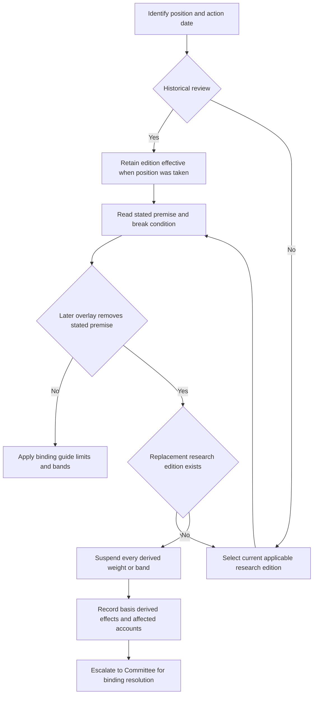

A position is assembled from distinct authorities, not from whichever document is newest: the research edition effective when the position was taken explains the decision; internal allocation guidance supplies any binding weight or limit; and a regulatory overlay constrains what the firm may do. This page is an operating procedure for preserving that record and handling a later change that defeats a note's stated premise. It is not a substitute for a Committee decision or an authorization to trade.

## 1. Start with the position date and preserve its basis of record

For a historical position, identify the research edition whose stated applicability includes the position date. Frozen research is never edited in place: a revision is published as a new edition, while the prior edition remains the basis of record for positions taken while it stood. A later review therefore tests the original decision against that original edition; it must not rewrite history using a later view.

The semiconductor-capex sequence is the clean superseding-reissue case. EQ-US-SEMI-CAPEX 2026-02 S.1 **supersedes** EQ-US-SEMI-CAPEX 2025-06 S.1 for positions taken on or after 2026-03-01: the new edition is neutral and expressly replaces the prior overweight. The 2025-06 marker nevertheless says that edition remains the basis of record for positions taken while it stood. Thus the 2025-06 overweight is the review record for positions taken from its 2025-07-01 applicability date through 2026-02-28; 2026-02 governs new positions from 2026-03-01.

This distinction is an invariant: supersession changes which edition governs new action after the effective date, not the evidence of why an earlier position was taken. Treat a withdrawal the same way for recordkeeping: it can suspend a derived live weight, but it does not retroactively make the original decision disappear.

## 2. Assemble the current-action authority in order

Before taking, changing, rebalancing, or reviewing a live position, make this ordered check:

1. **Classify the action.** Is it a review of a historical decision, a new position, or a change to a live allocation?
2. **Select the edition.** For historical review, retain the edition effective on the original position date. For new action, select the current applicable edition and check explicit supersession markers and effective dates.
3. **Read the stated premise and break condition.** Do not infer the premise from the recommendation alone. Record the note section that says what the view rests on and the section that says what would end it.
4. **Map every derived guide consequence.** Identify the binding weight, band, limit, funding pair, and affected accounts. Research itself does not authorize a binding weight.
5. **Test later regulatory overlays against the stated premise.** Compare applicability dates and operative change, including provisions expressly left unchanged. A regulatory requirement constrains action; it does not authorize a manager to invent a replacement allocation.
6. **Classify the outcome.** A true replacement research edition selects a new research basis for new positions. A regulatory change that removes the premise but has no replacement note creates a suspended-guidance case. Escalate the latter with the required record.

*Decision flow separating edition selection from a regulatory change that removes a stated premise without replacement research.*

## 3. Apply the regulatory-premise test, not a similarity test

The municipal note makes its dependency unusually explicit. FI-US-MUNI-CREDIT 2025-06 M.2 says the extra allocation rests on the phase-out threshold: cutting it enough to bring a meaningful share of top-bracket holders into AMT compresses the pickup and takes the recommendation with it. M.7 identifies a cut to that threshold as the risk that takes out M.2 and the recommendation, and M.8 requires immediate review and re-issue rather than waiting for the normal cycle.

IRS Revenue Procedure 2025-41 N.3 **supersedes** FI-US-MUNI-CREDIT 2025-06 M.2: for taxable years beginning on or after 2026-01-01, it sets phase-out thresholds at $500,000 for unmarried taxpayers and $1,000,000 for joint filers, while the note's premise used thresholds at which the exemption did not reach zero until $978,750 and $1,800,700. The research file remains labelled current and has not been re-issued. This is not evidence that the old premise survived; it is the regulatory-change-without-replacement case that requires suspension and escalation.

Do not over-read the change. IRS Revenue Procedure 2025-41 N.5 **preserves** FI-US-MUNI-CREDIT 2025-06 M.5's relevant qualified-501(c)(3) distinction: qualified 501(c)(3) bond interest is not an AMT item of tax preference, and the procedure says N.2 and N.3 do not apply to that interest. The neighbouring treatment survives, but it does not mechanically restore the guide's four-point private-activity overweight. The Committee must decide what, if any, binding expression follows from the remaining support.

The pension case follows the same control path. DOL Release 2026-31 P.2 and P.3 **supersedes** FI-US-PENSION-LDI 2026-03 L.2's funding-rule premise: the release widens the corridor for plan years beginning on or after 2027-01-01 and relieves a plan measured above 110% funded from minimum contributions, while L.2 says a rule change allowing a sponsor to release or re-risk surplus takes out the demand call. L.6 names altered discount-rate basis or reduced contribution requirements as a condition that ends the recommendation. No replacement pension-LDI note is supplied, so do not continue or recalculate a derived long-credit weight. DOL Release 2026-31 P.5 **preserves** the restrictions for plans below 80% funded; that limited preservation does not cure the removed surplus-plan premise.

## 4. Suspend derived guidance; do not solve the allocation locally

A suspension is a control state, not a new target and not a conclusion that the historical research was wrong. The taxable fixed-income guide makes the governing rule explicit for research it cites: a derived weight is suspended, not carried forward, until the Committee re-adopts it against replacement research, and the manager must escalate rather than re-derive the weight. Its tolerance rule further says a suspension-caused band breach is not drift and is not mechanically rebalanced.

For the municipal case, A.3 adopts a 22% municipal target against 18% neutral for top-bracket accounts and ties the four-point overweight to M.1 and M.2. A.5 makes the 28% IG-corporate target, against 32% neutral, its funding pair. When the municipal overweight is suspended, suspend the paired corporate underweight too and return both to their stated neutral levels; retaining the credit underweight would be an unexplained structural short. This specified neutral return is a guide-directed consequence, not a manager-derived replacement research view.

A manager may not carry forward the prior weight pending review or adopt the replacement note's recommendation directly. The same authority boundary applies where there is no replacement note: neither a residual fundamental case nor a preserved regulatory exception gives the manager authority to calculate a new binding weight. Global multi-asset guidance uses the same suspension principle for a band resting on superseded or withdrawn research, returning it to the prior Committee-adopted level pending review.

## 5. Escalate with a reviewable record

Send the Committee an escalation packet that identifies:

- the historical basis-of-record edition and its applicability date, plus the live action or review date;
- the stated premise, break condition, and exact regulatory overlay provisions tested;
- whether the event is a superseding reissue or a premise-removing regulatory change without replacement research;
- the replacement edition, if one exists, and its effective date;
- every weight, band, funding pair, and account affected, including any guide-directed neutral or prior-Committee level pending review;
- applicable mandate limits, client restrictions, and any regulatory requirement that cannot be cleared by approval; and
- the requested Committee resolution and the facts supporting it.

The required content for a superseded-note escalation is the superseded note, replacement if one exists, every derived weight, and affected accounts. Once cleared, the record must also state the condition, clearing authority, specific facts relied on, and date. A missing recorded basis is treated in audit as an unapproved position. Committee approval is required for matters beyond senior discretion, more than one escalation condition on an account, and any exception to a stated band; no approval can cure a regulatory breach.

## 6. Focused operating checks

Use these checks before closing the file:

| Check | Pass condition |
| --- | --- |
| Edition test | The record names the research edition effective on the original position date, and any later edition is used only for new action from its own effective date. |
| Premise test | The packet quotes or precisely identifies both the note's premise and its stated break condition, rather than relying on a recommendation label. |
| Overlay test | The overlay is compared to the premise using applicability dates and operative text; any expressly preserved neighbouring treatment is separately recorded. |
| Derived-guidance test | Every affected target, band, and funding pair is listed. A suspension is not processed as an ordinary drift rebalance. |
| Authority test | The manager neither carries forward a suspended weight nor adopts or calculates a replacement weight; the Committee is asked to make the binding decision. |
| Audit test | The cleared record includes condition, authority, facts, and date, and it identifies all affected accounts. |

## Source basis

- [Corpus edition and frozen-authority conventions](repo://README.md#L35-L68)
- [EQ-US-SEMI-CAPEX 2025-06](repo://internal_research/EQ/US/SEMI-CAPEX/2025-06.md#L1-L19) and [2026-02](repo://internal_research/EQ/US/SEMI-CAPEX/2026-02.md#L12-L18)
- [FI-US-MUNI-CREDIT 2025-06, §§M.1–M.8](repo://internal_research/FI/US/MUNI-CREDIT/2025-06.md#L16-L72) and [IRS Revenue Procedure 2025-41, §§N.3–N.5](repo://external_sources/IRS/2025-08-rev-proc-2025-41-amt-thresholds.md#L18-L34)
- [FI-US-PENSION-LDI 2026-03, §§L.1–L.7](repo://internal_research/FI/US/PENSION-LDI/2026-03.md#L16-L46) and [DOL Release 2026-31, §§P.2–P.5](repo://external_sources/DOL/2026-08-funding-relief-and-discount-rates.md#L13-L31)
- [US Taxable Account Fixed Income Allocation Guide, §§A.1–A.6](repo://internal_guidelines/allocation/us-taxable-fixed-income.md#L7-L43), [Global Multi-Asset Allocation Bands, §§B.1–B.7](repo://internal_guidelines/allocation/gl-multi-asset-bands.md#L7-L39), and [Portfolio Manager Discretion and Escalation Matrix, §§D.1–D.6](repo://internal_guidelines/authority/discretion-matrix.md#L7-L51)
