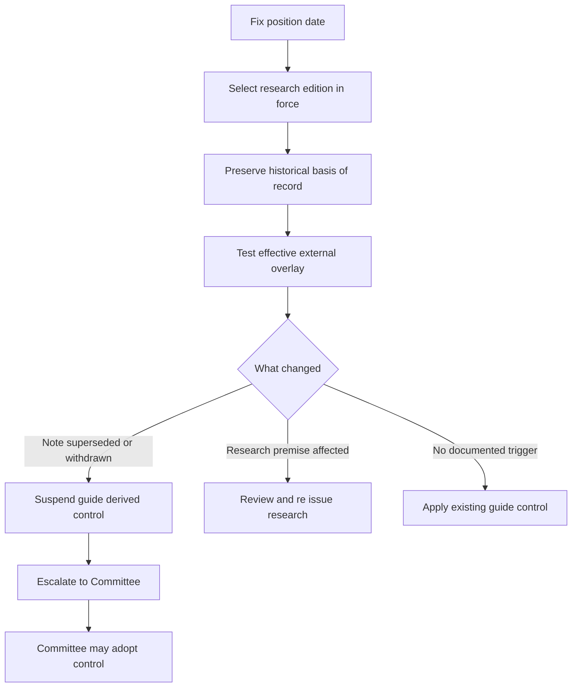

A position has three distinct sources of authority. The research edition in force on its trade date supplies the historical basis of record; a mandate guide supplies any binding portfolio weight; and a regulatory bulletin supplies an external constraint for the tax year and instrument it reaches. A later edition does not rewrite historical research, and neither a research view nor an overlay authorizes a portfolio manager to invent a successor weight.

## Dated assembly procedure

1. **Fix the position date and retain the applicable research edition.** Record the publication and applicability dates, recommendation, and stated assumptions. Frozen research is never edited in place; an edition remains the basis of record for positions taken while it stood, including a review performed later. Read a `SUPERSEDED by` marker with both editions. [Research-corpus conventions](repo://README.md#L41-L48) [Supersession convention](repo://README.md#L61-L68)
2. **Identify the separate binding control.** Research explains a view; the mandate guide determines the portfolio target, band, account scope, and interim treatment. The guide, not the note, owns a binding weight.
3. **Apply an external overlay at its stated boundary.** Test the note's load-bearing assumption against the overlay's effective tax year, taxpayer condition, and instrument treatment. Keep a preserved exception confined to the instruments it covers; do not extend an overlay to independent research premises.
4. **Use the documented control path.** A cited note that is superseded or withdrawn suspends its guide-derived weight and requires the D.4 escalation. A regulatory change that removes a stated research premise requires the note's required review and re-issue, but it does not by itself establish a new weight, automatic rebalance, or an unprovided suspension rule.
5. **Escalate only under the authority actually triggered.** For a superseded or withdrawn cited note, the manager records the required information and escalates to the Committee. The manager may not carry the prior weight forward or adopt replacement research directly; re-adopting a binding control is a Committee act. [Discretion Matrix D.4](repo://guidelines/authority/discretion-matrix.md#L31-L37)

This flow preserves the historical research record while keeping a research-premise review distinct from the guide's stated suspension trigger.

## Superseded research: US semiconductor capital equipment

| Basis-of-record period | Research edition and position |
| --- | --- |
| **2025-07-01 through 2026-02-28** | **EQ-US-SEMI-CAPEX 2025-06**, published 2025-06-11, is the basis of record for positions taken in this interval. Its view is overweight US semiconductor capital equipment on a 12–18-month horizon; its named change conditions are capex-guidance cuts, sustained memory pricing below cash cost, and material export controls. [2025-06](repo://research/EQ/US/SEMI-CAPEX/2025-06.md#L19-L23) [2025-06 change conditions](repo://research/EQ/US/SEMI-CAPEX/2025-06.md#L35-L41) |
| **On or after 2026-03-01** | **EQ-US-SEMI-CAPEX 2026-02**, published 2026-02-19, is the basis of record for newly taken positions. Its research view is neutral: the earlier cycle thesis had largely played out, with the change attributed to valuation and cycle position rather than deteriorating fundamentals. [2026-02 applicability and view](repo://research/EQ/US/SEMI-CAPEX/2026-02.md#L12-L18) |

**EQ-US-SEMI-CAPEX 2026-02 S.1 supersedes EQ-US-SEMI-CAPEX 2025-06 S.1** for positions taken on or after 2026-03-01. The predecessor's marker expressly preserves its basis-of-record role for earlier positions and later reviews; it is not current research authority for a new position. [2026-02 applicability](repo://research/EQ/US/SEMI-CAPEX/2026-02.md#L12-L18) [2025-06 supersession marker](repo://research/EQ/US/SEMI-CAPEX/2025-06.md#L1-L5)

**EQ-GL-AI-INFRA-POWER 2026-01 P.4 modifies EQ-US-SEMI-CAPEX 2026-02 S.4** by identifying grid interconnection as a constraint on the *rate* of capacity addition, rather than the level of eventual demand. This modifier does not supply a different semiconductor weight. [AI Infrastructure P.4](repo://research/EQ/GL/AI-INFRA-POWER/2026-01.md#L30-L32) [Semiconductor 2026-02 S.4–S.5](repo://research/EQ/US/SEMI-CAPEX/2026-02.md#L30-L36)

No mandate-guide control for this equity view is provided in the available evidence. Treat the two editions as research authority only; do not infer an automatic portfolio trade from their supersession.

## Actual overlay: municipal private-activity bonds

### Historical research authority and external constraint

**FI-US-MUNI-CREDIT 2025-06**, published 2025-06-12 and applicable to positions from 2025-07-01, is the available municipal research edition and remains the basis of record for positions taken while it stands. It recommends a two-to-four-point municipal overweight funded from investment-grade corporate credit, concentrated in private-activity bonds. The after-tax advantage is explicitly load-bearing: it depends on most top-bracket clients remaining outside AMT; a phase-out reduction that brings materially more of them into AMT means the M.1 recommendation does not survive. Fundamentals alone support only neutral to modest overweight. [Municipal Credit M.1–M.3](repo://research/FI/US/MUNI-CREDIT/2025-06.md#L16-L36)

Revenue Procedure 2025-41 applies to taxable years beginning on or after **2026-01-01**. It sets the AMT phase-out threshold at $500,000 for an unmarried individual and $1,000,000 for a joint filer, reduces the exemption above those thresholds, and says taxpayers above the applicable threshold are subject to the specified-private-activity-bond treatment regardless of prior thresholds. [Revenue Procedure N.1–N.3](repo://bulletins/IRS/2025-08-rev-proc-2025-41-amt-thresholds.md#L8-L22)

**IRS Revenue Procedure 2025-41 N.3 supersedes FI-US-MUNI-CREDIT 2025-06 M.2** as to the after-tax premise for affected taxpayers in taxable years beginning on or after 2026-01-01: N.3 changes the thresholds on which M.2 relied, and M.2 identifies that change as the condition under which its recommendation does not survive. The procedure does not choose a municipal allocation. [Revenue Procedure N.3](repo://bulletins/IRS/2025-08-rev-proc-2025-41-amt-thresholds.md#L18-L22) [Municipal Credit M.2](repo://research/FI/US/MUNI-CREDIT/2025-06.md#L22-L30)

**IRS Revenue Procedure 2025-41 N.5 preserves FI-US-MUNI-CREDIT 2025-06 M.5's qualified-501(c)(3) bond treatment.** Interest on a qualified 501(c)(3) bond is not an AMT preference and is unaffected by the procedure; the research identifies nonprofit hospitals and private higher education as predominantly qualified 501(c)(3) issuers, while airport special-facility paper predominantly is not. This bounded exception does not restore the private-activity after-tax rationale for instruments and taxpayers reached by N.3. [Revenue Procedure N.5](repo://bulletins/IRS/2025-08-rev-proc-2025-41-amt-thresholds.md#L30-L34) [Municipal Credit M.5](repo://research/FI/US/MUNI-CREDIT/2025-06.md#L44-L50)

The research itself requires immediate review and re-issue when the M.2 treatment changes. Its supply and credit analysis remains separately stated, but does not justify the full M.1 overweight on its own. [Municipal Credit M.3–M.4](repo://research/FI/US/MUNI-CREDIT/2025-06.md#L32-L42) [Municipal Credit M.7–M.8](repo://research/FI/US/MUNI-CREDIT/2025-06.md#L56-L70)

### Current binding control and escalation boundary

The US Taxable Account Fixed Income Allocation Guide is the current binding internal control for its stated account scope. It sets top-bracket municipal credit at 22% versus an 18% neutral weight; its four-point active overweight and private-activity concentration are adopted from FI-US-MUNI-CREDIT 2025-06 M.1 and rest on M.2. Accounts below the top bracket remain at the 18% neutral weight without that concentration. **The Allocation Guide A.3 constrains FI-US-MUNI-CREDIT 2025-06 M.1–M.2** by fixing the adopted expression and limiting it to top-bracket accounts. [Allocation Guide A.3](repo://guidelines/allocation/us-taxable-fixed-income.md#L17-L23) [Municipal Credit M.1–M.2](repo://research/FI/US/MUNI-CREDIT/2025-06.md#L16-L30)

The guide's automatic suspension rule is specifically a cited research note being superseded or withdrawn. The available municipal note has no supersession or withdrawal marker. Therefore, the evidence establishes immediate research review and re-issue after the overlay, but does not establish an automatic suspension, a return to neutral, or a replacement target solely because Revenue Procedure 2025-41 affects M.2. Do not create that missing successor control; if the note is subsequently superseded or withdrawn, apply A.1 and D.4 then. [Allocation Guide A.1](repo://guidelines/allocation/us-taxable-fixed-income.md#L7-L11) [Municipal Credit M.8](repo://research/FI/US/MUNI-CREDIT/2025-06.md#L68-L70)

When that stated suspension trigger applies, the municipal overweight and its paired four-point investment-grade corporate underweight are both suspended and return to neutral; a suspension-driven band condition is not ordinary drift and is not automatically rebalanced. The escalation record identifies the prior note, replacement if any, derived weights, and affected accounts. [Allocation Guide A.5–A.6](repo://guidelines/allocation/us-taxable-fixed-income.md#L33-L43) [Discretion Matrix D.4](repo://guidelines/authority/discretion-matrix.md#L31-L37)

## Guardrails

- Historical research authority answers why an existing position was taken; current binding control answers what the manager may hold without escalation; an external constraint answers which treatment applies. Do not substitute one for another.
- A regulatory requirement is not an investment-discretion exception: no approval may clear a position that breaches a stated regulatory requirement. [Discretion Matrix D.5](repo://guidelines/authority/discretion-matrix.md#L39-L47)
- Every cleared escalation must record the condition, clearing authority, specific facts relied on, and date. Without a recorded basis, audit treats it as unapproved. [Discretion Matrix D.6](repo://guidelines/authority/discretion-matrix.md#L49-L51)
