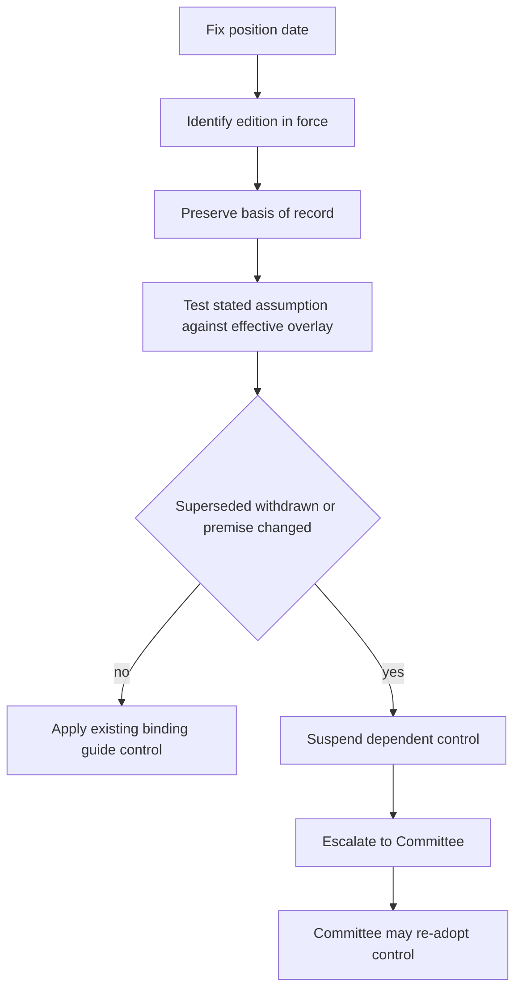

A position is assembled from separate authorities: the research edition in force when it was taken, any regulatory overlay effective for the relevant circumstance, and the mandate guide that creates the binding weight. These sources do not have interchangeable authority. A later research edition can change the research view for later positions; a regulator can remove a stated premise; and only the Investment Policy Committee can turn research into a successor binding weight. This page records the procedure rather than choosing an unapproved replacement.

## Decision procedure

1. **Fix the position date and identify the research edition then in force.** Record its publication and applicability dates, its recommendation, and its stated load-bearing assumption. That edition remains the basis of record for a position taken while it stood, including a later review; it is not erased by a replacement or withdrawal. A `SUPERSEDED by` marker must be read together with both editions. [Research-corpus convention](repo://README.md#L30-L35) · [Edition rule](repo://openwiki/INSTRUCTIONS.md#L86-L92)
2. **Identify the binding control separately.** A research recommendation is not itself a portfolio weight. Locate the mandate-guide weight or band that rests on the research and the accounts to which it applies. The taxable fixed-income guide, for example, adopts the municipal four-point overweight from Municipal Credit 2025-11 M.1 and makes its after-tax analysis at M.2 the basis for that control. [Allocation Guide A.3](repo://guidelines/allocation/us-taxable-fixed-income.md#L17-L23)
3. **Test the note's stated assumption against an overlay by its effective date.** Apply the exact regulatory rule only to the accounts, tax years, instruments, and treatment it reaches. Do not infer that a change to one premise invalidates independent parts of a note or sector constraints.
4. **Determine control state.** A cited research note that is superseded or withdrawn suspends every derived weight or band under the applicable guide. A regulatory change that meets a note's own invalidation condition requires the note's stated immediate review and must not be silently resolved into a new weight. Follow the guide's prescribed interim treatment; do not treat a suspension as ordinary market drift.
5. **Escalate rather than select.** Submit the required record to the Committee. A portfolio manager may not carry the old derived weight forward, re-derive it, automatically rebalance it, or directly adopt the replacement recommendation. The Committee alone may re-adopt a binding successor control. [Discretion Matrix D.4](repo://guidelines/authority/discretion-matrix.md#L31-L37)

This flow separates preservation of the historical record from the current authority to apply a control.

## Edition outcome: semiconductor capital equipment

- **As of 2025-07-01 through 2026-02-28 — controlling edition: EQ-US-SEMI-CAPEX 2025-06, effective 2025-07-01.** For positions taken in that interval, the overweight in US semiconductor capital equipment is the basis of record. Edition 2025-06 identifies capex-guidance cuts, sustained below-cash-cost memory pricing, and material export controls as conditions that would change its view. [2025-06 S.1–S.4](repo://research/EQ/US/SEMI-CAPEX/2025-06.md#L7-L25)
- **As of 2026-03-01 — controlling edition for newly taken positions: EQ-US-SEMI-CAPEX 2026-02, effective 2026-03-01.** EQ-US-SEMI-CAPEX 2026-02 S.1 **supersedes** EQ-US-SEMI-CAPEX 2025-06 S.1 for positions taken on or after that effective date: the current research view is neutral, with the earlier cycle thesis largely played out. The superseded edition nevertheless remains the basis of record for the earlier interval and later review of those earlier positions. [2026-02 applicability and S.1](repo://research/EQ/US/SEMI-CAPEX/2026-02.md#L1-L7) · [2025-06 supersession marker](repo://research/EQ/US/SEMI-CAPEX/2025-06.md#L1-L7)
- **As of 2026-03-01 — same controlling edition: EQ-US-SEMI-CAPEX 2026-02, effective 2026-03-01.** EQ-GL-AI-INFRA-POWER 2026-01 P.4 **modifies** EQ-US-SEMI-CAPEX 2026-02 S.4 by describing grid interconnection as a cap on the *rate* of capacity addition, not the level of eventual demand. It does not authorize a different semiconductor weight. [AI Infrastructure P.4](repo://research/EQ/GL/AI-INFRA-POWER/2026-01.md#L19-L21) · [Semiconductor 2026-02 S.4–S.5](repo://research/EQ/US/SEMI-CAPEX/2026-02.md#L19-L25)

## Regulatory-overlay outcome: municipal private activity bonds

- **As of positions taken on or after 2025-12-01, before the affected 2027 tax-year treatment — controlling research edition: FI-US-MUNI-CREDIT 2025-11, effective 2025-12-01.** The note's municipal overweight is concentrated in private activity bonds and explicitly rests on the assumption that most top-bracket clients are outside AMT; it says that a lower exemption or phase-out threshold drawing materially more such holders into AMT means the M.1 recommendation does not survive. Credit fundamentals alone support only neutral to modest overweight. [Municipal Credit M.1–M.3](repo://research/FI/US/MUNI-CREDIT/2025-11.md#L5-L23)
- **As of taxable years beginning on or after 2027-01-01 — controlling research edition remains FI-US-MUNI-CREDIT 2025-11, effective 2025-12-01, pending re-issue and Committee action.** IRS Notice 2026-18 N.3 **supersedes** FI-US-MUNI-CREDIT 2025-11 M.2: reduced AMT thresholds make the private-activity preference produce actual liability for taxpayers above them, matching the note's named invalidation condition. The notice supplies no transition relief for pre-effective-date acquisitions, and the note requires immediate review and re-issue on an announced change in this treatment. This is not authority to choose a replacement municipal weight. [IRS Notice N.2–N.5](repo://bulletins/IRS/2026-03-amt-private-activity-bond-interest.md#L9-L31) · [Municipal Credit M.2, M.7–M.8](repo://research/FI/US/MUNI-CREDIT/2025-11.md#L11-L17) [Municipal Credit M.7–M.8](repo://research/FI/US/MUNI-CREDIT/2025-11.md#L41-L55)
- **As of taxable years beginning on or after 2027-01-01 — same controlling research edition and effective date, subject to the same review.** IRS Notice 2026-18 N.4 **preserves** qualified 501(c)(3) bond interest treatment: it is not an AMT preference and is unaffected by the notice. This expressly leaves the treatment relevant to nonprofit hospitals and private higher education intact; it does not preserve the invalidated private-activity after-tax premise for every affected taxpayer or select a portfolio weight. [IRS Notice N.4](repo://bulletins/IRS/2026-03-amt-private-activity-bond-interest.md#L23-L27) · [Municipal Credit M.5](repo://research/FI/US/MUNI-CREDIT/2025-11.md#L31-L35)

## Suspension and escalation of the taxable fixed-income controls

The municipal target for top-bracket accounts is 22% against an 18% neutral weight. The four-point active overweight is adopted from Municipal Credit 2025-11 M.1 and rests on M.2; the guide therefore makes a cited note's supersession or withdrawal a suspension trigger rather than permission to carry the weight forward. [Allocation Guide A.1 and A.3](repo://guidelines/allocation/us-taxable-fixed-income.md#L7-L11) [Allocation Guide A.3](repo://guidelines/allocation/us-taxable-fixed-income.md#L17-L23)

- **As of 2027-01-01 when the IRS overlay becomes effective — controlling research edition: FI-US-MUNI-CREDIT 2025-11, effective 2025-12-01; controlling guide: US Taxable Account Fixed Income Allocation Guide, last revised 2025-12-02 (no separate guide effective date stated).** Suspend the municipal derived overweight. Its paired four-point IG-corporate underweight is the funding source and moves with it: suspend both and return both to neutral. Do not leave the corporate underweight in place. [Allocation Guide A.5](repo://guidelines/allocation/us-taxable-fixed-income.md#L33-L37)
- **As of 2027-01-01 — controlling research edition: FI-US-MUNI-CREDIT 2025-11, effective 2025-12-01; controlling guide: US Taxable Account Fixed Income Allocation Guide, last revised 2025-12-02 (no separate guide effective date stated).** A suspension-driven band condition is not a drift breach and is not automatically rebalanced; it requires the D.4 escalation because the correct weight is a Committee decision. [Allocation Guide A.6](repo://guidelines/allocation/us-taxable-fixed-income.md#L39-L43)
- **As of 2027-01-01 — controlling research edition: FI-US-MUNI-CREDIT 2025-11, effective 2025-12-01; controlling authority: Portfolio Manager Discretion and Escalation Matrix, last revised 2026-02-11 (no separate authority effective date stated).** The record must name the superseded or withdrawn note, replacement if available, every derived weight, and every affected account. For a cleared escalation, also record the condition, clearing authority, facts relied on, and date. An undocumented clearance is treated as unapproved in audit. Manager and senior-manager discretion does not permit direct adoption of replacement research into a binding weight. [Discretion Matrix D.1, D.4, D.6](repo://guidelines/authority/discretion-matrix.md#L7-L11) [Discretion Matrix D.4](repo://guidelines/authority/discretion-matrix.md#L31-L37) [Discretion Matrix D.6](repo://guidelines/authority/discretion-matrix.md#L49-L51)

## Guardrails

- A superseded or withdrawn edition is historical authority for the position date, not current authority for a new position or an unchanged derived control.
- A regulatory requirement is not an investment-discretion exception: no approval may clear a position that breaches a stated regulatory requirement. [Discretion Matrix D.5](repo://guidelines/authority/discretion-matrix.md#L39-L47)
- Keep scope precise. The IRS notice changes when private-activity interest creates AMT liability and preserves qualified 501(c)(3) treatment; it does not erase the municipal note's independent supply and credit discussion. The documented outcome is review, suspension where the guide requires it, and escalation—not an invented resolution. [IRS Notice N.3–N.4](repo://bulletins/IRS/2026-03-amt-private-activity-bond-interest.md#L17-L27) · [Municipal Credit M.3–M.4](repo://research/FI/US/MUNI-CREDIT/2025-11.md#L19-L29)
