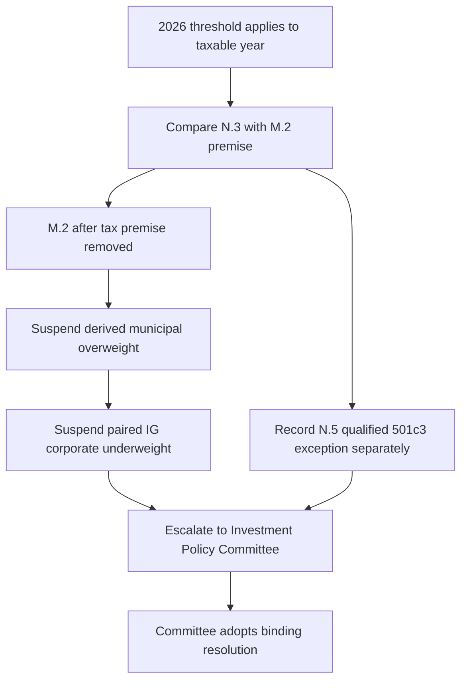

# Regulatory Overlay: AMT Threshold Change and Municipal Treatment

## Scope and effective boundary

This overlay tests the tax premise of `FI-US-MUNI-CREDIT 2025-06`; it is not a replacement research recommendation or a client-specific tax conclusion. IRS Revenue Procedure 2025-41 applies to taxable years beginning on or after **2026-01-01**. It sets the AMT exemption at $90,100 for an unmarried individual and $140,200 for married taxpayers filing jointly, then supplies the phase-out rule that matters to the municipal thesis. The procedure also says that its threshold is not indexed before 2030-01-01.

The municipal research remains the basis of record for its originally applicable positions, but it describes itself as current and not re-issued. The operative question for a live allocation is therefore whether the later rule changes the stated premise—not whether the historical decision was reasonable when made.

## Directed proposition 1 — N.3 supersedes the M.2 basis

**IRS Revenue Procedure 2025-41 N.3 supersedes the threshold-dependent basis in FI-US-MUNI-CREDIT 2025-06 M.2 for taxable years beginning on or after 2026-01-01.** This is a premise-level supersession, not a claim that the revenue procedure reissues or withdraws the research note.

M.2 says, “**The threshold is what does the work**.” Its 90–110 bp top-bracket pickup assumes that the AMT exemption does not reach zero until $978,750 for a single filer or $1,800,700 for joint filers, leaving most of the book outside AMT. It then states the break condition directly: “**Cut the phase-out threshold far enough to pull a meaningful share of top-bracket holders into the AMT**” and “**the pickup compresses toward nothing, taking M.1 with it**.” M.7 identifies that cut as the risk that takes out both M.2 and the recommendation.

N.3 supplies that change: the exemption “**is reduced by twenty-five cents for each dollar**” of AMTI over **$500,000** for an unmarried taxpayer and **$1,000,000** for married taxpayers filing jointly. It further provides that a taxpayer above the applicable threshold receives this treatment “**without regard to whether that taxpayer was subject to the tax under the thresholds previously in effect**.” Those thresholds are materially below the phase-out-to-zero amounts on which M.2 relied. The overlay therefore removes the stated after-tax premise of the private-activity overweight; it does not establish a revised pickup or a substitute municipal recommendation.

The underlying AMT preference has not been repealed. N.4 says that interest on a specified private activity bond “**remains an item of tax preference**” under section 57(a)(5)(A) and is included in AMTI; it also leaves unchanged the statutory definition for post-1986 private activity bonds with tax-exempt interest. The broken assumption is the population expected to avoid AMT through the former threshold, not the preference’s existence.

## Directed proposition 2 — N.5 preserves the neighboring treatment

**IRS Revenue Procedure 2025-41 N.5 preserves the qualified-501(c)(3) treatment identified in FI-US-MUNI-CREDIT 2025-06 M.5.** M.5 says that nonprofit hospital systems and private higher education—the first two preferred sectors—are predominantly issued as qualified 501(c)(3) bonds, and distinguishes them because section 57(a)(5)(C)(ii) excepts those bonds from preference treatment.

N.5 states the decisive statutory boundary: for section 57(a)(5)(C)(i), “**private activity bond … does not include any qualified 501(c)(3) bond as defined in section 145**.” Accordingly, its interest “**is not an item of tax preference and is not included in alternative minimum taxable income**.” The procedure makes the separation explicit: “**Nothing in N.2 or N.3 applies**” to that interest, and the treatment is “**preserved in full and is unaffected**” by the new amounts.

This preserved treatment is narrower than the superseded M.2 premise. It maintains the AMT distinction for qualified 501(c)(3) hospital and higher-education exposure; it does not extend to the third preferred sector, airport special-facility paper, which M.5 says predominantly is not qualified 501(c)(3) paper. Nor does it reinstate the four-point municipal overweight: the allocation guide adopted that overweight from M.1 and its after-tax analysis at M.2, and the research says fundamentals alone support at most neutral to modest overweight.

## Control consequence for the allocation

The taxable fixed-income guide makes the municipal 22% target versus an 18% neutral for top-bracket clients conditional on M.1/M.2, with the four-point overweight concentrated in private activity bonds. A later regulatory change matching M.2’s expressly stated failure condition triggers immediate review and re-issue under M.8. Because no replacement municipal note is supplied, treat this as a premise-removing regulatory change without replacement research.

*The overlay removes the threshold-based allocation premise while retaining the separately excepted qualified-501(c)(3) treatment for the Committee’s review.*

Under A.1, a guide weight based on superseded or withdrawn support is suspended rather than carried forward until the Committee re-adopts it against replacement research; D.4 likewise prohibits a portfolio manager from re-deriving the weight. Here the same control is required because the regulatory overlay removes the note’s stated premise and no replacement note exists. The manager must not infer a new target from the residual credit case or from N.5’s preserved exception.

A.5 makes the 28% IG-corporate target, versus its 32% neutral, the funding pair for the municipal overweight. When municipal overweight support is suspended, suspend that paired corporate underweight as well; the guide directs both to neutral rather than retaining an unexplained credit underweight. A suspension-caused band breach is not ordinary drift and is not mechanically rebalanced.

The escalation packet should identify the 2025-06 basis-of-record edition, the live action date and affected accounts, quote M.2’s premise and break condition alongside N.3, separately record N.5/M.5’s preserved treatment, and list the municipal target, paired IG target, bands, and applicable mandate restrictions. The Committee—not the portfolio manager—decides any new binding expression. A cleared escalation must document the condition, authority, facts relied on, and date; an approval cannot cure a regulatory breach.

## Focused checks

| Check | Required result |
| --- | --- |
| Applicability | Apply N.3 only for taxable years beginning on or after 2026-01-01; retain the historical research edition as the record for earlier position decisions. |
| Premise | Record the M.2 threshold dependency and its stated failure condition, rather than treating the overweight label alone as the premise. |
| Separation | Record N.3’s threshold effect and N.5’s qualified-501(c)(3) exception as separate propositions; do not generalize the exception to all private activity bonds. |
| Allocation | Suspend the derived municipal overweight and its paired IG underweight; do not calculate a replacement weight or mechanically rebalance a suspension-caused breach. |
| Authority | Escalate for a Committee resolution with the required record; preserve binding sector and duration limits unless and until an authorized decision changes them. |

## Evidence

- [IRS Revenue Procedure 2025-41, N.1–N.8](repo://external_sources/IRS/2025-08-rev-proc-2025-41-amt-thresholds.md#L8-L46)
- [FI-US-MUNI-CREDIT 2025-06, M.1–M.8](repo://internal_research/FI/US/MUNI-CREDIT/2025-06.md#L16-L72)
- [US Taxable Account Fixed Income Allocation Guide, A.1–A.6](repo://internal_guidelines/allocation/us-taxable-fixed-income.md#L7-L43)
- [Portfolio Manager Discretion and Escalation Matrix, D.1 and D.3–D.6](repo://internal_guidelines/authority/discretion-matrix.md#L7-L51)
