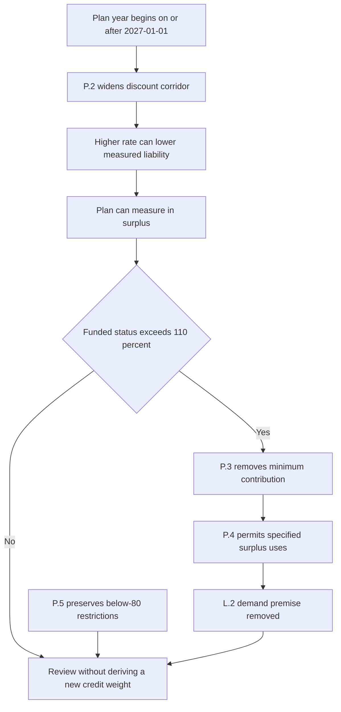

## Scope and effective boundary

This overlay tests the regulatory premise behind `FI-US-PENSION-LDI 2026-03`; it is neither replacement research nor a pension investment recommendation. DOL Release 2026-31 is effective **for plan years beginning on or after 2027-01-01**. It widens the permitted corridor around the 25-year average segment rates from 10% to 20% in each direction. The release says that the wider corridor can permit a higher liability discount rate, lowering measured liabilities; a plan at or near full funding under the former corridor will in most cases measure in surplus under the new one.

The research note was published on 2026-03-05 and applies to positions taken on or after 2026-04-01. It remains the basis of record for a position taken while it applied. Its live premise, however, must be tested from the release's effective boundary: the note expects corporate defined-benefit plans to keep buying long corporate paper through 2028 because surplus plans de-risk by extending duration and rotating from return-seeking assets into long credit.

## Directed supersession — the surplus-plan premise

**DOL Release 2026-31 P.2 and P.3 supersede the funding-rule premise in FI-US-PENSION-LDI 2026-03 L.2 for plan years beginning on or after 2027-01-01.** This is a directed, premise-level relationship. The release does not reissue, amend, or withdraw the research note.

The relationship follows the note's own failure condition. L.2 says that changing the rules so a sponsor can release or re-risk a surplus can reverse the flow on which the overweight rests. L.6 expressly identifies a change that permits surplus release, alters the discount-rate basis, or cuts contribution requirements as the risk that takes out L.2 and the recommendation. P.2 changes the discount-rate corridor and measurement result; P.3 removes the minimum required contribution for a plan whose P.2 funded-status measurement exceeds 110%, with an election to treat the excess as available for the permitted uses in P.4.

Those permitted uses matter to the demand mechanism. Subject to the P.6 notice requirement, a sponsor meeting the P.3 threshold may transfer excess assets to a qualified replacement plan or apply them to retiree health accounts. The release does not permit a sponsor reversion outside the existing statutory framework. Thus the overlay removes the surplus-protection and contribution/measurement assumptions that supported persistent de-risking demand; it does not establish the magnitude, timing, or direction of any replacement flow.

*The effective-date overlay changes the surplus-plan incentives underlying the research premise while retaining the separate below-80%-funded restriction boundary.*

## Directed preservation — the under-80%-funded boundary

**DOL Release 2026-31 P.5 preserves in full the requirements and restrictions applicable to plans below 80% funded; it does not preserve FI-US-PENSION-LDI 2026-03 L.2's surplus-plan demand premise.** P.5 also leaves benefit accrual and vesting rules unchanged and does not address the fiduciary standards governing plan-asset investment, which continue on their own terms.

The preservation is deliberately narrow. A plan below 80% funded receives no relief from restrictions currently applicable to it under P.2 or P.3. That retained constraint is not evidence that the note's aggregate thesis survives: L.2 rests on surplus plans protecting a surplus by de-risking, whereas P.2–P.4 change measurement, contribution, and permitted-use incentives for plans measuring above the P.3 threshold. Record the preserved underfunded-plan restrictions separately rather than using them to restore the superseded premise.

## Election and operating record

P.3 relief is conditional, not automatic. The plan must exceed 110% funded as measured under P.2, and the sponsor must elect the relief. A sponsor that elects it must notify participants within 30 days of the election in the release's prescribed form. Any review should therefore record the applicable plan-year start, P.2 measurement basis, whether the P.3 threshold is met, election status, permitted surplus use, and notice status; it should not assume that every plan receives relief simply because the corridor has changed.

No replacement pension-LDI research edition is supplied. The directed supersession calls for review of any guidance derived from the pension-demand recommendation, but this overlay **does not prescribe a new credit weight**, carry forward an old one, or infer one from the restrictions preserved for underfunded plans. Preserve the historical basis of record and obtain an authorized allocation decision rather than treating this regulatory overlay as replacement research.

## Focused checks

| Check | Required result |
| --- | --- |
| Effective date | Apply P.2–P.4 only for plan years beginning on or after 2027-01-01. |
| Directed relationship | Record P.2/P.3 as superseding L.2's funding-rule premise, not as superseding the research edition itself. |
| Mechanism | Verify the P.2 measurement, P.3 above-110% threshold, sponsor election, P.4 use, and P.6 participant notice before characterizing a specific plan as relieved. |
| Preservation | Record P.5's full preservation of below-80%-funded restrictions separately; do not treat it as a restoration of the surplus-plan demand premise. |
| Allocation authority | Retain the historical research record and escalate any derived guidance for authorized resolution; do not prescribe or calculate a replacement long-credit weight. |

## Evidence

- [DOL Release 2026-31, P.1–P.6](repo://external_sources/DOL/2026-08-funding-relief-and-discount-rates.md#L7-L35)
- [FI-US-PENSION-LDI 2026-03, L.1–L.7](repo://internal_research/FI/US/PENSION-LDI/2026-03.md#L12-L46)
- [Corpus frozen-authority convention](repo://README.md#L39-L48)
