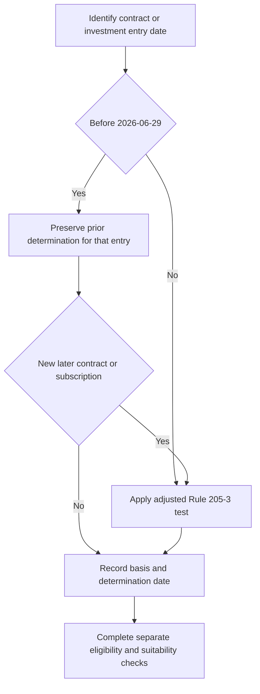

# Regulatory Overlay: Qualified-Client Thresholds and Transition

## Scope and controlling sources

This overlay records the adjusted dollar tests in SEC Order IA-7104 and the private-markets eligibility guide's implementation of that order. It is a compliance control, not research, client-specific advice, a suitability finding, or an investment approval. The order's scope is deliberately limited:

> “This order adjusts the dollar amount tests in rule 205-3 and nothing further. The accredited investor standards of Regulation D are not adjusted by this order. The qualified purchaser definition in section 2(a)(51) of the Investment Company Act of 1940 is not adjusted by this order. Each of those standards continues to apply according to its own terms.” — [SEC Order IA-7104, Q.6](repo://external_sources/SEC/2026-04-order-ia-7104-qualified-client.md#L34-L36)

The internal guide implements the order rather than independently setting thresholds: it requires the Q.2 assets-under-management or net-worth test for determinations on or after the order's effective date, and expressly directs staff to read the order rather than rely on a restatement. [Private Markets Client Eligibility Determination Guide, P.2](repo://internal_guidelines/suitability/private-markets-eligibility.md#L11-L15)

## Current qualified-client test

For an advisory contract or private-fund investment entered into on or after **2026-06-29**, apply the adjusted Rule 205-3 test at the entry timing specified in the order:

> “It is hereby ordered that, effective 2026-06-29, the dollar amount of the assets-under-management test set forth in rule 205-3(d)(1)(i) is $1,400,000, and the dollar amount of the net worth test set forth in rule 205-3(d)(1)(ii) is $2,700,000.” — [SEC Order IA-7104, Q.2](repo://external_sources/SEC/2026-04-order-ia-7104-qualified-client.md#L14-L18)

> “A client is a qualified client if the client has at least $1,400,000 under the management of the investment adviser immediately after entering into the advisory contract, or if the investment adviser reasonably believes, immediately prior to entering into the advisory contract, that the client has a net worth of more than $2,700,000.” — [SEC Order IA-7104, Q.2](repo://external_sources/SEC/2026-04-order-ia-7104-qualified-client.md#L16-L18)

For the net-worth pathway, exclude the value of the primary residence and indebtedness secured by it up to fair market value; a natural person's net worth may include jointly held spousal assets. The order says it does not modify either provision. [SEC Order IA-7104, Q.3](repo://external_sources/SEC/2026-04-order-ia-7104-qualified-client.md#L20-L22)

## Transition: preserve the prior decision, do not reuse it

The transition is limited to the pre-effective-date contract or investment; it is not a portable status for a later subscription. The governing preservation language is:

> “This order does not apply to an advisory contract entered into, or to an investment in a private fund made, before 2026-06-29. The transition provisions of rule 205-3(c) continue to apply, and a person who satisfied the dollar amount test in effect at the time of that person's entry continues to be a qualified client with respect to that contract or investment.” — [SEC Order IA-7104, Q.4](repo://external_sources/SEC/2026-04-order-ia-7104-qualified-client.md#L24-L28)

> “A determination made before the effective date is preserved and is not disturbed by this order. Such a determination may not be relied upon for a contract entered into, or an investment made, on or after the effective date.” — [SEC Order IA-7104, Q.4](repo://external_sources/SEC/2026-04-order-ia-7104-qualified-client.md#L26-L28)

The guide implements that boundary by keeping a properly made pre-effective-date determination valid, requiring the file to identify the prior thresholds, and requiring the adjusted amounts for a new subscription entered into on or after the effective date. [Private Markets Client Eligibility Determination Guide, P.3](repo://internal_guidelines/suitability/private-markets-eligibility.md#L17-L21)

*Entry-date control flow: prior reliance is preserved only for its earlier contract or investment, while every later entry uses the adjusted test.*

## Distinct decisions and operating order

Do not collapse the following decisions into one client label:

| Decision | What it establishes | Relationship to this overlay |
| --- | --- | --- |
| **Qualified client** | The Rule 205-3 assets-under-management or net-worth pathway, including the transition rule | This overlay changes these dollar tests only. |
| **Accredited investor** | Regulation D status | Determine separately; it was not adjusted by this order. A client may be accredited without being qualified. [Guide, P.4](repo://internal_guidelines/suitability/private-markets-eligibility.md#L23-L25) |
| **Qualified purchaser** | The Investment Company Act section 2(a)(51) definition | A separate standard, unchanged by this order, that applies on its own terms. |
| **Eligibility** | Whether the client may be offered the private-markets strategy under the internal guide | A regulatory determination; it must be determined and documented before any offer. [Guide, P.1](repo://internal_guidelines/suitability/private-markets-eligibility.md#L7-L10) |
| **Suitability** | Whether an eligible client should make the commitment, including liquidity | Necessary after eligibility and before commitment; it is not established by qualified-client status. [Guide, P.6](repo://internal_guidelines/suitability/private-markets-eligibility.md#L31-L35) |

Eligibility is necessary but not sufficient. The research allocation is only for eligible clients and does not determine qualified-client or accredited-investor status; it is not evidence for this gate. [Private Markets Allocation Framework, V.1–V.2](repo://internal_research/MA/GL/PRIVATE-MARKETS/2025-12.md#L16-L22) Before commitment, suitability also includes the liquidity constraint: assess the client's spending requirement, and do not exceed unfunded commitments equal to two years of liquid portfolio spending. [Private Markets Allocation Framework, V.6](repo://internal_research/MA/GL/PRIVATE-MARKETS/2025-12.md#L36-L38)

A private-markets commitment requires approval, but approval comes after the eligibility gate and cannot cure ineligibility. The authority matrix requires the P.1 eligibility determination before approval is sought and prohibits approval of a commitment for a client who is not eligible. [Portfolio Manager Discretion and Escalation Matrix, D.3 and D.5](repo://internal_guidelines/authority/discretion-matrix.md#L17-L29) [Portfolio Manager Discretion and Escalation Matrix, D.5](repo://internal_guidelines/authority/discretion-matrix.md#L39-L47)

## Determination file, retention, and review checks

The order requires retention of the Rule 205-3 basis:

> “An investment adviser relying on a determination under this order shall retain the records required by rule 204-2(a)(8) documenting the basis for that determination, including the dollar amount test relied upon and the date of the determination.” — [SEC Order IA-7104, Q.5](repo://external_sources/SEC/2026-04-order-ia-7104-qualified-client.md#L30-L32)

The guide implements and supplements that obligation: every determination records the pathway, evidence, decision maker, and date, and audit treats a determination without a recorded basis as no determination. [Private Markets Client Eligibility Determination Guide, P.5](repo://internal_guidelines/suitability/private-markets-eligibility.md#L27-L29)

Use these focused checks when opening or reviewing a file:

1. Identify the specific contract, investment, or new subscription and its entry date.
2. For a pre-2026-06-29 entry, retain the prior determination, identify its prior-threshold basis, and link it only to that entry.
3. For a 2026-06-29-or-later entry, document the applicable Q.2 pathway, its evidence, the adjusted dollar test relied upon, and determination date.
4. Record accredited-investor status separately; do not infer it from qualified-client status. Apply any qualified-purchaser requirement separately according to its own terms.
5. Stop the offering process if eligibility is missing, unsupported, or not met. For an eligible client, complete suitability and liquidity work before seeking commitment approval.
6. Retain the record and its evidence under Rule 204-2(a)(8); confirm that the file distinguishes the regulatory eligibility determination from suitability and approval.

## Source basis

- [SEC Order IA-7104, Q.1–Q.6](repo://external_sources/SEC/2026-04-order-ia-7104-qualified-client.md#L8-L36)
- [Private Markets Client Eligibility Determination Guide, P.1–P.6](repo://internal_guidelines/suitability/private-markets-eligibility.md#L7-L35)
- [Portfolio Manager Discretion and Escalation Matrix, D.3 and D.5](repo://internal_guidelines/authority/discretion-matrix.md#L17-L29)
- [Private Markets Allocation Framework, V.1–V.2 and V.6](repo://internal_research/MA/GL/PRIVATE-MARKETS/2025-12.md#L16-L22)
