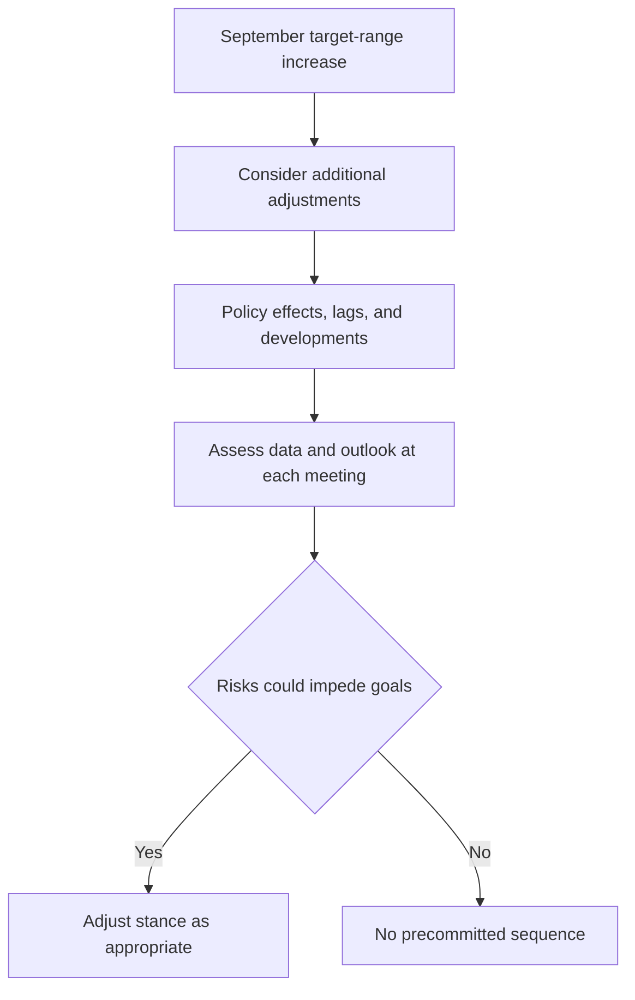

## Purpose and source boundary

This overlay is a reading boundary between the September Federal Open Market Committee (FOMC) statement and the US Fixed Income Research duration note. Both underlying documents label themselves synthetic demonstration material and disclaim reliance; this page records their stated content within that corpus, rather than treating either document as live guidance or investment advice.【repo://bulletins/FED/2026-09-fomc-statement.md#L3-L6】【repo://research/FI/US/DURATION-PATH/2026-10.md#L1-L3】

The FOMC statement was issued in September 2026 and is effective on publication.【repo://bulletins/FED/2026-09-fomc-statement.md#L8-L8】 The research note was published on 2026-10-06 and applies only to positions taken on or after 2026-11-01.【repo://research/FI/US/DURATION-PATH/2026-10.md#L12-L14】 That difference in scope matters: the statement records a Committee decision, while the later note supplies a desk recommendation.

## September decision and what it covers

At its September meeting, the FOMC raised the federal-funds target range by 25 basis points to **3-3/4 to 4 percent**. It judged a somewhat more restrictive stance appropriate in support of its dual mandate.【repo://bulletins/FED/2026-09-fomc-statement.md#L10-L12】 The stated rationale was that inflation remained elevated relative to the 2 percent objective and that the action supports a timelier return to that objective.【repo://bulletins/FED/2026-09-fomc-statement.md#L14-L16】

The same statement separately maintains ample reserves and continues reductions of Treasury and agency mortgage-backed-security holdings at the previously announced pace; it announces no change in that pace.【repo://bulletins/FED/2026-09-fomc-statement.md#L22-L24】 This balance-sheet treatment is part of the statement's scope, but it is not an announced sequence of future target-range changes.

## Non-path limitation and decision process

F.5 directs the Committee, when deciding the extent of any additional target-range adjustments, to consider cumulative policy effects, policy lags, and economic and financial developments.【repo://bulletins/FED/2026-09-fomc-statement.md#L26-L28】 It then expressly says that the statement describes **no path** and commits the Committee to **no sequence** of future adjustments. Instead, the Committee will assess incoming data and the evolving outlook at each meeting and may adjust the policy stance if risks could impede its goals.【repo://bulletins/FED/2026-09-fomc-statement.md#L30-L30】

This is the stated conditional decision process; it does not project the direction, timing, or number of future changes.【repo://bulletins/FED/2026-09-fomc-statement.md#L28-L30】

## Relationship to the duration assumption

The duration desk reads the FOMC communication narrowly: it calls F.5 a decision rather than a path. Its central case assumes **one further increase over the coming 12 months**, versus **one and a half** increases implied by the market; the half-step gap is the entire basis for the duration recommendation and is characterized as a modest deviation, not a conviction call.【repo://research/FI/US/DURATION-PATH/2026-10.md#L20-L24】 That one-increase figure is therefore the desk's scenario assumption—not FOMC guidance, a forecast, or a mechanical consequence of the September decision.

The resulting recommendation is a modest **+0.4 years** of duration versus benchmark in the five-to-ten-year sector, with no long-end duration expression.【repo://research/FI/US/DURATION-PATH/2026-10.md#L16-L18】 The desk expects 2s10s steepening and expresses the position with a steepening bias rather than as a parallel duration extension.【repo://research/FI/US/DURATION-PATH/2026-10.md#L30-L32】 It excludes the long end because it sees term premium as fair to cheap, heavy long-end supply, and no catalyst for compression within twelve months; a long-end duration position would express a view it does not hold.【repo://research/FI/US/DURATION-PATH/2026-10.md#L26-L28】

## Monitoring boundary

The note identifies risks that could defeat its scenario or trade expression: inflation prints could turn its assumed single increase into a sequence, a fiscal event could raise long-end supply beyond projections, and a disorderly term-premium repricing could hurt the front-loaded position. It also notes that three members dissented at the July meeting in favor of an increase.【repo://research/FI/US/DURATION-PATH/2026-10.md#L34-L36】【repo://bulletins/FED/2026-09-fomc-statement.md#L34-L36】 Monitor these as research risks, while retaining the FOMC's no-path limitation: no number or schedule of future adjustments may be inferred from the statement.

For the dated research view, see [US Duration and Curve](/openwiki/research/fixed-income/duration-and-curve.md). For portfolio-control context, see [Global Multi-Asset Bands](/openwiki/guidance/allocation/global-multi-asset-bands.md).
