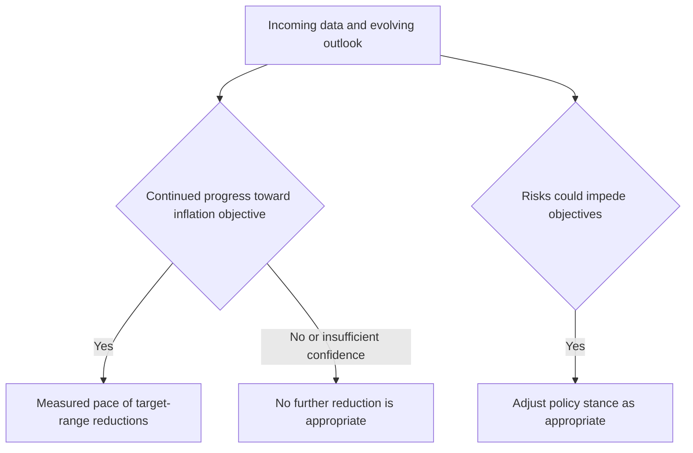

## Purpose and scope

This overlay records the external policy premise for the duration and curve view; it is not an investment recommendation and does not convert Federal Reserve guidance into a promised rate path. The underlying statement was issued in January 2026 and became effective on publication. Its assessment says inflation has moved closer to the two-percent objective, labour-market conditions have come into better balance, and risks are roughly balanced.

## Contingent policy-path guidance

The F.2 contingency is, exactly:

> The Committee anticipates that reductions in the target range will proceed at a measured pace, contingent on continued progress toward the inflation objective. The Committee does not expect it will be appropriate to reduce the target range further until it has gained greater confidence that inflation is moving sustainably toward two percent.

This is conditional guidance, not a commitment. The statement expressly characterises projections as conditional on the realised inflation path. The Committee retains the responsibility to assess incoming data and the evolving outlook and may adjust the policy stance if risks could impede its objectives.

This diagram shows the conditional decision logic stated in F.2 and F.4; it does not depict a precommitted schedule.

## Connection to the duration note

The research desk says its central case follows the Federal Reserve's measured, realised-disinflation-contingent guidance. Separately, the desk **assumes three reductions over the coming twelve months**, compared with a market-implied two and a half. That half-step is the entire duration recommendation and is described by the desk as a modest deviation rather than a conviction call.

Accordingly, the three-reduction figure is the desk's scenario input, not a Federal Reserve forecast, promise, or mechanical consequence of F.2. The distinction is an operating invariant for readers of the duration note: preserve the regulator's contingency when using the desk's central case.

## Implications and failure conditions

The duration note implements the view as a modest +0.4-year duration position against benchmark in the five-to-ten-year area, avoids a long-end duration expression, and carries a steepening bias between two and ten years. Its stated risks include an inflation-print sequence that removes the F.2 contingency, heavier long-end supply after a fiscal event, and a disorderly term-premium repricing. If realised inflation fails to sustain progress toward two percent, treating the desk's reduction count as committed policy would invalidate the premise rather than merely miss a timing estimate.

The Federal Reserve statement also continues previously announced balance-sheet reductions in Treasury and agency mortgage-backed securities with no announced pace change. That balance-sheet direction is separate from the conditional target-range guidance and should not be used to infer an additional policy-rate commitment.

## Source boundary

- **Policy authority:** `bulletins/FED/2026-01-policy-rate-path-statement.md`, especially F.2 for rate-path guidance, F.3 for balance sheet, and F.4 for data dependence.
- **Research interpretation:** `research/FI/US/DURATION-PATH/2026-01.md`. This note supplies the three-reduction assumption and positioning; it does not alter or speak for the Federal Reserve.
