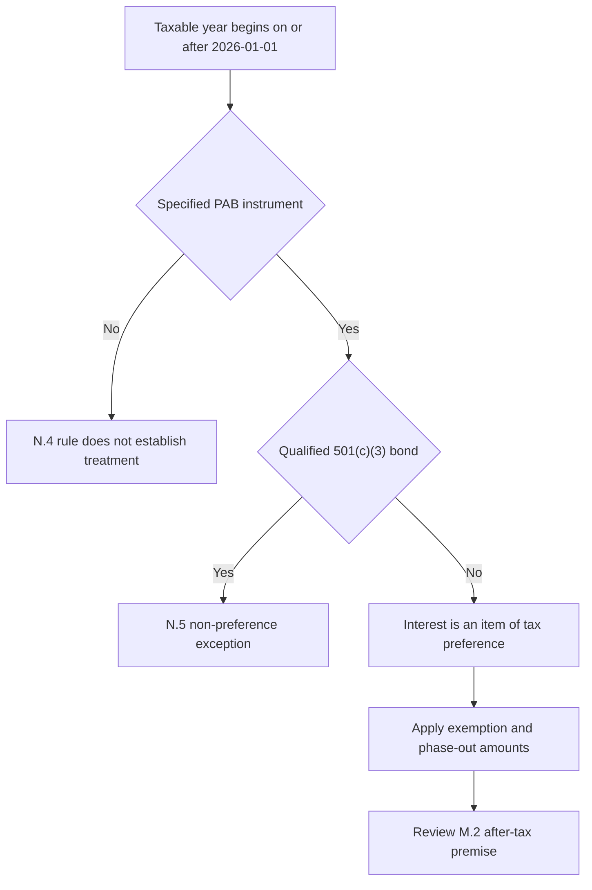

## Scope and source boundary

This page records the stated effect of the synthetic-corpus IRS Revenue Procedure 2025-41, not live tax guidance or investment advice. The procedure applies to taxable years beginning **“on or after” 2026-01-01** and supersedes section 2.11 of Rev. Proc. 2024-58; it makes no inference about items it does not address. [Revenue Procedure 2025-41, N.1 and N.7–N.8](repo://bulletins/IRS/2025-08-rev-proc-2025-41-amt-thresholds.md#L8-L12) [Revenue Procedure 2025-41, N.7–N.8](repo://bulletins/IRS/2025-08-rev-proc-2025-41-amt-thresholds.md#L40-L46) [Corpus disclaimer](repo://README.md#L7-L19)

The overlay answers a limited question: when the procedure’s AMT amounts and PAB rule reach a holder and instrument, what happens to the municipal research’s explicitly threshold-dependent after-tax premise? It does not set a portfolio allocation, determine a holder’s actual tax liability, or supply a tax calculation for a particular account.

## 2026 AMT amounts and phase-out mechanism

For taxable years beginning **“on or after” 2026-01-01**, the AMT exemption is **$90,100** for an unmarried individual other than a surviving spouse and **$140,200** for married individuals filing a joint return or a surviving spouse. For a married individual filing separately, the amount is one half of the joint-return amount. [Revenue Procedure 2025-41, N.2](repo://bulletins/IRS/2025-08-rev-proc-2025-41-amt-thresholds.md#L14-L16)

The exemption declines by 25 cents for every dollar of alternative minimum taxable income above **$500,000** for an unmarried individual and **$1,000,000** for married individuals filing jointly. Those thresholds are not determined by section 1(f) and are not indexed for taxable years beginning before 2030-01-01. The procedure states that a taxpayer above the applicable threshold is subject to the N.4 treatment regardless of whether the prior thresholds had subjected that taxpayer to the tax. [Revenue Procedure 2025-41, N.3](repo://bulletins/IRS/2025-08-rev-proc-2025-41-amt-thresholds.md#L18-L22)

## Instrument boundary

For a specified private activity bond, interest remains an **“item of tax preference”** under section 57(a)(5)(A) and is included in alternative minimum taxable income, subject to the stated deduction adjustment. The procedure defines that instrument, for this purpose, as a section 141 private activity bond issued after 1986-08-07 whose interest is excluded from gross income under section 103; it does not modify that definition or treatment. [Revenue Procedure 2025-41, N.4](repo://bulletins/IRS/2025-08-rev-proc-2025-41-amt-thresholds.md#L24-L28)

The statutory boundary is not exhausted by the general PAB description. The procedure separately continues the exceptions for certain qualified residential-rental exempt-facility bonds, qualified mortgage bonds, qualified veterans’ mortgage bonds, and qualifying refunding bonds whose refunded—or, in a series, original—bond was issued before 1986-08-08. [Revenue Procedure 2025-41, N.6](repo://bulletins/IRS/2025-08-rev-proc-2025-41-amt-thresholds.md#L36-L38)

Revenue Procedure 2025-41 N.5 explicitly **preserves** the qualified-501(c)(3) exception: a qualified section 145 bond is excluded from “private activity bond” for this preference rule, and its interest is neither an item of tax preference nor included in alternative minimum taxable income. Nothing in N.2 or N.3 applies to that interest. This is relevant to the research’s preferred sectors because nonprofit hospitals and private higher education are predominantly qualified 501(c)(3) bonds, while airport special-facility paper predominantly is not. Qualification must therefore be determined for the instrument rather than inferred solely from a sector label. [Revenue Procedure 2025-41, N.5](repo://bulletins/IRS/2025-08-rev-proc-2025-41-amt-thresholds.md#L30-L34) [Municipal Credit 2025-06, M.5](repo://research/FI/US/MUNI-CREDIT/2025-06.md#L44-L50)

This decision flow separates the effective tax-year condition, the specified-PAB rule, and the qualified-501(c)(3) exception; it is not an account-level AMT calculation.

## Relevance to Municipal Credit 2025-06

Municipal Credit 2025-06 M.2 characterizes the private-activity position as an after-tax—not a spread—case for top-bracket holders. It identifies the thresholds, rather than the long-settled preference treatment, as its load-bearing assumption: if a lower phase-out threshold draws a materially larger share of those holders into AMT, M.1 does not survive. The procedure’s 2026 threshold reset is consequently an overlay on that premise for affected taxpayers and non-excepted instruments; it is not a change to the section 57(a)(5) preference rule or a replacement municipal recommendation. [Municipal Credit 2025-06, M.2](repo://research/FI/US/MUNI-CREDIT/2025-06.md#L22-L30) [Revenue Procedure 2025-41, N.3–N.4](repo://bulletins/IRS/2025-08-rev-proc-2025-41-amt-thresholds.md#L18-L28)

The credit-fundamental and supply discussions remain independently stated in M.3–M.4. They support only a neutral-to-modest overweight on their own, rather than the full M.1 overweight. Do not extend the AMT overlay to sector limits or duration guidance that the procedure does not address. [Municipal Credit 2025-06, M.3–M.4](repo://research/FI/US/MUNI-CREDIT/2025-06.md#L32-L42) [Municipal Credit 2025-06, M.5–M.6](repo://research/FI/US/MUNI-CREDIT/2025-06.md#L44-L54)

## Required review and control boundary

M.8 requires immediate review and re-issue when an announced change affects the M.2 tax treatment. The allocation guide’s 22% top-bracket municipal target against an 18% neutral weight, four-point overweight, and PAB concentration are adopted from M.1/M.2; the guide does not authorize a portfolio manager to choose a replacement target. [Municipal Credit 2025-06, M.8](repo://research/FI/US/MUNI-CREDIT/2025-06.md#L68-L70) [Allocation Guide, A.3](repo://guidelines/allocation/us-taxable-fixed-income.md#L17-L23)

The guide’s suspension and Committee-escalation rule has a distinct trigger: a research note cited by the guide is superseded or withdrawn. The available evidence establishes an immediate research review and re-issue for the affected premise, but does not establish that Revenue Procedure 2025-41 itself suspends the municipal weight, returns the paired investment-grade corporate position to neutral, or selects a successor weight. This overlay does not infer an acquisition-date transition rule. If the guide’s stated supersession-or-withdrawal trigger later occurs, the derived municipal overweight and paired corporate underweight are suspended and return to neutral, and the manager escalates rather than re-deriving a weight. [Allocation Guide, A.1 and A.5–A.6](repo://guidelines/allocation/us-taxable-fixed-income.md#L7-L11) [Allocation Guide, A.5–A.6](repo://guidelines/allocation/us-taxable-fixed-income.md#L33-L43) [Discretion Matrix, D.4](repo://guidelines/authority/discretion-matrix.md#L31-L37)

Operationally, retain the taxpayer’s taxable-year facts, alternative minimum taxable income inputs, and instrument qualification evidence needed to apply the stated boundaries; route a changed research conclusion through the research and Committee control paths. An investment-discretion approval cannot create an exception to a stated regulatory requirement. [Discretion Matrix, D.5–D.6](repo://guidelines/authority/discretion-matrix.md#L39-L51)
