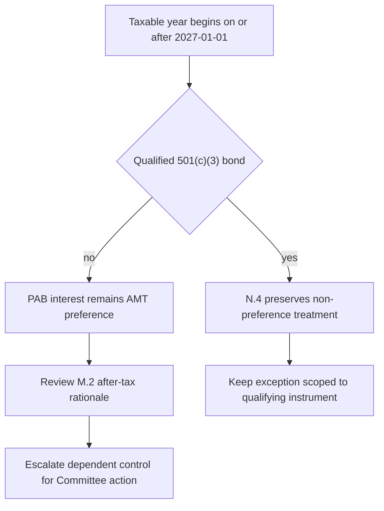

IRS Notice 2026-18 is a tax-treatment overlay, not a wholesale replacement for the municipal-credit view. It applies for taxable years beginning **“on or after” 2027-01-01**. Its relevant effect is to lower the AMT exemption and phase-out thresholds, changing when the existing AMT preference on certain private activity bond (PAB) interest produces liability. The notice itself says that treatment does not change; the positioning consequence arises because the Municipal Credit 2025-11 thesis made the former threshold population a load-bearing assumption. [Notice N.1–N.3](repo://bulletins/IRS/2026-03-amt-private-activity-bond-interest.md#L3-L21) · [Municipal Credit M.2](repo://research/FI/US/MUNI-CREDIT/2025-11.md#L11-L17)

## Effective-date rule and AMT mechanics

For taxable years beginning **“on or after” 2027-01-01**, the notice sets the AMT exemption at **$85,700** for married individuals filing jointly and **$55,100** for unmarried individuals. It sets the corresponding phase-out thresholds at **$500,000** and **$300,000**, respectively. The exemption falls by $0.25 for each dollar of alternative minimum taxable income above the applicable threshold, and these amounts are not indexed before taxable years beginning 2030-01-01. The notice permits reliance on the stated amounts until superseded and says that the later indexation methodology will be published separately. [Notice N.2 and N.6](repo://bulletins/IRS/2026-03-amt-private-activity-bond-interest.md#L9-L15) · [Notice N.6](repo://bulletins/IRS/2026-03-amt-private-activity-bond-interest.md#L33-L35)

Interest on a qualified PAB issued after 1986, other than a qualified 501(c)(3) bond, remains an **“item of tax preference”** included in alternative minimum taxable income under section 57(a)(5). Thus the operative change is not a newly imposed preference: reduced thresholds can bring taxpayers into AMT for whom that preference previously did not create actual liability. [Notice N.3](repo://bulletins/IRS/2026-03-amt-private-activity-bond-interest.md#L17-L21)

## Instrument boundary: qualified 501(c)(3) bonds

N.4 expressly preserves the qualified 501(c)(3) exception: interest on a qualified 501(c)(3) bond is not an AMT preference and is unaffected by the notice. This is material to the municipal implementation universe because the research identifies nonprofit hospital systems and private higher education among preferred PAB sectors; airport special-facility obligations commonly are not qualified 501(c)(3) bonds. The exception must be tested at the instrument level rather than inferred from an issuer or municipal-sector label. [Notice N.4](repo://bulletins/IRS/2026-03-amt-private-activity-bond-interest.md#L23-L27) · [Municipal Credit M.5](repo://research/FI/US/MUNI-CREDIT/2025-11.md#L31-L35)

## No acquisition-date grandfathering

There is no transition relief. The notice provides that the N.3 treatment applies to interest received in a taxable year beginning **“on or after” 2027-01-01**, **“regardless of when the obligation was acquired.”** A pre-effective-date purchase therefore does not preserve the prior practical AMT outcome for interest received in an affected tax year. Apply the overlay by the holder's taxable-year and interest-receipt condition, not the acquisition date. [Notice N.5](repo://bulletins/IRS/2026-03-amt-private-activity-bond-interest.md#L29-L31)

## Effect on the municipal positioning basis

For the private-activity after-tax rationale, **N.3 supersedes M.2**: M.2 had relied on indexed AMT amounts leaving most top-bracket clients outside AMT, and stated that a lower exemption or phase-out threshold drawing materially more such holders into AMT would cause the M.1 recommendation not to survive. N.3 supplies that named threshold change while retaining the underlying statutory preference. This is an overlay conclusion about the rationale, not a statement that the notice changes every municipal holding or that it chooses a replacement weight. [Notice N.3](repo://bulletins/IRS/2026-03-amt-private-activity-bond-interest.md#L17-L21) · [Municipal Credit M.2](repo://research/FI/US/MUNI-CREDIT/2025-11.md#L11-L17)

Separately, **N.4 preserves qualified 501(c)(3) treatment**: it states that such interest is not an AMT preference and is unaffected. That preserved exception does not reinstate M.2's general private-activity premise for taxpayers and instruments subject to N.3; it identifies a bounded unaffected class. [Notice N.4](repo://bulletins/IRS/2026-03-amt-private-activity-bond-interest.md#L23-L25) · [Municipal Credit M.2](repo://research/FI/US/MUNI-CREDIT/2025-11.md#L13-L17)

Credit fundamentals and constrained supply are independent portions of the research. They support only a neutral-to-modest overweight on their own, rather than the size of the M.1 overweight. Do not characterize the notice as eliminating the whole municipal view, its sector limits, or its duration guidance. [Municipal Credit M.3–M.4](repo://research/FI/US/MUNI-CREDIT/2025-11.md#L19-L29) · [Municipal Credit M.5–M.6](repo://research/FI/US/MUNI-CREDIT/2025-11.md#L31-L39)

## Control response and ownership boundary

The research note requires immediate review and re-issue on an announced change to the tax treatment described in M.2. The allocation guide makes the top-bracket municipal target 22% versus an 18% neutral weight, adopts its four-point overweight and PAB concentration from M.1/M.2, and requires escalation when its supporting research is superseded or withdrawn. The notice and overlay are not authority for a portfolio manager to calculate a substitute target. [Municipal Credit M.8](repo://research/FI/US/MUNI-CREDIT/2025-11.md#L53-L55) · [Allocation Guide A.1 and A.3](repo://guidelines/allocation/us-taxable-fixed-income.md#L7-L11) · [Allocation Guide A.3](repo://guidelines/allocation/us-taxable-fixed-income.md#L17-L23)

This decision flow applies the effective-date, instrument, and governance boundaries without selecting a replacement portfolio weight.

Where the cited research-dependent municipal overweight is suspended under the guide, its paired four-point investment-grade corporate underweight is suspended as well and both return to neutral. A suspension-driven band condition is not ordinary drift and is not automatically rebalanced; the successor control is a Committee decision. [Allocation Guide A.5–A.6](repo://guidelines/allocation/us-taxable-fixed-income.md#L33-L43)

Under the escalation procedure, managers cannot directly adopt replacement research into a binding weight. The Committee may re-adopt a successor control only after the required escalation record identifies the affected derived weights and accounts. [Discretion Matrix D.4](repo://guidelines/authority/discretion-matrix.md#L31-L37)
