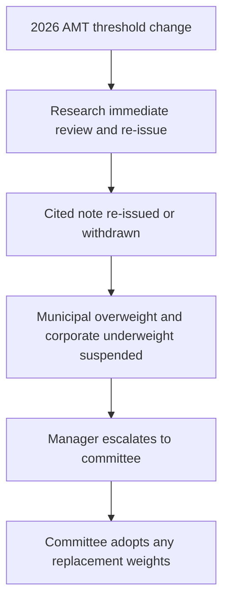

## Scope and effective-date boundary

This overlay applies to taxable years beginning **on or after 2026-01-01**. It is based on a synthetic demonstration bulletin, not real IRS guidance or a source on which a client or the firm may rely. The operational point is nevertheless explicit in the corpus: the change is a threshold change, not a change in whether specified private-activity-bond interest is an AMT preference item. [IRS Revenue Procedure 2025-41 N.1, N.8](repo://bulletins/IRS/2025-08-rev-proc-2025-41-amt-thresholds.md#L10-L12) [N.4](repo://bulletins/IRS/2025-08-rev-proc-2025-41-amt-thresholds.md#L24-L28)

## What changes in 2026

For the covered taxable years, IRS Revenue Procedure 2025-41 N.2 sets the section 55(d)(1) AMT exemption at $90,100 for an unmarried individual other than a surviving spouse and $140,200 for married taxpayers filing jointly or a surviving spouse (one half of the joint amount for married filing separately). IRS Revenue Procedure 2025-41 N.3 then states verbatim that the exemption "is reduced by twenty-five cents for each dollar" of AMTI above $500,000 for an unmarried taxpayer and $1,000,000 for a joint return. The stated thresholds are neither determined under section 1(f) nor indexed before 2030-01-01. [N.2–N.3](repo://bulletins/IRS/2025-08-rev-proc-2025-41-amt-thresholds.md#L14-L22)

**Relationship — supersession.** IRS Revenue Procedure 2025-41 N.3 **supersedes** FI-US-MUNI-CREDIT 2025-06 M.2's threshold premise for taxable years beginning on or after 2026-01-01: the research used then-current phase-out points at which the exemption reached zero ($978,750 unmarried and $1,800,700 joint) to conclude that most top-bracket clients lay outside AMT. The note labels that premise its "load-bearing assumption" and says its overweight does not survive a reduction that draws a materially larger share of those clients into AMT. The 2026 threshold change therefore removes the stated after-tax basis for the private-activity concentration; it does not retrospectively rewrite the basis of record for positions taken under the 2025-06 edition. [IRS Revenue Procedure 2025-41 N.3](repo://bulletins/IRS/2025-08-rev-proc-2025-41-amt-thresholds.md#L18-L22) [FI-US-MUNI-CREDIT 2025-06 M.2](repo://research/FI/US/MUNI-CREDIT/2025-06.md#L22-L30) [edition applicability](repo://research/FI/US/MUNI-CREDIT/2025-06.md#L12-L14)

The practical implication is client-specific AMT exposure, not a blanket conclusion that municipal credit or every private-activity bond is federally taxable. The 2025-06 note says the pre-tax private-activity spread is generally inside comparable corporate credit; its advantage exists only after tax and for top-bracket holders. Its credit fundamentals support only neutral to modest overweight independently. [FI-US-MUNI-CREDIT 2025-06 M.2–M.3](repo://research/FI/US/MUNI-CREDIT/2025-06.md#L22-L36)

## What the procedure preserves

**Private-activity treatment.** IRS Revenue Procedure 2025-41 N.4 **preserves** FI-US-MUNI-CREDIT 2025-06 M.2's stated preference-item treatment: interest on a specified private activity bond "remains an item of tax preference" under section 57(a)(5)(A) and is included in AMTI, subject to the stated deduction adjustment. It also says that it does not modify the section 57(a)(5)(C)(i) definition: a section 141 private activity bond issued after 1986-08-07 whose interest is excluded from gross income under section 103. Thus, the regulatory change changes the AMT population exposed to the preference rather than eliminating the preference itself. [IRS Revenue Procedure 2025-41 N.4](repo://bulletins/IRS/2025-08-rev-proc-2025-41-amt-thresholds.md#L24-L28) [FI-US-MUNI-CREDIT 2025-06 M.2](repo://research/FI/US/MUNI-CREDIT/2025-06.md#L24-L30)

**Qualified 501(c)(3) exception.** IRS Revenue Procedure 2025-41 N.5 **preserves** FI-US-MUNI-CREDIT 2025-06 M.5's differentiated exposure among preferred sectors. For section 57(a)(5)(C)(i), the procedure says a qualified section 145 501(c)(3) bond is not a private activity bond; its interest "is not an item of tax preference and is not included in alternative minimum taxable income." It further says this treatment is "preserved in full and is unaffected" by N.2 or N.3. The research identifies nonprofit hospitals and private higher education as predominantly qualified 501(c)(3) bonds, while airport special-facility paper predominantly is not; the preserved exception therefore prevents treating all preferred private-activity exposure alike. [IRS Revenue Procedure 2025-41 N.5](repo://bulletins/IRS/2025-08-rev-proc-2025-41-amt-thresholds.md#L30-L34) [FI-US-MUNI-CREDIT 2025-06 M.5](repo://research/FI/US/MUNI-CREDIT/2025-06.md#L44-L50)

Separately, IRS Revenue Procedure 2025-41 N.6 preserves the statutory exceptions for specified exempt-facility, qualified mortgage, qualified veterans' mortgage, and qualifying pre-1986 refunding bonds. They are not an authorization to disregard account-level suitability or allocation limits. [N.6](repo://bulletins/IRS/2025-08-rev-proc-2025-41-amt-thresholds.md#L36-L38)

**Prior procedure.** IRS Revenue Procedure 2025-41 N.1 **supersedes** Rev. Proc. 2024-58 section 2.11 in its entirety; N.7 repeats that result. This is separate from its supersession of the research note's threshold premise. [IRS Revenue Procedure 2025-41 N.1, N.7](repo://bulletins/IRS/2025-08-rev-proc-2025-41-amt-thresholds.md#L10-L12) [N.7](repo://bulletins/IRS/2025-08-rev-proc-2025-41-amt-thresholds.md#L40-L42)

## Allocation response and authority boundary

FI-US-MUNI-CREDIT 2025-06 M.8 requires immediate review and re-issue, rather than scheduled review, for a change to the tax treatment described in M.2. The threshold is expressly the risk the desk says would invalidate M.2 and the recommendation. That triggers research reassessment; it does not permit a portfolio manager to recompute the 22% target or choose a replacement view. [M.7–M.8](repo://research/FI/US/MUNI-CREDIT/2025-06.md#L56-L70)

The following control flow applies once the research note is re-issued or withdrawn:

This shows the governance sequence after the research lifecycle event; the regulatory change itself does not give the manager authority to alter a weight.

**Relationship — implementation and constraint.** The US Taxable Account Fixed Income Allocation Guide A.3 **implements** FI-US-MUNI-CREDIT 2025-06 M.1–M.2 by setting a 22% municipal target for top-federal-bracket clients, four points above neutral, and concentrating that overweight in private activity. It says this is an after-tax, not credit, position. The same guide limits below-top-bracket accounts to the 18% neutral municipal weight without the private-activity concentration. [Allocation Guide A.3](repo://guidelines/allocation/us-taxable-fixed-income.md#L17-L23) [FI-US-MUNI-CREDIT 2025-06 M.1–M.2](repo://research/FI/US/MUNI-CREDIT/2025-06.md#L16-L30)

**Relationship — constraint.** IRS Revenue Procedure 2025-41 N.3 **constrains** the Allocation Guide A.3 response by removing the research's threshold-based after-tax premise for the private-activity overweight; it does not itself prescribe a replacement allocation. The guide makes the operational boundary explicit: if a cited research note is superseded or withdrawn, its derived weight is suspended rather than carried forward and requires escalation. The paired 28% investment-grade-corporate target and four-point underweight also suspend and return to neutral with the municipal overweight, avoiding an unsupported structural credit short. [IRS Revenue Procedure 2025-41 N.3](repo://bulletins/IRS/2025-08-rev-proc-2025-41-amt-thresholds.md#L18-L22) [Allocation Guide A.1, A.3, A.5](repo://guidelines/allocation/us-taxable-fixed-income.md#L7-L11) [A.3](repo://guidelines/allocation/us-taxable-fixed-income.md#L17-L23) [A.5](repo://guidelines/allocation/us-taxable-fixed-income.md#L33-L37)

The discretion matrix D.4 requires the manager to escalate rather than re-derive a weight when a cited note is superseded or withdrawn. The record must identify the old and replacement notes, every derived weight, and affected accounts; neither carrying forward the old weight nor directly adopting the replacement recommendation is permitted. Committee adoption is required because moving a research view into a binding weight is a committee act. A stated regulatory requirement cannot be cleared through discretionary approval. [Discretion Matrix D.4–D.5](repo://guidelines/authority/discretion-matrix.md#L31-L47)
