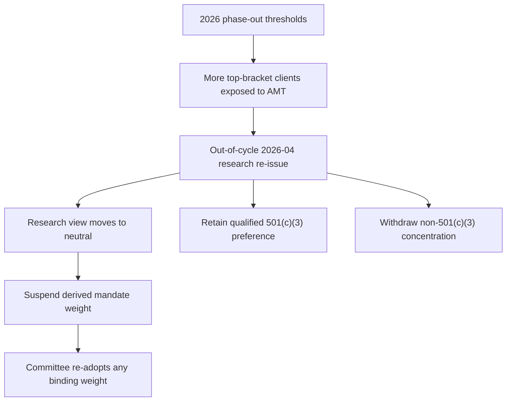

## Scope and effective-date boundary

IRS Revenue Procedure 2025-41 is a synthetic demonstration document and “nothing here is guidance, and no reliance is possible.” Within the corpus, it applies to taxable years beginning “on or after 2026-01-01.” It is a regulatory overlay: it states tax treatment and thresholds, not a portfolio allocation instruction. [Revenue Procedure notice](repo://bulletins/IRS/2025-08-rev-proc-2025-41-amt-thresholds.md#L3-L8) [Revenue Procedure N.8](repo://bulletins/IRS/2025-08-rev-proc-2025-41-amt-thresholds.md#L44-L46)

For those taxable years, N.2 sets the section 55(d)(1) AMT exemption at $90,100 for an unmarried individual other than a surviving spouse and $140,200 for married joint filers or a surviving spouse; married filing separately receives half the joint amount. N.3 says the exemption “is reduced by twenty-five cents for each dollar” of AMTI above $500,000 for an unmarried individual and $1,000,000 for a joint return. Those thresholds are not determined by section 1(f) and are not indexed before 2030-01-01. [Revenue Procedure N.2–N.3](repo://bulletins/IRS/2025-08-rev-proc-2025-41-amt-thresholds.md#L14-L22)

IRS Revenue Procedure 2025-41 **supersedes** Rev. Proc. 2024-58 section 2.11 in its entirety. That supersession is distinct from the later research lifecycle described below. [Revenue Procedure N.1](repo://bulletins/IRS/2025-08-rev-proc-2025-41-amt-thresholds.md#L10-L12) [Revenue Procedure N.7](repo://bulletins/IRS/2025-08-rev-proc-2025-41-amt-thresholds.md#L40-L42)

## Preserved tax treatments

IRS Revenue Procedure 2025-41 **preserves** the specified-private-activity-bond preference treatment: interest “remains an item of tax preference” under section 57(a)(5)(A), is included in AMTI, and is subject to the stated deduction adjustment. N.4 also says the procedure does not modify the specified-bond definition—section 141 private-activity bonds issued after 1986-08-07 with section 103-excluded interest—or the treatment itself. The threshold event therefore expands the population to which the preference can matter; it does not eliminate the preference. [Revenue Procedure N.4](repo://bulletins/IRS/2025-08-rev-proc-2025-41-amt-thresholds.md#L24-L28)

IRS Revenue Procedure 2025-41 **preserves** the qualified-501(c)(3) treatment. A qualified section 145 bond is excluded from “private activity bond” for this purpose; its interest “is not an item of tax preference and is not included in alternative minimum taxable income.” N.5 adds that this treatment “is preserved in full and is unaffected” by N.2 or N.3. The threshold change consequently does not reach qualified-501(c)(3) interest. [Revenue Procedure N.5](repo://bulletins/IRS/2025-08-rev-proc-2025-41-amt-thresholds.md#L30-L34)

N.6 leaves separate exceptions intact for specified qualified residential-rental exempt-facility bonds, qualified mortgage bonds, qualified veterans’ mortgage bonds, and qualifying pre-1986 refunding bonds. It makes no inference about items the procedure does not address. [Revenue Procedure N.6](repo://bulletins/IRS/2025-08-rev-proc-2025-41-amt-thresholds.md#L36-L38) [Revenue Procedure N.7](repo://bulletins/IRS/2025-08-rev-proc-2025-41-amt-thresholds.md#L40-L42)

## Completed research re-issue

FI-US-MUNI-CREDIT 2026-04 **supersedes** FI-US-MUNI-CREDIT 2025-06 in its entirety for positions taken on or after 2026-05-01; the earlier edition remains the basis of record for positions taken while it stood. Published 2026-04-09, the replacement was re-issued out of cycle in response to Revenue Procedure 2025-41 under the prior note’s M.8 review trigger. [Municipal research 2026-04, publication and M.1](repo://research/FI/US/MUNI-CREDIT/2026-04.md#L16-L18) [Municipal research 2026-04 M.1](repo://research/FI/US/MUNI-CREDIT/2026-04.md#L20-L27)

The completed re-issue moves the desk view from overweight to neutral and withdraws the former private-activity concentration. It attributes the outcome to the fixed $500,000/$1,000,000 phase-out thresholds: its modelling places a majority of the formerly assumed-outside-AMT top-bracket client base inside AMT for 2026, compresses the after-tax advantage to about 15 basis points from 90–110 basis points, and places that residual inside transaction costs. [Municipal research 2026-04 M.1–M.2](repo://research/FI/US/MUNI-CREDIT/2026-04.md#L20-L24) [Municipal research 2026-04 M.2](repo://research/FI/US/MUNI-CREDIT/2026-04.md#L37-L53)

The re-issue retains a modest preference limited to qualified-501(c)(3) obligations of nonprofit hospitals and private higher education because those sectors are predominantly qualified-501(c)(3) issuance. It withdraws the airport special-facility preference in full because that paper is predominantly non-501(c)(3) private-activity issuance. This preserves the required distinction between a generally withdrawn private-activity concentration and the tax treatment that remains intact for qualified-501(c)(3) obligations. [Municipal research 2026-04 M.3](repo://research/FI/US/MUNI-CREDIT/2026-04.md#L55-L67)

Within its neutral research view, FI-US-MUNI-CREDIT 2026-04 recommends no new non-501(c)(3) private-activity positions; it does not recommend forced sales of existing positions and instead describes orderly reduction. Its eight-to-fifteen-year duration preference is unchanged. These are research conclusions, not binding transition instructions. [Municipal research 2026-04 M.4](repo://research/FI/US/MUNI-CREDIT/2026-04.md#L69-L78) [Municipal research 2026-04 M.6](repo://research/FI/US/MUNI-CREDIT/2026-04.md#L86-L89)

This flow shows the completed research lifecycle and the separate mandate-governance response; the revenue procedure itself does not select a municipal weight. [Municipal research 2026-04, publication and M.1](repo://research/FI/US/MUNI-CREDIT/2026-04.md#L16-L27) [Discretion matrix D.4](repo://guidelines/authority/discretion-matrix.md#L31-L35)

## Mandate and authority boundary

The US Taxable Account Fixed Income Allocation Guide **implements** the historical 2025-06 view as a 22% municipal target against an 18% neutral weight for top-bracket clients, with a private-activity concentration. It assigns below-top-bracket clients the 18% neutral weight without that concentration. Because the guide still cites the now-superseded 2025-06 note, A.1 makes the derived weight suspended rather than carried forward pending committee re-adoption against the replacement note. [Allocation guide A.1](repo://guidelines/allocation/us-taxable-fixed-income.md#L7-L11) [Allocation guide A.3](repo://guidelines/allocation/us-taxable-fixed-income.md#L17-L23)

A.5 couples the suspended municipal overweight to its funding trade: the 28% investment-grade-corporate target and municipal 22% target return to their 32% and 18% neutral references, respectively. A suspension-caused band condition is not an ordinary-drift rebalance. [Allocation guide A.5–A.6](repo://guidelines/allocation/us-taxable-fixed-income.md#L33-L43)

The discretion matrix requires the manager to escalate a superseded cited note to the committee, record the superseded and replacement notes, every derived weight, and affected accounts, and refrain from carrying forward the prior weight or directly adopting the 2026-04 research recommendation. Turning a research view into a binding weight is a committee act. A regulatory breach cannot be cleared at any authority level. [Discretion matrix D.4](repo://guidelines/authority/discretion-matrix.md#L31-L37) [Discretion matrix D.5](repo://guidelines/authority/discretion-matrix.md#L39-L47)

### Operating checklist

1. Determine whether the account action concerns a historical position, for which the applicable research edition remains the basis of record, or a current action, for which the 2026-04 re-issue and current guidance apply. [Municipal research 2026-04 M.1](repo://research/FI/US/MUNI-CREDIT/2026-04.md#L20-L27)
2. Apply the AMT overlay at the taxpayer and bond-treatment level; do not generalize the specified-private-activity preference to qualified-501(c)(3) bonds. [Revenue Procedure N.4–N.5](repo://bulletins/IRS/2025-08-rev-proc-2025-41-amt-thresholds.md#L24-L34)
3. Treat the historical 2025-06-derived municipal and paired corporate weights as suspended, use the guide’s neutral references, and do not mechanically treat the condition as drift. [Allocation guide A.1, A.5–A.6](repo://guidelines/allocation/us-taxable-fixed-income.md#L7-L11) [Allocation guide A.5–A.6](repo://guidelines/allocation/us-taxable-fixed-income.md#L33-L43)
4. Escalate the required record to the committee; do not use the regulatory overlay or the neutral research view as a manager-selected allocation instruction. [Discretion matrix D.4](repo://guidelines/authority/discretion-matrix.md#L31-L35)
