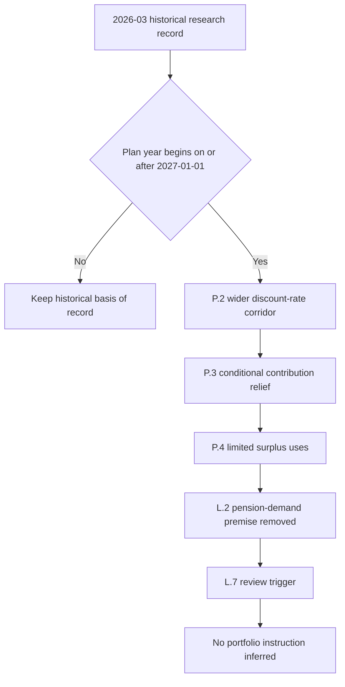

## Scope, authority, and the 2027 boundary

DOL Release 2026-31 is a synthetic demonstration bulletin, not guidance or a source on which reliance is possible. Within this corpus, it is a **regulatory overlay**: it states amendments to funding rules for single-employer defined-benefit plans, rather than a long-credit trade or a binding portfolio weight. It was issued in 2026-08 and applies only to plan years beginning on or after **2027-01-01**. [Release notice and applicability](repo://bulletins/DOL/2026-08-funding-relief-and-discount-rates.md#L1-L7) [Release P.1](repo://bulletins/DOL/2026-08-funding-relief-and-discount-rates.md#L9-L11)

The boundary is prospective. It does not change the research edition applicable to a position already taken: frozen research and regulatory bulletins are published as separate records, while an edition in force on the position date remains the basis of record for that position. [Corpus model](repo://README.md#L39-L48)

## DOL provisions that supersede the demand premise prospectively

**DOL Release 2026-31 P.2 supersedes the discount-rate part of the FI-US-PENSION-LDI 2026-03 L.2 premise for affected 2027-and-later plan years.** P.2 widens the corridor around twenty-five-year average segment rates from 10% to 20% in each direction. It permits a higher discount rate, lowers measured liabilities, and says a plan at or near full funding under the prior corridor will in most cases measure in surplus under the new one. [Release P.2](repo://bulletins/DOL/2026-08-funding-relief-and-discount-rates.md#L13-L17)

**DOL Release 2026-31 P.3 supersedes the contribution-preservation part of that premise for qualifying plans.** A plan measured above 110% funded under P.2 has no minimum required contribution for that plan year, and its sponsor may elect to treat the excess as available for P.4 purposes. [Release P.3](repo://bulletins/DOL/2026-08-funding-relief-and-discount-rates.md#L19-L21)

**DOL Release 2026-31 P.4 supersedes the no-surplus-release premise only to the stated conditional extent.** For a plan meeting P.3’s threshold, it permits transfers of excess assets to a qualified replacement plan or application to retiree health accounts, subject to P.6 notice; it does **not** permit a sponsor reversion outside the existing statutory framework. [Release P.4](repo://bulletins/DOL/2026-08-funding-relief-and-discount-rates.md#L23-L25)

Those are the precise changes that invalidate the research demand case going forward. FI-US-PENSION-LDI 2026-03 is an overweight long-dated investment-grade-credit call based on persistent corporate defined-benefit-plan buying through 2028. Its load-bearing assumption says that funding rules make surplus worth protecting through contribution requirements and the liability discount-rate basis, and expressly says that rules permitting surplus release or re-risking would reverse the flow and leave the overweight unable to survive. Its L.6 risk names surplus release, discount-rate changes, and reduced contribution requirements as invalidating events. [Pension LDI L.1–L.2](repo://research/FI/US/PENSION-LDI/2026-03.md#L16-L24) [Pension LDI L.6](repo://research/FI/US/PENSION-LDI/2026-03.md#L38-L42)

DOL Release 2026-31 P.2–P.4 therefore **supersede** the demand premise—not retrospectively the historical edition or every possible long-credit rationale—for plan years beginning on or after 2027-01-01. The note itself makes its expected pension flow, rather than a valuation case, the basis for the overweight; its stated review trigger is any announced change to pension-funding or discount-rate rules. [Release applicability and P.2–P.4](repo://bulletins/DOL/2026-08-funding-relief-and-discount-rates.md#L7-L25) [Pension LDI header and L.2](repo://research/FI/US/PENSION-LDI/2026-03.md#L12-L24) [Pension LDI L.7](repo://research/FI/US/PENSION-LDI/2026-03.md#L44-L46)

This flow separates the prospective regulatory overlay and research review from the historical position record and any mandate action. [Release applicability and P.2–P.4](repo://bulletins/DOL/2026-08-funding-relief-and-discount-rates.md#L7-L25) [Pension LDI L.2, L.6–L.7](repo://research/FI/US/PENSION-LDI/2026-03.md#L20-L24) [Pension LDI L.6–L.7](repo://research/FI/US/PENSION-LDI/2026-03.md#L38-L46) [Corpus model](repo://README.md#L39-L48)

## Restrictions and standards DOL preserves or does not address

**DOL Release 2026-31 P.5 preserves** benefit-accrual and vesting rules. It also preserves in full the requirements applicable to plans below 80% funded, and neither P.2 nor P.3 relieves a below-80%-funded plan of any existing restriction. [Release P.5](repo://bulletins/DOL/2026-08-funding-relief-and-discount-rates.md#L27-L30)

**DOL Release 2026-31 P.5 does not address** fiduciary standards governing investment of plan assets; those standards continue on their own terms. The release consequently does not establish an investment-manager permission, a de-risking requirement, or a direction to buy or sell long credit. [Release P.5](repo://bulletins/DOL/2026-08-funding-relief-and-discount-rates.md#L29-L31)

**DOL Release 2026-31 P.6 preserves a procedural condition on the P.3 election:** a sponsor electing relief must notify participants within 30 days in the release appendix’s prescribed form. P.4 makes the listed surplus uses subject to that notice requirement. [Release P.4](repo://bulletins/DOL/2026-08-funding-relief-and-discount-rates.md#L23-L25) [Release P.6](repo://bulletins/DOL/2026-08-funding-relief-and-discount-rates.md#L33-L35)

## Historical research record and implementation boundary

FI-US-PENSION-LDI 2026-03 was published 2026-03-05 and applies to positions taken on or after 2026-04-01. Keep it as the applicable-position record for positions taken while it stood: it recorded a long-end-specific flow view, not a general investment-grade index view. The separate FI-US-IG-SPREADS 2025-09 underweight is a valuation view on the index, and the LDI note says the two views do not contradict one another. [Pension LDI publication and L.1](repo://research/FI/US/PENSION-LDI/2026-03.md#L12-L18) [Pension LDI L.5](repo://research/FI/US/PENSION-LDI/2026-03.md#L34-L36) [IG-spreads G.1–G.3](repo://research/FI/US/IG-SPREADS/2025-09.md#L16-L26)

The prospective overlay triggers the LDI note’s review condition, but it does not rewrite the historical recommendation as if it had never been made. It also does not itself publish a replacement research edition, choose a new research recommendation, or create a mandate response. The corpus model reserves binding portfolio weights for living internal guidance, whereas research supplies the thesis and a regulatory overlay supplies the applicable legal constraint. [Pension LDI L.6–L.7](repo://research/FI/US/PENSION-LDI/2026-03.md#L38-L46) [Corpus model](repo://README.md#L39-L48) [Taxable fixed-income guide purpose](repo://guidelines/allocation/us-taxable-fixed-income.md#L1-L5)

Do not infer a portfolio instruction from this page or from the release. The available taxable fixed-income guide’s stated binding weights are derived from FI-US-MUNI-CREDIT 2025-06 and FI-US-IG-SPREADS 2025-09, not FI-US-PENSION-LDI 2026-03. Its superseded-note suspension and committee-escalation mechanism applies where a guide cites the research note at issue; absent such a documented dependency, it does not establish a LDI-specific weight, suspension, or trade. [Taxable fixed-income guide A.1, A.3, A.5, A.8](repo://guidelines/allocation/us-taxable-fixed-income.md#L7-L11) [Taxable fixed-income guide A.3](repo://guidelines/allocation/us-taxable-fixed-income.md#L17-L23) [Taxable fixed-income guide A.5](repo://guidelines/allocation/us-taxable-fixed-income.md#L33-L37) [Taxable fixed-income guide A.8](repo://guidelines/allocation/us-taxable-fixed-income.md#L49-L51) [Discretion matrix D.4](repo://guidelines/authority/discretion-matrix.md#L31-L35)

### Operating record for a review

1. Select the frozen research edition by the historical position date and retain its thesis, assumption, and invalidation trigger as the basis of record. [Corpus model](repo://README.md#L39-L48) [Pension LDI publication, L.2, and L.7](repo://research/FI/US/PENSION-LDI/2026-03.md#L14-L24) [Pension LDI L.7](repo://research/FI/US/PENSION-LDI/2026-03.md#L44-L46)
2. For a current plan-year analysis, apply P.2 only from 2027-01-01; test P.3’s above-110% threshold, P.4’s limited permitted uses and non-reversion boundary, P.5’s preserved restrictions, and P.6’s 30-day notice requirement. [Release applicability and P.2–P.6](repo://bulletins/DOL/2026-08-funding-relief-and-discount-rates.md#L7-L35)
3. Record that P.2–P.4 remove the L.2 demand premise prospectively and initiate the L.7 research review; do not transform that conclusion into an allocation or execution direction. [Release P.2–P.4](repo://bulletins/DOL/2026-08-funding-relief-and-discount-rates.md#L13-L25) [Pension LDI L.2, L.6–L.7](repo://research/FI/US/PENSION-LDI/2026-03.md#L20-L24) [Pension LDI L.6–L.7](repo://research/FI/US/PENSION-LDI/2026-03.md#L38-L46)
4. If a governing mandate actually cites this research, use its documented supersession and escalation controls; otherwise obtain the applicable mandate and authority decision rather than inventing one from the regulatory overlay. [Discretion matrix D.1, D.4](repo://guidelines/authority/discretion-matrix.md#L7-L11) [Discretion matrix D.4](repo://guidelines/authority/discretion-matrix.md#L31-L35)
