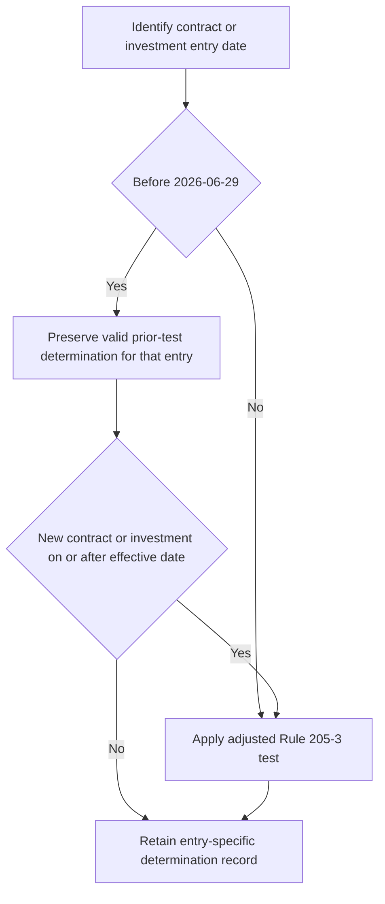

## Regulatory boundary and applicability

SEC Order IA-7104 adjusts only the dollar-amount tests in Rule 205-3. It is effective **2026-06-29**. This overlay is a compliance reference for private-markets entry decisions, not an investment recommendation and not a substitute for the order or for the separate internal eligibility process. The order is the source of the tests; the private-markets eligibility guide implements those tests operationally and expressly defers to the order rather than restating a locally maintained threshold. [SEC Order IA-7104 Q.2, Q.6](repo://bulletins/SEC/2026-04-order-ia-7104-qualified-client.md#L14-L18) [SEC Order IA-7104 Q.6](repo://bulletins/SEC/2026-04-order-ia-7104-qualified-client.md#L34-L36) [Private-markets eligibility guide P.2](repo://guidelines/suitability/private-markets-eligibility.md#L11-L15)

The order’s adjustment authority is grounded in Advisers Act section 205(e): the Commission adjusts the Rule 205-3 dollar thresholds for inflation on the prescribed five-year cycle, rounded to the nearest $100,000 using the Personal Consumption Expenditures Chain-Type Price Index. That mechanism explains why the operative amounts must be read with their order and effective date, rather than treated as permanent policy settings. [SEC Order IA-7104 Q.1](repo://bulletins/SEC/2026-04-order-ia-7104-qualified-client.md#L10-L12)

## Tests for a determination on or after 2026-06-29

For an entry subject to the adjusted order, a client is a qualified client through either alternative Rule 205-3 path:

- **Assets-under-management path:** at least **$1,400,000** under management by the investment adviser **immediately after entering into the advisory contract**.
- **Net-worth path:** the investment adviser **reasonably believes, immediately prior to entering into the advisory contract**, that the client has net worth of **more than $2,700,000**.

The quoted timing and the difference between “at least” and “more than” are outcome-critical parts of the test, not documentation conventions. [SEC Order IA-7104 Q.2](repo://bulletins/SEC/2026-04-order-ia-7104-qualified-client.md#L14-L18)

For the net-worth path, exclude the value of the client’s primary residence and indebtedness secured by that residence up to its fair-market value. A natural person’s net worth may include assets held jointly with that person’s spouse. The order states that it does not modify either provision. [SEC Order IA-7104 Q.3](repo://bulletins/SEC/2026-04-order-ia-7104-qualified-client.md#L20-L22)

## Legacy determination versus a new entry

The transition turns on the date of the **contract or private-fund investment**, not merely the date a file is reviewed. The order does not apply to an advisory contract entered into, or a private-fund investment made, **before 2026-06-29**. Rule 205-3(c)’s transition provisions continue to apply: a person who met the dollar test in force at entry remains a qualified client for that contract or investment. [SEC Order IA-7104 Q.4](repo://bulletins/SEC/2026-04-order-ia-7104-qualified-client.md#L24-L26)

> “A determination made before the effective date is preserved and is not disturbed by this order. Such a determination may not be relied upon for a contract entered into, or an investment made, on or after the effective date.” [SEC Order IA-7104 Q.4](repo://bulletins/SEC/2026-04-order-ia-7104-qualified-client.md#L28-L28)

Accordingly, preserve a valid pre-effective-date determination with its original contract or investment, but do not roll it forward as the eligibility basis for a new contract or subscription on or after **2026-06-29**. The internal guide implements this boundary by requiring the file to identify the prior-threshold basis for a carried-forward determination and by requiring the adjusted amounts for a new subscription. [SEC Order IA-7104 Q.4](repo://bulletins/SEC/2026-04-order-ia-7104-qualified-client.md#L24-L28) [Private-markets eligibility guide P.3](repo://guidelines/suitability/private-markets-eligibility.md#L17-L21)

This flow distinguishes preserving a historical determination for its original entry from applying it to a later entry, which the order prohibits. [SEC Order IA-7104 Q.4](repo://bulletins/SEC/2026-04-order-ia-7104-qualified-client.md#L24-L28)

## Required record and audit posture

An adviser relying on a determination under the order must retain the Rule 204-2(a)(8) records documenting the basis, including the dollar test relied on and the determination date. The internal guide adds operating fields—pathway, evidence, decision maker, and date—and treats a determination without a recorded basis as no determination in audit. Those guide fields implement the regulatory retention duty; they do not alter the legal test. [SEC Order IA-7104 Q.5](repo://bulletins/SEC/2026-04-order-ia-7104-qualified-client.md#L30-L32) [Private-markets eligibility guide P.5](repo://guidelines/suitability/private-markets-eligibility.md#L27-L29)

For safe operational use, the record should make the entry date and status legible: a legacy file identifies the pre-effective-date entry and prior threshold; a current file identifies the applicable adjusted test, its contract-timing evidence, and the supporting financial evidence. This is the control that prevents a preserved historical determination from being reused for a new entry. [SEC Order IA-7104 Q.2, Q.4–Q.5](repo://bulletins/SEC/2026-04-order-ia-7104-qualified-client.md#L14-L18) [SEC Order IA-7104 Q.4–Q.5](repo://bulletins/SEC/2026-04-order-ia-7104-qualified-client.md#L24-L32) [Private-markets eligibility guide P.3, P.5](repo://guidelines/suitability/private-markets-eligibility.md#L17-L29)

## Standards expressly unchanged

IA-7104 states: “This order adjusts the dollar amount tests in rule 205-3 and nothing further.” It does **not** adjust either the Regulation D accredited-investor standards or the Investment Company Act section 2(a)(51) qualified-purchaser definition; each continues under its own terms. A qualified-client result therefore does not establish either separate status, and accredited-investor status must be assessed separately under the implementing guide. [SEC Order IA-7104 Q.6](repo://bulletins/SEC/2026-04-order-ia-7104-qualified-client.md#L34-L36) [Private-markets eligibility guide P.4](repo://guidelines/suitability/private-markets-eligibility.md#L23-L25)

## Private-markets control sequence

The qualified-client determination is a gating regulatory condition, not portfolio-manager discretion. No private-markets strategy may be offered until eligibility is determined and documented. A private-markets commitment then requires approval regardless of size, but approval cannot clear an ineligible client or a regulatory breach. [Private-markets eligibility guide P.1](repo://guidelines/suitability/private-markets-eligibility.md#L7-L9) [Discretion matrix D.3, D.5](repo://guidelines/authority/discretion-matrix.md#L17-L29) [Discretion matrix D.5](repo://guidelines/authority/discretion-matrix.md#L39-L47)

Eligibility is necessary but not sufficient. Before commitment, apply the separate suitability review and liquidity constraint: unfunded private-markets commitments must not exceed two years of liquid-portfolio spending. The research framework applies only to eligible clients and expressly leaves eligibility to the regulatory thresholds, so neither research support nor commitment approval replaces the record-backed qualified-client determination. [Private-markets eligibility guide P.6](repo://guidelines/suitability/private-markets-eligibility.md#L31-L35) [Private-markets framework V.2, V.6](repo://research/MA/GL/PRIVATE-MARKETS/2025-12.md#L20-L22) [Private-markets framework V.6](repo://research/MA/GL/PRIVATE-MARKETS/2025-12.md#L36-L38)

### Entry checklist

1. Identify whether the contract or investment was entered into before **2026-06-29**, or is an entry on or after that date.
2. For a current entry, document one adjusted Rule 205-3 path with the required timing; for a net-worth path, apply the residence exclusions.
3. For a legacy entry, retain the prior determination only for that contract or investment; label its prior-threshold and pre-effective-date basis.
4. Retain the regulatory record and the guide’s underlying evidence, pathway, decision-maker, and date.
5. Determine accredited-investor status separately, then complete suitability and the spending-based liquidity review.
6. Seek the required commitment approval only after these eligibility controls are complete; stop rather than escalate an ineligible client for an exception.
