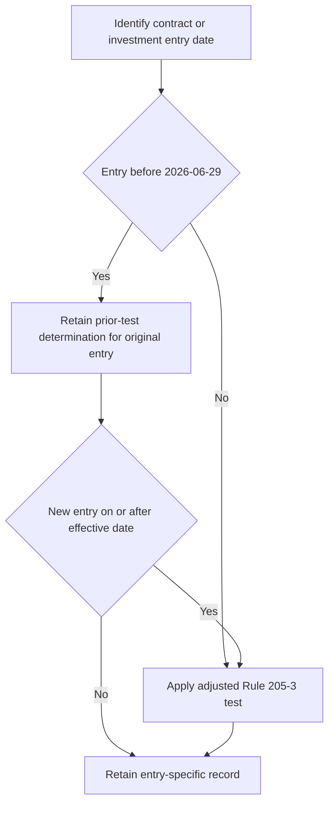

## Authority and scope

> **Demonstration-corpus notice:** SEC Order IA-7104 is explicitly labelled a synthetic document with invented release details, dates, and amounts, and says that no reliance is possible. This page records the repository's stated control model; it is not legal advice. [Order notice](repo://external_sources/SEC/2026-04-order-ia-7104-qualified-client.md#L1-L8)

SEC Order IA-7104 is authoritative for the Rule 205-3 dollar tests and their effective-date boundary. The private-markets eligibility guide is the operational implementation: it directs staff to the order rather than locally restating thresholds. The order is effective **2026-06-29** and adjusts Rule 205-3 dollar tests only. [Order Q.2](repo://external_sources/SEC/2026-04-order-ia-7104-qualified-client.md#L14-L18) [Order Q.6](repo://external_sources/SEC/2026-04-order-ia-7104-qualified-client.md#L34-L36) [Eligibility guide P.2](repo://internal_guidelines/suitability/private-markets-eligibility.md#L11-L15)

The adjustment mechanism comes from Advisers Act section 205(e): the Commission adjusts Rule 205-3 dollar thresholds on its prescribed five-year cycle, rounded to the nearest $100,000 using the Personal Consumption Expenditures Chain-Type Price Index. Operate from the order applicable to the entry date rather than treating a locally copied amount as a permanent setting. [Order Q.1](repo://external_sources/SEC/2026-04-order-ia-7104-qualified-client.md#L10-L12)

## Tests for a current entry

For a contract or private-fund investment entered into on or after **2026-06-29**, the adjusted Rule 205-3 paths are alternatives:

- **Assets-under-management path:** the client has at least **$1,400,000** under the investment adviser's management **immediately after** entering into the advisory contract.
- **Net-worth path:** the adviser reasonably believes **immediately prior to** entering into the advisory contract that the client has net worth of **more than $2,700,000**.

Both the measurement time and the difference between “at least” and “more than” are elements of the test. [Order Q.2](repo://external_sources/SEC/2026-04-order-ia-7104-qualified-client.md#L14-L18)

For the net-worth path, exclude the value of the primary residence and debt secured by it up to fair-market value. A natural person's net worth may include assets held jointly with that person's spouse; the order does not modify either provision. [Order Q.3](repo://external_sources/SEC/2026-04-order-ia-7104-qualified-client.md#L20-L22)

## Entry-specific transition boundary

A pre-effective-date determination remains tied to the specific advisory contract entered into, or private-fund investment made, before **2026-06-29**. Rule 205-3(c)'s transition treatment preserves a person who satisfied the dollar test then in force for that original contract or investment. A subsequent review of that file does not change its entry date. [Order Q.4](repo://external_sources/SEC/2026-04-order-ia-7104-qualified-client.md#L24-L26)

> “A determination made before the effective date is preserved and is not disturbed by this order. Such a determination may not be relied upon for a contract entered into, or an investment made, on or after the effective date.” [Order Q.4](repo://external_sources/SEC/2026-04-order-ia-7104-qualified-client.md#L28-L28)

The guide implements this invariant by requiring carried-forward files to identify their prior-threshold basis. For a new subscription on or after the effective date, make a new determination at the adjusted amounts; a legacy basis **may not be relied upon**. [Order Q.4](repo://external_sources/SEC/2026-04-order-ia-7104-qualified-client.md#L24-L28) [Eligibility guide P.3](repo://internal_guidelines/suitability/private-markets-eligibility.md#L17-L21)

This flow distinguishes preservation for an original entry from prohibited reuse for a later entry. [Order Q.4](repo://external_sources/SEC/2026-04-order-ia-7104-qualified-client.md#L24-L28)

## Determination record and audit control

An adviser relying on an order determination must retain Rule 204-2(a)(8) records of its basis, including the dollar test used and determination date. The implementing guide requires the pathway, supporting evidence, decision maker, and date; an unrecorded basis is treated as no determination in audit. These operating fields implement the retention duty and do not alter the legal test. [Order Q.5](repo://external_sources/SEC/2026-04-order-ia-7104-qualified-client.md#L30-L32) [Eligibility guide P.5](repo://internal_guidelines/suitability/private-markets-eligibility.md#L27-L29)

The record must make its lifecycle legible. A legacy record identifies the original pre-effective-date entry and prior threshold; a current-entry record identifies the adjusted path, the entry-time timing evidence, and financial evidence. This prevents historical status from being reused for a new entry. [Order Q.2, Q.4-Q.5](repo://external_sources/SEC/2026-04-order-ia-7104-qualified-client.md#L14-L18) [Order Q.4-Q.5](repo://external_sources/SEC/2026-04-order-ia-7104-qualified-client.md#L24-L32) [Eligibility guide P.3, P.5](repo://internal_guidelines/suitability/private-markets-eligibility.md#L17-L29)

## Separate status tests and commitment gates

Qualified-client status does not establish another investor status. IA-7104 leaves the Regulation D accredited-investor standards and the Investment Company Act section 2(a)(51) qualified-purchaser definition unchanged. Determine accredited-investor status separately; qualified-purchaser analysis likewise continues under its own standard. [Order Q.6](repo://external_sources/SEC/2026-04-order-ia-7104-qualified-client.md#L34-L36) [Eligibility guide P.4](repo://internal_guidelines/suitability/private-markets-eligibility.md#L23-L25)

No private-markets strategy may be offered until eligibility is determined and documented. It is a regulatory determination outside portfolio-manager discretion. Every commitment requires approval regardless of size, but approval is sought after the eligibility gate and no authority tier can clear an ineligible client or a regulatory breach. [Eligibility guide P.1](repo://internal_guidelines/suitability/private-markets-eligibility.md#L7-L9) [Discretion matrix D.3](repo://internal_guidelines/authority/discretion-matrix.md#L17-L29) [Discretion matrix D.5](repo://internal_guidelines/authority/discretion-matrix.md#L39-L47)

Eligibility is necessary but insufficient. Before commitment, complete the separate suitability review and liquidity constraint; unfunded commitments must not exceed **two years of liquid-portfolio spending**. Research applies only to eligible clients and does not replace either the regulatory determination or the approval gate. [Eligibility guide P.6](repo://internal_guidelines/suitability/private-markets-eligibility.md#L31-L35) [Private-markets research V.2, V.6](repo://internal_research/MA/GL/PRIVATE-MARKETS/2025-12.md#L20-L22) [Private-markets research V.6](repo://internal_research/MA/GL/PRIVATE-MARKETS/2025-12.md#L36-L38)

## Operator checklist

1. Classify the proposed contract or investment by its entry date.
2. For a current entry, document one adjusted Rule 205-3 path with entry-time evidence; apply the residence exclusions for net worth.
3. For a legacy entry, retain the prior basis only with its original entry and clearly label the prior threshold.
4. Retain the Rule 204-2(a)(8) basis and the guide's pathway, evidence, decision-maker, and date fields.
5. Determine accredited-investor status separately; where relevant, assess qualified-purchaser status under its separate standard.
6. Complete suitability and the spending-based liquidity review, then seek required commitment approval. Stop rather than escalate an ineligible client or regulatory breach for an exception.
