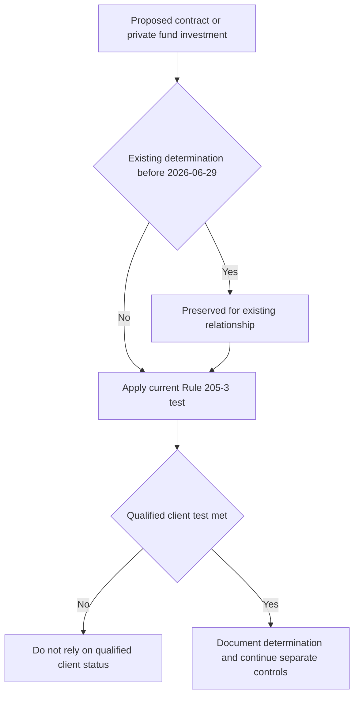

# SEC Qualified Client Threshold Overlay

> **Scope correction:** Despite this page's legacy filename, this overlay concerns the **qualified client** tests in Advisers Act Rule 205-3, not the separate **qualified purchaser** definition. SEC Order IA-7104 adjusts only Rule 205-3's dollar tests; it does not establish investment eligibility, suitability, a portfolio allocation, or an approval exception.

## Controlling rule and effective date

SEC Order IA-7104 is effective **2026-06-29**. It sets two alternative qualified-client tests:

| Test | Exact operative requirement |
| --- | --- |
| Assets under management | The client has at least **$1,400,000** under management by the investment adviser **immediately after entering into the advisory contract**. |
| Net worth | The adviser **reasonably believes, immediately prior to entering into the advisory contract**, that the client has net worth of more than **$2,700,000**. |

> “Effective 2026-06-29, the dollar amount of the assets-under-management test … is **$1,400,000**, and the dollar amount of the net worth test … is **$2,700,000**.” [Order IA-7104 Q.2](repo://bulletins/SEC/2026-04-order-ia-7104-qualified-client.md#L14-L18)

For the net-worth route, exclude the primary residence's value and indebtedness secured by it up to fair market value. A natural person may include assets held jointly with that person's spouse. The order does not modify those calculation rules. [Order IA-7104 Q.3](repo://bulletins/SEC/2026-04-order-ia-7104-qualified-client.md#L20-L22)

The [Private Markets Client Eligibility Determination Guide](/openwiki/guidance/suitability/private-markets-eligibility.md) **implements** Order IA-7104 Q.2: it directs personnel to apply either of the order's tests on or after the order's effective date and deliberately does not restate amounts that later adjustment could make stale. The order remains the controlling source for the test and date. [Eligibility Guide P.2](repo://guidelines/suitability/private-markets-eligibility.md#L11-L15) [Order IA-7104 Q.2](repo://bulletins/SEC/2026-04-order-ia-7104-qualified-client.md#L14-L18)

## Transition: preserve the old relationship, retest new business

The transition is tied to a contract or private-fund investment, rather than a portable client label.

> “A determination made before the effective date is preserved and is not disturbed by this order. Such a determination may not be relied upon for a contract entered into, or an investment made, on or after the effective date.” [Order IA-7104 Q.4](repo://bulletins/SEC/2026-04-order-ia-7104-qualified-client.md#L24-L28)

Thus, a person who met the test at entry remains a qualified client with respect to an advisory contract or private-fund investment entered into before **2026-06-29**; the adjustment alone does not require divestment. But a pre-effective-date result cannot support a new contract, subscription, or investment on or after that date. The eligibility guide **implements** that boundary by requiring the file to identify the prior thresholds and requiring a new subscription to be tested at the adjusted amounts. [Order IA-7104 Q.4](repo://bulletins/SEC/2026-04-order-ia-7104-qualified-client.md#L24-L28) [Eligibility Guide P.3](repo://guidelines/suitability/private-markets-eligibility.md#L17-L21)

This flow distinguishes preservation for an existing relationship from the fresh determination required for new post-effective-date business.

## Keep three standards separate

| Status | Governing scope in this overlay | What Order IA-7104 does |
| --- | --- | --- |
| **Qualified client** | Advisers Act Rule 205-3 dollar tests | Adjusts the two dollar amounts described above. |
| **Accredited investor** | Regulation D | Does **not** adjust its criteria. |
| **Qualified purchaser** | Investment Company Act section 2(a)(51) | Does **not** adjust its definition. |

> “This order adjusts the dollar amount tests in rule 205-3 and nothing further.” [Order IA-7104 Q.6](repo://bulletins/SEC/2026-04-order-ia-7104-qualified-client.md#L34-L36)

Do not infer any one of these statuses from another. The eligibility guide **implements** the order's limited scope by requiring a separate accredited-investor determination and recognizing that the available strategies vary according to the status actually met. A particular offering may require a different status; identify its actual requirement rather than treating the Rule 205-3 result as a qualified-purchaser determination. [Order IA-7104 Q.6](repo://bulletins/SEC/2026-04-order-ia-7104-qualified-client.md#L34-L36) [Eligibility Guide P.4](repo://guidelines/suitability/private-markets-eligibility.md#L23-L25)

## Recordkeeping and operating controls

For every reliance, retain the basis and preserve enough information to reconstruct which test was applied. The order requires records under Rule 204-2(a)(8), including the dollar test relied upon and the determination date:

> “An investment adviser relying on a determination under this order shall retain the records required by rule 204-2(a)(8) documenting the basis for that determination, including the dollar amount test relied upon and the date of the determination.” [Order IA-7104 Q.5](repo://bulletins/SEC/2026-04-order-ia-7104-qualified-client.md#L30-L32)

The eligibility guide **implements** that recordkeeping requirement by recording the pathway, supporting evidence, determining person, and date; audit treats a determination without a recorded basis as no determination. For a carried-forward result, also record that prior thresholds governed it. [Eligibility Guide P.3](repo://guidelines/suitability/private-markets-eligibility.md#L17-L21) [Eligibility Guide P.5](repo://guidelines/suitability/private-markets-eligibility.md#L27-L29) [Order IA-7104 Q.5](repo://bulletins/SEC/2026-04-order-ia-7104-qualified-client.md#L30-L32)

For private-markets operations, eligibility is a regulatory gate outside portfolio-manager discretion: it must be determined and documented before an offer. It remains necessary, not sufficient. Complete the separate suitability and liquidity review, then obtain the required commitment approval; approval cannot cure an ineligible client. [Eligibility Guide P.1 and P.6](repo://guidelines/suitability/private-markets-eligibility.md#L7-L9) [Eligibility Guide P.6](repo://guidelines/suitability/private-markets-eligibility.md#L31-L35) [Discretion Matrix D.3 and D.5](repo://guidelines/authority/discretion-matrix.md#L17-L29) [Discretion Matrix D.5](repo://guidelines/authority/discretion-matrix.md#L39-L47)

## Review checklist

1. Identify whether the action is an existing pre-2026-06-29 relationship or new post-effective-date business.
2. For new business, apply the current Rule 205-3 qualified-client test and its timing requirement; do not carry an earlier determination forward.
3. If using net worth, apply the primary-residence exclusion and joint-spousal-assets rule.
4. Determine accredited-investor or qualified-purchaser status separately if the offering requires either one.
5. Retain the test, evidence, determiner, and date, and flag carried-forward records as using prior thresholds.
6. For a private-markets commitment, complete eligibility, suitability, and liquidity controls before seeking approval.

## Related guidance

- [Private Markets Client Eligibility and Suitability](/openwiki/guidance/suitability/private-markets-eligibility.md) — operational eligibility, suitability, liquidity, and documentation controls.
- [Portfolio Manager Discretion and Escalation](/openwiki/guidance/authority/discretion-and-escalation.md) — approval authority and non-clearable regulatory conditions.
- [Private Markets](/openwiki/research/multi-asset/private-markets.md) — research context that applies only after regulatory eligibility.
