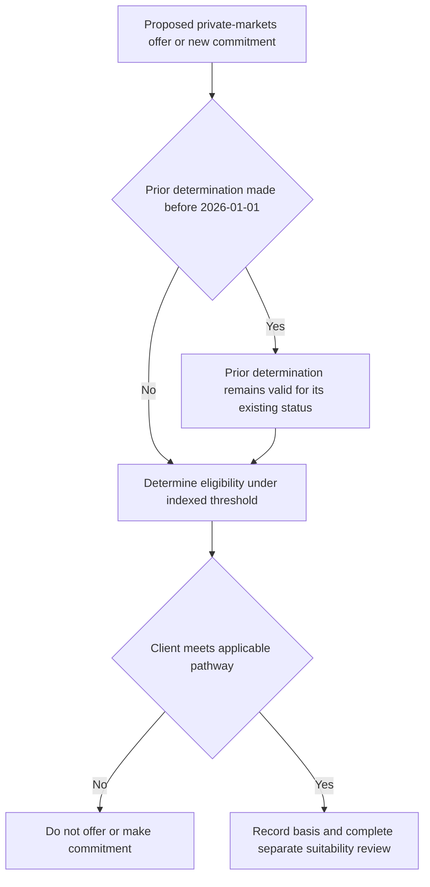

# Regulatory Overlay: SEC Qualified Purchaser Thresholds

SEC Release 2025-08 is the controlling regulatory input for qualified-purchaser determinations relevant to private-markets eligibility. It applies the indexed thresholds to determinations made on or after **2026-01-01**; it does not turn eligibility into an investment judgment or an approval exception. The internal [Private Markets Eligibility and Suitability guidance](/openwiki/guidance/suitability/private-markets-eligibility.md) is the operational entrypoint: eligibility must be determined and documented before a strategy is offered.

## Indexed qualified-purchaser test

Release 2025-08 Q.2 sets these thresholds for determinations made on or after the effective date:

| Client category | Indexed investments threshold |
| --- | ---: |
| Natural person | $6.2 million |
| Family company | $31 million |

The release indexes these dollar thresholds every five years using the adopting-text methodology. The eligibility guide implements Q.2 by requiring a natural-person determination made on or after the effective date to meet the release's indexed investments threshold, and by directing personnel to the release rather than duplicating an amount that indexation can make stale.

## Effective-date boundary: continuing status is not a new determination

A qualified-purchaser determination properly made before 2026-01-01 remains valid. Release Q.4 therefore does not require divestiture merely because the person no longer meets an indexed threshold. This is continuing eligibility for the prior determination, not permission to reuse that determination for new business.

For a **new determination** on or after 2026-01-01, the person may not be treated as a qualified purchaser on the basis of the prior-threshold determination. The internal guide implements that Q.4 boundary expressly: a carried-forward determination may not be the basis for a new commitment made on or after the effective date. Obtain and document a new determination under the then-applicable indexed threshold before proceeding.

This flow separates the preservation of an earlier determination from the new, documented determination required for a post-effective-date commitment.

## Accredited investor remains separate

**SEC Release 2025-08 Q.3 preserves the accredited-investor criteria without change**, including the previously adopted professional-certification pathway. The eligibility guide implements this preserved rule by requiring accredited-investor status to be determined separately from qualified-purchaser status.

Do not infer one status from the other. A client can be accredited without being a qualified purchaser, and the available strategies differ by the pathway actually met. Conversely, the indexed qualified-purchaser amounts do not alter accredited-investor criteria or displace the professional-certification route.

## Records and control ownership

An adviser relying on a determination must retain its basis. For any carried-forward determination, the record must state that it was made under the prior thresholds. Firm guidance expands the determination record to include the pathway used, supporting evidence, the decision maker, and the determination date; a determination without a recorded basis is treated as no determination in audit.

Eligibility is a regulatory gate rather than portfolio-manager discretion. The guide prohibits offering a private-markets strategy until eligibility is determined and documented. A private-markets commitment also requires approval, but approval follows eligibility and cannot clear a client who is ineligible. Eligibility also remains necessary rather than sufficient: before commitment, the guide requires separate suitability review and the private-markets framework's liquidity constraint, under which unfunded commitments must not exceed two years of liquid-portfolio spending.

## Operating checklist

1. Identify whether the activity is continuing an existing, properly documented pre-2026-01-01 determination or supports a new determination/new commitment.
2. For a new post-effective-date determination, apply Release 2025-08 Q.2's applicable indexed threshold; do not rely on a grandfathered record.
3. Determine accredited-investor status independently under the unchanged Q.3 criteria when that pathway is relevant.
4. Retain the pathway, evidence, decision maker, date, and—where carried forward—the fact that prior thresholds governed the determination.
5. Only after documented eligibility, complete suitability and liquidity review, then obtain the required commitment approval.

## Sources

- [SEC Release 2025-08 — Qualified Purchaser Threshold Indexation](repo://bulletins/SEC/2025-08-qualified-purchaser-threshold.md#L3-L25)
- [Private Markets Eligibility Determination Guide](repo://guidelines/suitability/private-markets-eligibility.md#L7-L33)
- [Private Markets Allocation Framework, MA-GL-PRIVATE-MARKETS 2025-12](repo://research/MA/GL/PRIVATE-MARKETS/2025-12.md#L9-L27)
- [Portfolio Manager Discretion and Escalation Matrix](repo://guidelines/authority/discretion-matrix.md#L17-L47)
