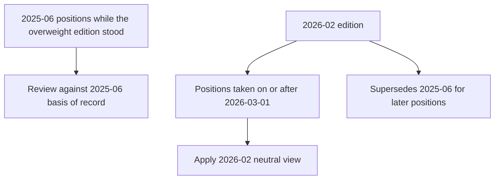

## Scope and basis-of-record rule

This page records synthetic demonstration research, not investment advice. It separates two editions of the US semiconductor-capital-equipment view rather than applying the current conclusion retroactively. A position is reviewed against the edition in force when it was taken: the frozen 2025-06 note explicitly remains the basis of record for positions established while it stood, even when the review occurs later. [EQ-US-SEMI-CAPEX 2025-06, notice](repo://internal_research/EQ/US/SEMI-CAPEX/2025-06.md#L3-L5) [edition applicability](repo://internal_research/EQ/US/SEMI-CAPEX/2025-06.md#L19-L19)

This shows the edition boundary: supersession changes the governing view for later positions, not the recorded rationale for historical ones. [EQ-US-SEMI-CAPEX 2026-02, applicability](repo://internal_research/EQ/US/SEMI-CAPEX/2026-02.md#L12-L14) [EQ-US-SEMI-CAPEX 2025-06, basis of record](repo://internal_research/EQ/US/SEMI-CAPEX/2025-06.md#L3-L5)

**Relationship — supersession.** EQ-US-SEMI-CAPEX 2026-02 **supersedes** EQ-US-SEMI-CAPEX 2025-06 for positions taken on or after 2026-03-01. The new edition is neutral, with overweight as its stated prior recommendation; the earlier edition was published on 2025-06-11 and applied to positions taken on or after 2025-07-01. [EQ-US-SEMI-CAPEX 2026-02, recommendation and applicability](repo://internal_research/EQ/US/SEMI-CAPEX/2026-02.md#L5-L14) [EQ-US-SEMI-CAPEX 2025-06, recommendation and applicability](repo://internal_research/EQ/US/SEMI-CAPEX/2025-06.md#L9-L19)

## Edition 2025-06 — historical overweight basis

The 2025-06 desk view was an overweight in US semiconductor capital equipment over a 12-to-18-month horizon, expressed through capital equipment rather than fabless or memory, on which the desk held no view. Its early-cycle case was that wafer-fab-equipment spending had troughed in Q4 2024 and increased for two quarters; the desk associated prior troughs with seven to nine quarters of expansion and therefore placed the anticipated peak in late 2026. [EQ-US-SEMI-CAPEX 2025-06 S.1–S.2](repo://internal_research/EQ/US/SEMI-CAPEX/2025-06.md#L21-L29) [S.5](repo://internal_research/EQ/US/SEMI-CAPEX/2025-06.md#L39-L41)

The historical quality and confirmation evidence was extended lithography and deposition-tool lead times—past 50 weeks—and a reduced top-three-customer revenue share of 51%, versus 64% at the prior peak. The desk attributed the concentration change to two new leading-edge logic-foundry customers and regarded it as a genuine quality improvement rather than a mix artefact. [EQ-US-SEMI-CAPEX 2025-06 S.2–S.3](repo://internal_research/EQ/US/SEMI-CAPEX/2025-06.md#L25-L33)

For a review of a position governed by this edition, the stated invalidation signals were a capex-guidance reduction from either of the two largest logic customers, sustained memory pricing below cash cost (a historical precursor to memory-capex deferral by two quarters), or export controls that materially restricted shipments to the customer base. These are the original view's monitoring conditions; they are not a substitute for the later edition's neutral recommendation. [EQ-US-SEMI-CAPEX 2025-06 S.4](repo://internal_research/EQ/US/SEMI-CAPEX/2025-06.md#L35-L37)

## Edition 2026-02 — current neutral view

The 2026-02 view reduces US semiconductor capital equipment to neutral because the earlier cycle thesis had largely played out and valuation plus cycle position no longer supported overweight—not because the desk identified a deterioration in fundamentals. Spending had risen for six consecutive quarters, placing the expansion two to three quarters from the peak under the 2025-06 seven-to-nine-quarter pattern; lead times had stopped extending and shortened modestly in deposition tooling. The desk reads that lead-time reversal as an ordinary late-cycle signal rather than a demand event. [EQ-US-SEMI-CAPEX 2026-02 S.1–S.2](repo://internal_research/EQ/US/SEMI-CAPEX/2026-02.md#L16-L24)

The concentration argument remains intact rather than driving the downgrade: the top three customers' share improved further to 46%, and the desk says the 2025-06 structural argument is preserved in full. At neutral, the desk retains a relative preference for lithography over deposition and etch on pricing-power grounds. [EQ-US-SEMI-CAPEX 2026-02 S.3, S.5](repo://internal_research/EQ/US/SEMI-CAPEX/2026-02.md#L26-L36)

## Power constraint: timing modifier, not semiconductor end-demand thesis

The global 2026-01 research initiates an overweight in regulated utilities with data-centre load growth in their service territories and electrical-equipment manufacturers with transformer and switchgear capacity, effective for positions taken on or after **2026-02-01**; it has no directional compute-vendor view. Its premise is that, through 2026, the binding AI-infrastructure constraint has shifted from accelerator supply to electrical infrastructure—interconnection queue position, transformer lead times, and, in some jurisdictions, generation adequacy. [EQ-GL-AI-INFRA-POWER 2026-01, applicability and P.1–P.2](repo://internal_research/EQ/GL/AI-INFRA-POWER/2026-01.md#L14-L24)

**Relationship — modification.** EQ-GL-AI-INFRA-POWER 2026-01 P.4 **modifies** EQ-US-SEMI-CAPEX 2026-02 S.4 by treating grid-interconnection timelines as a gate on leading-edge fab siting. The consequence is a cap on the *rate* at which capacity can be brought online—the shape and timing of capacity additions—not the level of eventual semiconductor demand. Accordingly, it is not evidence that overturns the 2026-02 desk's statement that shortened tooling lead times are a late-cycle, rather than demand, signal. [EQ-GL-AI-INFRA-POWER 2026-01 P.4](repo://internal_research/EQ/GL/AI-INFRA-POWER/2026-01.md#L30-L32) [EQ-US-SEMI-CAPEX 2026-02 S.4](repo://internal_research/EQ/US/SEMI-CAPEX/2026-02.md#L30-L32)

The operational distinction is to monitor power availability as a capacity-ramp timing constraint alongside the semiconductor cycle and valuation rationale. The relationship modifies timing analysis; it does not prescribe a semiconductor-capex allocation change or convert into a directional semiconductor end-demand call. The global note's risks explicitly include a slowdown in AI capital formation that would remove its load-growth premise. [EQ-GL-AI-INFRA-POWER 2026-01 P.4 and P.6](repo://internal_research/EQ/GL/AI-INFRA-POWER/2026-01.md#L30-L40)
