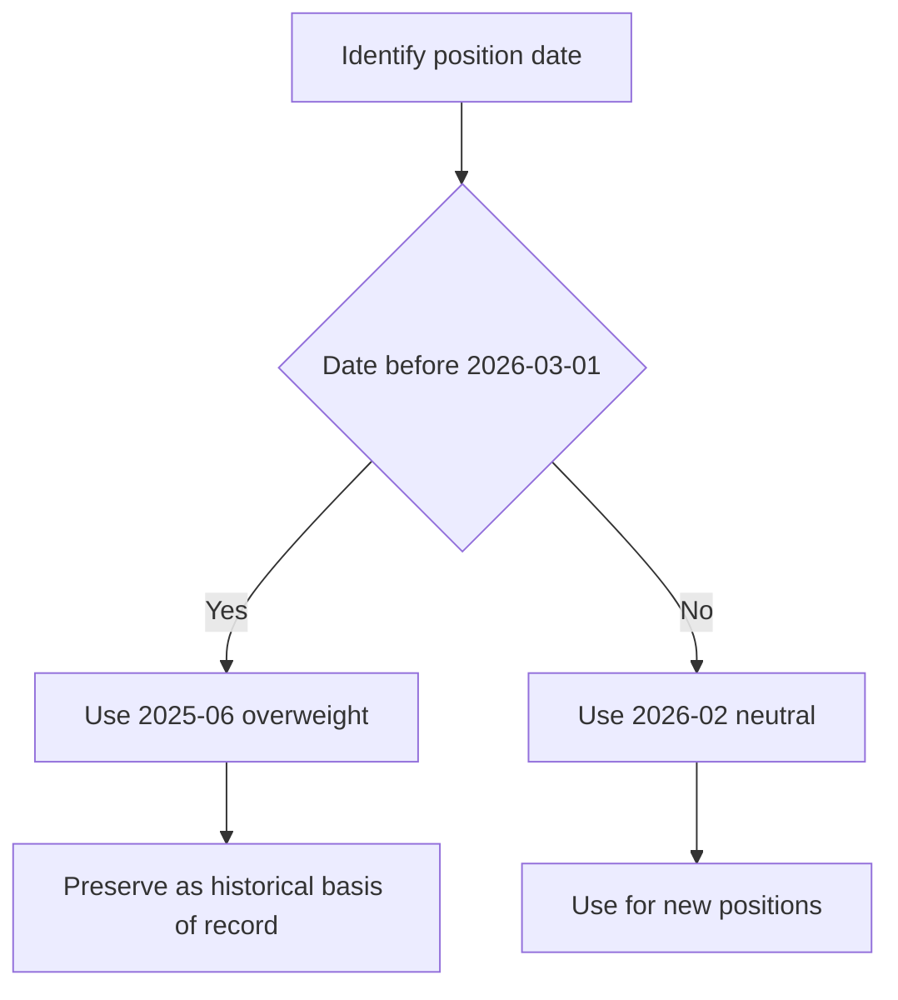

# US Semiconductor Capex: Edition History and Power Constraint

> **Synthetic demonstration material.** The underlying notes explicitly state that they are not research, a recommendation, or investment advice. This page records their internal edition history and stated reasoning; it does not authorize a trade or allocation.

## Scope and edition authority

This is a **market-view** page for US semiconductor capital equipment. It records two editions of `EQ-US-SEMI-CAPEX`, both written by US Equity Research:

| Edition | Published | Applicable position date | Recommendation | Status for position records |
| --- | --- | --- | --- | --- |
| 2025-06 | 2025-06-11 | On or after 2025-07-01 | Overweight | Historical authority for positions taken while it stood |
| 2026-02 | 2026-02-19 | On or after 2026-03-01 | Neutral, from overweight | Governs positions taken from its applicability date |

**EQ-US-SEMI-CAPEX 2026-02 supersedes EQ-US-SEMI-CAPEX 2025-06** for positions taken on or after 2026-03-01: the reissue expressly identifies the new applicability date and supersession, while the prior edition states both the supersession and that it remains the basis of record for positions taken while it stood. [2026-02 reissue provision](repo://internal_research/EQ/US/SEMI-CAPEX/2026-02.md#L12-L18) [2025-06 historical-authority provision](repo://internal_research/EQ/US/SEMI-CAPEX/2025-06.md#L3-L5)

<!-- openwiki: broken internal link [/openwiki/position-assembly/basis-of-record-and-suspended-weights.md#L13-L19] heading anchor "L13-L19" does not exist in "/openwiki/position-assembly/basis-of-record-and-suspended-weights.md". Fix the href or restore the target, then delete this comment. -->
The date selects the relevant edition; it does not retrospectively replace the rationale for a historical position. Thus, a review of a position taken from 2025-07-01 through 2026-02-28 uses the 2025-06 edition as its basis of record, even if the review occurs after the 2026-02 reissue. A new position on or after 2026-03-01 uses 2026-02. This follows the general position-assembly procedure to select the edition effective on the original position date for historical review and the current applicable edition for new action. [Edition applicability and historical authority](repo://internal_research/EQ/US/SEMI-CAPEX/2025-06.md#L19-L23) [Reissue applicability](repo://internal_research/EQ/US/SEMI-CAPEX/2026-02.md#L12-L18) [Basis-of-record procedure](/openwiki/position-assembly/basis-of-record-and-suspended-weights.md#L13-L19)

*Edition selection for historical review and new position taking under the stated applicability dates.*

## What changed: cycle position and valuation

The 2025-06 edition was an early-cycle overweight on a 12-to-18-month view. It identified a fourth-quarter 2024 trough in wafer-fab-equipment spending, two subsequent quarters of growth, and lengthening order books. The edition treated more-than-50-week lead times for lithography and deposition tooling as an early-cycle forward indicator, and mapped a historical seven-to-nine-quarter expansion from trough to a late-2026 peak. It expressed the view through capital equipment rather than fabless or memory segments. [2025-06 summary, cycle, and expression](repo://internal_research/EQ/US/SEMI-CAPEX/2025-06.md#L21-L29) [2025-06 positioning](repo://internal_research/EQ/US/SEMI-CAPEX/2025-06.md#L39-L41)

The 2026-02 edition reduced the segment to neutral because the earlier cycle thesis had largely played out and valuation and cycle position no longer supported the overweight—not because fundamentals had deteriorated. By then the desk recorded six consecutive quarters of spending growth, placing the expansion two to three quarters from peak on the earlier pattern. Lead times had stopped extending and shortened modestly for deposition tooling; the desk characterized that reversal as an ordinary late-cycle signal rather than a demand event. [2026-02 downgrade rationale](repo://internal_research/EQ/US/SEMI-CAPEX/2026-02.md#L12-L24)

The current neutral is a segment-level weight, not a statement that all equipment exposures are equivalent: 2026-02 retains a preference for lithography over deposition and etch on pricing-power grounds. [2026-02 positioning](repo://internal_research/EQ/US/SEMI-CAPEX/2026-02.md#L34-L36)

## Preserved structural concentration argument

The 2025-06 quality case was that top-three-customer concentration had moderated to 51% of segment revenue from 64% at the prior peak. The note attributed most of the change to two new leading-edge logic-foundry customers, rather than a mix artefact. [2025-06 concentration analysis](repo://internal_research/EQ/US/SEMI-CAPEX/2025-06.md#L31-L33)

**EQ-US-SEMI-CAPEX 2026-02 S.3 preserves EQ-US-SEMI-CAPEX 2025-06 S.3**: the reissue reports further improvement to 46% for the top three customers and states that the structural argument is preserved in full and is not the downgrade reason; the earlier provision establishes the argument and its customer-base rationale. [2026-02 preservation provision](repo://internal_research/EQ/US/SEMI-CAPEX/2026-02.md#L26-L28) [2025-06 concentration provision](repo://internal_research/EQ/US/SEMI-CAPEX/2025-06.md#L31-L33)

This separates a structural quality consideration from the live weight decision. The concentration thesis remains part of the analytical record, but it does not override the 2026-02 neutral decision driven by valuation and late-cycle position.

## Power constraint: a rate modifier, not a demand-level change

The 2026-02 edition adds a constraint absent from 2025-06: in several jurisdictions, grid-interconnection timelines increasingly gate leading-edge fab siting rather than tooling availability. The desk treats the result as a cap on the **rate** of new capacity addition, rather than a reduction in the eventual level of demand. [2026-02 power constraint provision](repo://internal_research/EQ/US/SEMI-CAPEX/2026-02.md#L30-L32)

**EQ-GL-AI-INFRA-POWER 2026-01 P.4 modifies EQ-US-SEMI-CAPEX 2026-02 S.4**: the global provision describes grid interconnection as a gate on leading-edge fab siting in several jurisdictions and a modifier of the semiconductor-capital-equipment cycle that changes the shape of additions rather than eventual demand; the US provision applies the same rate-versus-level framing to the reissued view. [Global modification provision](repo://internal_research/EQ/GL/AI-INFRA-POWER/2026-01.md#L30-L32) [US power-constraint provision](repo://internal_research/EQ/US/SEMI-CAPEX/2026-02.md#L30-L32)

The global note locates the wider electrical bottleneck in interconnection queue position, transformer lead times, and—in some jurisdictions—generation adequacy, rather than accelerator supply. It reports median interconnection-study completion beyond 40 months in the largest US market operator and high-voltage large-power-transformer lead times of three to four years. These are contextual mechanisms for the capacity-addition shape; they are not a separate directional view on compute vendors. [Electrical constraint and queue context](repo://internal_research/EQ/GL/AI-INFRA-POWER/2026-01.md#L16-L28) [Transformer context](repo://internal_research/EQ/GL/AI-INFRA-POWER/2026-01.md#L34-L36)

## Monitoring the stated view

For the 2025-06 historical thesis, the specified change conditions were capex-guidance reductions from either of the two largest logic customers, sustained memory pricing below cash cost, and export controls materially restricting shipments to the customer base. [2025-06 change conditions](repo://internal_research/EQ/US/SEMI-CAPEX/2025-06.md#L35-L37)

For the current edition, monitor the late-cycle evidence that informed neutral—spending progression, lead-time direction, and valuation/cycle position—alongside whether grid interconnection continues to gate siting. The global power thesis also names changes in useful-work energy efficiency, allocation of interconnection capacity away from data-centre load, and AI capital formation as risks. [2026-02 cycle and power evidence](repo://internal_research/EQ/US/SEMI-CAPEX/2026-02.md#L18-L32) [Global stated risks](repo://internal_research/EQ/GL/AI-INFRA-POWER/2026-01.md#L38-L40)

## Source basis

- [EQ-US-SEMI-CAPEX 2025-06](repo://internal_research/EQ/US/SEMI-CAPEX/2025-06.md#L1-L43)
- [EQ-US-SEMI-CAPEX 2026-02](repo://internal_research/EQ/US/SEMI-CAPEX/2026-02.md#L1-L38)
- [EQ-GL-AI-INFRA-POWER 2026-01](repo://internal_research/EQ/GL/AI-INFRA-POWER/2026-01.md#L1-L42)
<!-- openwiki: broken internal link [/openwiki/position-assembly/basis-of-record-and-suspended-weights.md#L13-L19] heading anchor "L13-L19" does not exist in "/openwiki/position-assembly/basis-of-record-and-suspended-weights.md". Fix the href or restore the target, then delete this comment. -->
- [Basis of record and suspended weights](/openwiki/position-assembly/basis-of-record-and-suspended-weights.md#L13-L19)
