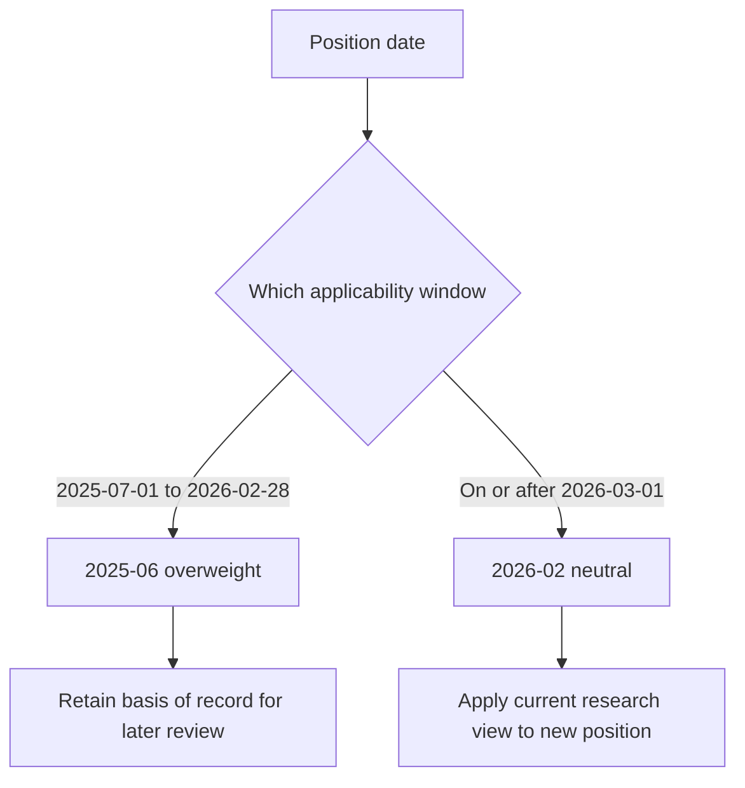

## Scope and authority

This page assembles the dated research record for **EQ-US-SEMI-CAPEX**. It distinguishes the research edition applicable when a position was taken from the current view for a newly taken position. A research recommendation is not, by itself, a binding portfolio weight; any mandate-guide control and escalation outcome must be established separately. [Edition procedure](repo://openwiki/position-assembly/supersession-and-escalation.md#L11-L19)

**EQ-US-SEMI-CAPEX 2026-02 S.1 supersedes EQ-US-SEMI-CAPEX 2025-06 S.1 for positions taken on or after 2026-03-01.** The directed relationship is supported by the successor's express supersession statement and the predecessor's `SUPERSEDED by` marker. It changes the research authority for later positions, but does not erase the earlier edition as the basis of record for positions taken while it stood. [2026-02 provision](repo://research/EQ/US/SEMI-CAPEX/2026-02.md#L1-L7) · [2025-06 provision](repo://research/EQ/US/SEMI-CAPEX/2025-06.md#L1-L7)

The diagram shows research-edition selection by position date; it does not create a binding portfolio weight.

## Edition register and governed positions

| Edition | Published / applicable from | Research stance | Positions it governs as basis of record |
| --- | --- | --- | --- |
| **2025-06** | Published 2025-06-11; applicable from 2025-07-01 | **Overweight** US semiconductor capital equipment on a 12–18 month view | Positions taken from 2025-07-01 through 2026-02-28. The note expressly retains this edition as the basis of record, including reviews performed later. |
| **2026-02** | Published 2026-02-19; applicable from 2026-03-01 | **Neutral**, reduced from overweight | Positions taken on or after 2026-03-01. This is the current research view in the available record. |

[2025-06 applicability and record retention](repo://research/EQ/US/SEMI-CAPEX/2025-06.md#L3-L11) · [2026-02 applicability and stance](repo://research/EQ/US/SEMI-CAPEX/2026-02.md#L1-L7)

## 2025-06: preserved overweight case

The historical case was an early-cycle call: wafer-fab-equipment spending was assessed to have troughed in Q4 2024 and risen for two consecutive quarters. Applying the desk's historical seven-to-nine-quarter expansion pattern placed a peak in late 2026. Lithography and deposition-tool lead times had extended beyond 50 weeks, a signal the desk considered a reliable forward indicator in the prior three cycles. [Cycle assessment](repo://research/EQ/US/SEMI-CAPEX/2025-06.md#L13-L17)

The quality premise was also constructive. The top three customers represented 51% of segment revenue versus 64% at the prior peak; the desk attributed the improvement to two new leading-edge logic-foundry customers and treated it as genuine rather than a mix artefact. The expression was capital equipment, not fabless or memory, for which the edition stated no view. [Concentration and expression](repo://research/EQ/US/SEMI-CAPEX/2025-06.md#L19-L29)

The edition named three review triggers: a capex-guidance reduction by either of the two largest logic customers, sustained memory pricing below cash cost, or an export-control action materially restricting shipments to the customer base. [Change conditions](repo://research/EQ/US/SEMI-CAPEX/2025-06.md#L23-L25)

## 2026-02: current neutral view

The successor reduces the sector to neutral because the earlier cycle thesis had largely played out, citing valuation and cycle position rather than deteriorating fundamentals. At that point, wafer-fab-equipment spending had risen for six consecutive quarters—two to three quarters from the peak under the earlier seven-to-nine-quarter pattern—and deposition lead times had stopped extending and shortened modestly. The desk characterizes that lead-time reversal as an ordinary late-cycle signal, not a demand event. [Rationale and cycle position](repo://research/EQ/US/SEMI-CAPEX/2026-02.md#L5-L13)

Customer concentration is a retained constructive premise: the top-three share improved further to 46%, and the successor explicitly says the 2025-06 structural argument is preserved in full and is not the downgrade's cause. The current implementation is neutral weight, while retaining a relative preference for lithography over deposition and etch on pricing-power grounds. [Concentration and positioning](repo://research/EQ/US/SEMI-CAPEX/2026-02.md#L15-L25)

### New modifier: power and interconnection

A grid-interconnection constraint, absent from the 2025-06 note, now increasingly gates leading-edge fab siting rather than tooling availability. It caps the **rate** of capacity addition rather than the **level** of eventual demand. The semiconductor note identifies the global power note as the coverage source; that note calls this a modifier to the semiconductor cycle view, not a replacement for it. [Semiconductor constraint](repo://research/EQ/US/SEMI-CAPEX/2026-02.md#L19-L21) · [Global-note relationship](repo://research/EQ/GL/AI-INFRA-POWER/2026-01.md#L19-L21)

For the broader electrical-infrastructure thesis and its monitoring risks, see [AI Infrastructure Power](/openwiki/research/equities/ai-infrastructure-power.md). That page owns the global power-sector view; this page owns the US semiconductor-capex edition history, sector stance, and cycle interpretation.

## Premise reconciliation

| Premise | 2025-06 status | 2026-02 status and consequence |
| --- | --- | --- |
| Cycle stage | Early expansion, with peak estimated late 2026 | Six quarters of growth and an estimated two-to-three quarters to peak; this is the principal reason to move from overweight to neutral. |
| Tool lead times | More than 50 weeks and extending in lithography and deposition | No longer extending; modestly shorter for deposition. Interpreted as late-cycle rather than a demand break. |
| Customer concentration | Improved to 51%, viewed as structural | Improved further to 46%; expressly retained and not a downgrade cause. |
| Capacity-addition constraint | Tooling availability was the operative context; no power constraint stated | Grid interconnection is now an explicit siting gate, shaping the timing of additions but not eventual demand. |
| Segment expression | Capital equipment only; no fabless or memory view | Neutral segment weight, with lithography preferred to deposition and etch on pricing power. |

The latest note describes the lithography preference as unchanged from the prior edition, but the supplied 2025-06 text does not expressly state that relative preference. Accordingly, the documented historical record should not be expanded beyond its stated capital-equipment expression; the explicit preference is recorded here as part of 2026-02. [2025-06 positioning](repo://research/EQ/US/SEMI-CAPEX/2025-06.md#L27-L29) · [2026-02 positioning](repo://research/EQ/US/SEMI-CAPEX/2026-02.md#L23-L25)

## Operational reading

- Use the 2025-06 overweight and its named review triggers when reconstructing or reviewing an in-scope historical position; do not retrospectively substitute the neutral stance.
- Use 2026-02 neutral for a position newly taken on or after 2026-03-01, subject to the separate mandate and approval process.
- Monitor cycle maturity and lead-time direction alongside the retained concentration improvement. Treat grid connection timing as a pacing modifier to capacity additions, not evidence that eventual demand has been removed.
- Do not infer an automatic portfolio rebalance from the research supersession. The documented procedure requires a separately identified binding control and, where applicable, escalation rather than direct adoption of a replacement research view. [Position-assembly procedure](repo://openwiki/position-assembly/supersession-and-escalation.md#L13-L19)
