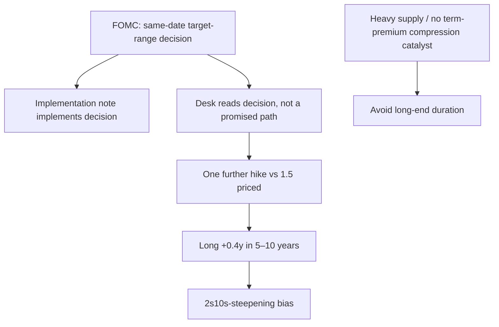

## Scope and current research expression

> **Demonstration-corpus status:** the underlying FOMC materials and duration note are explicitly synthetic. The duration note says it is not research, a recommendation, or investment advice; this page documents its stated internal research expression only. [Duration-note notice](repo://internal_research/FI/US/DURATION-PATH/2026-10.md#L1-L3) [FOMC-statement notice](repo://external_sources/FED/2026-09-fomc-statement.md#L1-L6)

**Edition 2026-10** is a US Fixed Income Research view, published 2026-10-06 and applicable to positions taken on or after 2026-11-01. It changes the stance from neutral to **long duration by +0.4 years versus benchmark**. The intended expression is in the **5–10-year** sector, not the long end. [Duration note, header and D.1](repo://internal_research/FI/US/DURATION-PATH/2026-10.md#L5-L18)

The recommendation has two distinct implementation characteristics:

- place the modest duration long primarily in 5–10-year maturities; and
- use a **2s10s-steepening bias**, rather than a parallel extension of duration. [Duration note, D.1 and D.4](repo://internal_research/FI/US/DURATION-PATH/2026-10.md#L16-L18) [Duration note, D.4](repo://internal_research/FI/US/DURATION-PATH/2026-10.md#L30-L32)

The diagram separates the official decision and its implementation from the desk’s own path assumption, and separates that policy-path expression from the long-end constraint. [FOMC statement, F.1 and F.5](repo://external_sources/FED/2026-09-fomc-statement.md#L10-L12) [Implementation note, I.1 and I.4](repo://external_sources/FED/2026-09-rates-on-reserve-balances-and-primary-credit.md#L8-L12) [Duration note, D.2–D.4](repo://internal_research/FI/US/DURATION-PATH/2026-10.md#L20-L32)

## FOMC decision, implementation, and the research assumption

At the September 2026 meeting, the FOMC raised the federal-funds target range by 25 basis points to **3.75%–4.00%**, judged a somewhat more restrictive stance appropriate, and described inflation as elevated relative to its 2% objective. [FOMC statement, F.1–F.2](repo://external_sources/FED/2026-09-fomc-statement.md#L10-L16)

The same-date implementation note **implements** that target-range decision. It records a 3.90% interest rate on reserve balances, effective 2026-09-17, and a 25-basis-point increase in the primary credit rate to 4.0%, also effective that date. The note is a mechanical companion to the statement and states no policy view of its own. [Implementation note, I.1–I.3](repo://external_sources/FED/2026-09-rates-on-reserve-balances-and-primary-credit.md#L8-L24)

Crucially, the implementation note implements the same-date target-range decision; it does **not** modify or extend the statement and carries no policy-path guidance beyond F.5. It therefore cannot be read as confirmation of the desk’s forecast. [Implementation note, I.4](repo://external_sources/FED/2026-09-rates-on-reserve-balances-and-primary-credit.md#L26-L30) [FOMC statement, F.5](repo://external_sources/FED/2026-09-fomc-statement.md#L26-L30)

The desk’s premise is deliberately narrower than an assertion about FOMC intent: its central case is **one further increase over 12 months**, against **1.5 increases market-implied**. The half-step difference is the entire and modest basis for the duration recommendation, rather than a high-conviction directional call. [Duration note, D.2](repo://internal_research/FI/US/DURATION-PATH/2026-10.md#L20-L24)

The statement itself makes no commitment to a future adjustment sequence. It says any additional adjustments will reflect cumulative effects, policy lags, and economic and financial developments, while incoming data and the evolving outlook are assessed at each meeting. [FOMC statement, F.5](repo://external_sources/FED/2026-09-fomc-statement.md#L26-L30)

## Why the long end is excluded

The desk regards term premium as fair to cheap, but sees heavy long-end supply and no catalyst for term-premium compression within 12 months. It consequently avoids long-end duration: that position would add a term-premium view the desk does not hold. The 5–10-year placement is thus a constraint on the expression, not simply a maturity preference. [Duration note, D.3](repo://internal_research/FI/US/DURATION-PATH/2026-10.md#L26-L28)

The curve thesis is continued steepening between two and ten years. A steepening-biased implementation, rather than a parallel duration extension, preserves that relative-maturity view. [Duration note, D.4](repo://internal_research/FI/US/DURATION-PATH/2026-10.md#L30-L32)

## Risks and review boundaries

The policy-path risk is that inflation produces a sequence of increases rather than the single increase assumed by the desk. As context for that hawkish tail, the September action was unanimous, while three members dissented at the July meeting in favor of a 25-basis-point increase. This history is not a commitment to subsequent tightening. [Duration note, D.5](repo://internal_research/FI/US/DURATION-PATH/2026-10.md#L34-L36) [FOMC statement, F.6](repo://external_sources/FED/2026-09-fomc-statement.md#L32-L36)

Separately, a fiscal event could increase long-end supply beyond current projections, and a disorderly repricing of term premium could hurt the position despite its front-loaded expression. These are long-end risks, not evidence for changing the desk’s policy-path assumption. [Duration note, D.5](repo://internal_research/FI/US/DURATION-PATH/2026-10.md#L34-L36)

A focused review should keep three questions independent: whether data still support the one-more-hike premise; whether 2s10s still supports a steepening expression; and whether supply or term premium reinforces the decision not to use the long end. The FOMC statement’s meeting-by-meeting formulation means the September decision alone does not resolve the first question prospectively. [Duration note, D.2–D.5](repo://internal_research/FI/US/DURATION-PATH/2026-10.md#L20-L36) [FOMC statement, F.5](repo://external_sources/FED/2026-09-fomc-statement.md#L26-L30)

## Governance boundary

This page is a research input, not a mandate authority or binding-weight instruction. Where a research note cited by a mandate guide is superseded or withdrawn, the manager must suspend the derived weight and escalate rather than carry it forward or directly adopt a replacement view; adopting a research view into a binding weight is a committee act. Apply the relevant mandate guidance and authority process before turning this research expression into an account action. [Discretion matrix, D.4](repo://internal_guidelines/authority/discretion-matrix.md#L31-L37)
