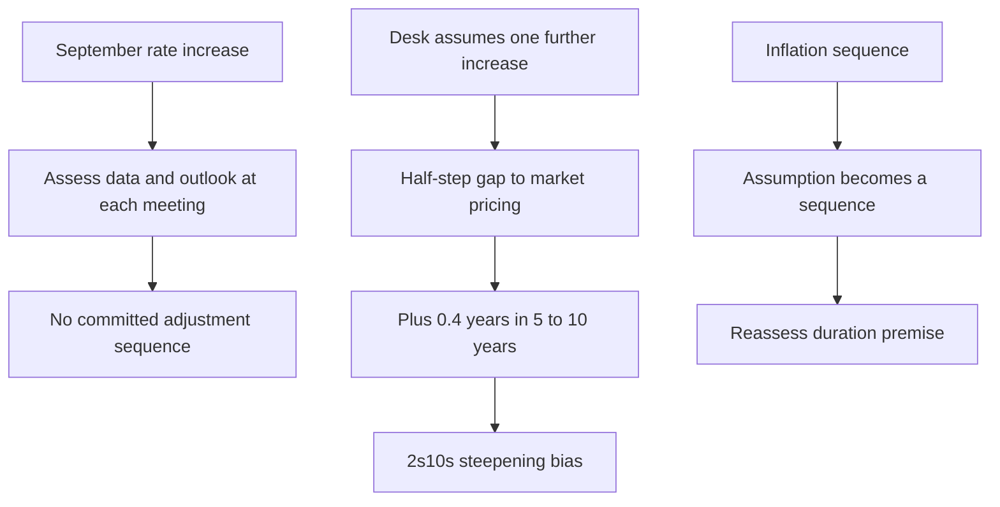

# US Duration and Curve Positioning

## Mandate, edition, and applicability

This page records **FI-US-DURATION-PATH, Edition 2026-10**, published by US Fixed Income Research on **2026-10-06** and applicable to positions taken on or after **2026-11-01**. The note changed the prior neutral stance to long duration and specifies that the expression is in 5–10 years after the September hike.【repo://research/FI/US/DURATION-PATH/2026-10.md#L5-L14】

Use the [Federal Reserve policy-path overlay](/openwiki/regulatory/fed-policy-path.md) for the source boundary and [Global Multi-Asset Bands](/openwiki/guidance/allocation/global-multi-asset-bands.md) for multi-asset control context.

## Recommended expression

The desk recommends a modest **+0.4 years of duration versus benchmark** in the **five-to-ten-year** sector and recommends against expressing duration at the long end.【repo://research/FI/US/DURATION-PATH/2026-10.md#L16-L18】 It expects continued **2s10s steepening**, so the duration position should carry a steepening bias rather than be implemented as a parallel extension.【repo://research/FI/US/DURATION-PATH/2026-10.md#L30-L32】

The sizing is intentionally modest. The desk’s central case is **one further increase over the coming 12 months**, versus **one and a half increases** implied by the market. It calls that half-step difference the whole duration recommendation and a modest deviation rather than a conviction call.【repo://research/FI/US/DURATION-PATH/2026-10.md#L20-L24】

## Federal Reserve boundary: decision, not forecast

At its September meeting, the FOMC raised the federal-funds target range by 25 basis points to **3-3/4 to 4 percent**, judging a somewhat more restrictive stance appropriate. It said inflation remained elevated relative to its 2 percent objective and that the action supported a timelier return to that objective.【repo://bulletins/FED/2026-09-fomc-statement.md#L10-L16】

The statement does **not** describe a future path or commit the Committee to a sequence of adjustments. For any additional adjustment, it says the Committee will consider cumulative effects, policy lags, and economic and financial developments; it will assess incoming data and the evolving outlook at each meeting and may adjust the stance if risks impede its goals.【repo://bulletins/FED/2026-09-fomc-statement.md#L26-L30】 Therefore, the desk’s one-increase case is its scenario assumption, not Federal Reserve guidance, a Fed forecast, or a mechanically implied schedule.【repo://research/FI/US/DURATION-PATH/2026-10.md#L20-L24】【repo://bulletins/FED/2026-09-fomc-statement.md#L28-L30】

The diagram separates the FOMC’s data-dependent, non-committed process from the desk’s conditional scenario and its trade expression.【repo://bulletins/FED/2026-09-fomc-statement.md#L26-L30】【repo://research/FI/US/DURATION-PATH/2026-10.md#L20-L24】【repo://research/FI/US/DURATION-PATH/2026-10.md#L30-L36】

The FOMC also continues reducing Treasury and agency MBS holdings at the previously announced pace while maintaining ample reserves, with no announced pace change. That balance-sheet language is separate from, and does not supply, a future target-range sequence.【repo://bulletins/FED/2026-09-fomc-statement.md#L22-L24】【repo://bulletins/FED/2026-09-fomc-statement.md#L26-L30】

## Long-end exclusion and risk monitoring

The desk sees term premium as fair to cheap but identifies heavy long-end supply and no catalyst for compression inside 12 months. Long-end duration would consequently be a term-premium view that the desk does not hold.【repo://research/FI/US/DURATION-PATH/2026-10.md#L26-L28】

Monitor three stated failure modes: inflation prints that turn the assumed single increase into a sequence, a fiscal event that raises long-end supply beyond projections, and a disorderly repricing of term premium that hurts the front-loaded position. The note also records that three members dissented at the July meeting in favor of an increase, making the hawkish tail a stated consideration rather than an omitted alternative.【repo://research/FI/US/DURATION-PATH/2026-10.md#L34-L36】
