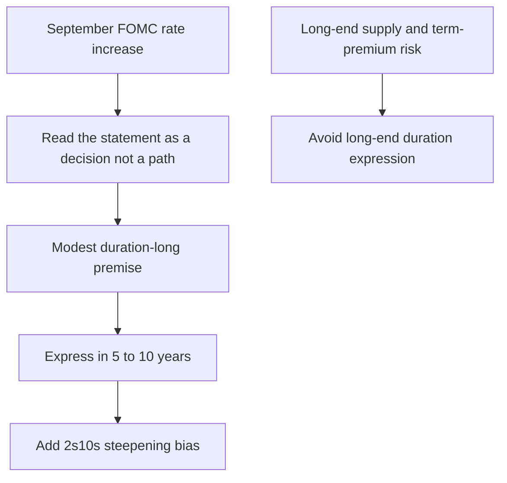

## View at a glance

**Edition 2026-10** is a US Fixed Income Research market view, published 2026-10-06 and applicable to positions taken on or after 2026-11-01. It recommends a **modest +0.4-year duration position versus benchmark**, changed from neutral, and places that exposure in the **5–10-year** portion of the Treasury curve rather than the long end. This is research, not binding allocation guidance or client-specific investment advice. [Duration-path note, header and D.1](repo://research/FI/US/DURATION-PATH/2026-10.md#L1-L18)

The expression has two linked elements:

- hold the modest duration-long primarily in 5–10-year maturities;
- apply a steepening bias between 2 and 10 years rather than extend duration as a parallel move.

The maturity choice is integral to the view: the desk does not intend the +0.4-year recommendation to be a long-end term-premium trade. [Duration-path note, D.1 and D.4](repo://research/FI/US/DURATION-PATH/2026-10.md#L16-L18) [Duration-path note, D.3](repo://research/FI/US/DURATION-PATH/2026-10.md#L26-L32)

This diagram shows the note's separation of the policy-path premise, the curve expression, and the independent reason not to use the long end. [Duration-path note, D.2–D.4](repo://research/FI/US/DURATION-PATH/2026-10.md#L20-L32)

## Evidence from the September FOMC: decision, not promised trajectory

At its 2026-09 meeting, the FOMC raised the federal-funds target range by 25 basis points to **3.75%–4.00%**, judging a somewhat more restrictive stance appropriate; it cited inflation elevated relative to its 2% objective. [FOMC statement, F.1–F.2](repo://bulletins/FED/2026-09-fomc-statement.md#L10-L16)

The note's policy interpretation is deliberately narrow. Its central case is **one further increase over the coming 12 months**, compared with **1.5 increases implied by the market**, and it says that the half-step gap is the entire basis of the duration recommendation—not a high-conviction call. [Duration-path note, D.2](repo://research/FI/US/DURATION-PATH/2026-10.md#L20-L24)

That is an analytical assumption of the research desk, not a statement of FOMC intent. The FOMC explicitly says it will consider cumulative effects, policy lags, and economic and financial developments when determining the extent of any additional adjustments; it does **not** describe or commit to a sequence of future moves and will assess incoming data and the evolving outlook meeting by meeting. [FOMC statement, F.5](repo://bulletins/FED/2026-09-fomc-statement.md#L26-L30)

## Why duration is in 5–10 years, not the long end

The desk views term premium as fair to cheap, but sees heavy long-end supply and no catalyst for term-premium compression within 12 months. Consequently, a long-end duration position would introduce a term-premium view that the desk does not hold. The 5–10-year implementation therefore preserves the modest policy-path expression while declining that separate long-end bet. [Duration-path note, D.3](repo://research/FI/US/DURATION-PATH/2026-10.md#L26-L28)

The curve component is an expectation of continued **2s10s steepening**. It is not evidence that every maturity should rally equally; the note specifically prefers a steepening-biased expression to a parallel duration extension. [Duration-path note, D.4](repo://research/FI/US/DURATION-PATH/2026-10.md#L30-L32)

## Risks and monitoring boundaries

The principal **policy-path risk** is an inflation sequence that turns the assumed single further increase into a sequence of hikes. The statement records that three members dissented at the July meeting because each preferred a 25-basis-point increase, although the September action itself was unanimous; this is context for the hawkish tail, not a promise of subsequent tightening. [Duration-path note, D.5](repo://research/FI/US/DURATION-PATH/2026-10.md#L34-L36) [FOMC statement, F.6](repo://bulletins/FED/2026-09-fomc-statement.md#L32-L36)

The distinct **long-end risk** is a fiscal event that raises long-end supply beyond current projections, compounded by a disorderly repricing of term premium. The front-loaded 5–10-year expression reduces, but does not eliminate, the latter's potential harm to the overall duration position. [Duration-path note, D.5](repo://research/FI/US/DURATION-PATH/2026-10.md#L34-L36)

For implementation review, keep these questions separate: whether incoming inflation and activity data still support the note's one-more-hike assumption; whether the 2s10s steepening thesis remains intact; and whether long-end supply or term premium has changed enough to reinforce the decision not to extend into the long end. The FOMC's own data-dependent, meeting-by-meeting formulation means its September statement alone cannot answer the first question prospectively. [Duration-path note, D.2–D.5](repo://research/FI/US/DURATION-PATH/2026-10.md#L20-L36) [FOMC statement, F.5](repo://bulletins/FED/2026-09-fomc-statement.md#L26-L30)

## Relationship to portfolio governance

This page records a research view and its intended expression. Any conversion of it into portfolio weights, mandate exposure, or a client action remains subject to the applicable allocation guidance and decision authority; research input does not itself set a binding allocation. [Global Multi-Asset Allocation Guidance, scope and ownership](repo://openwiki/guidance/allocation/global-multi-asset-bands.md#L11-L15)
