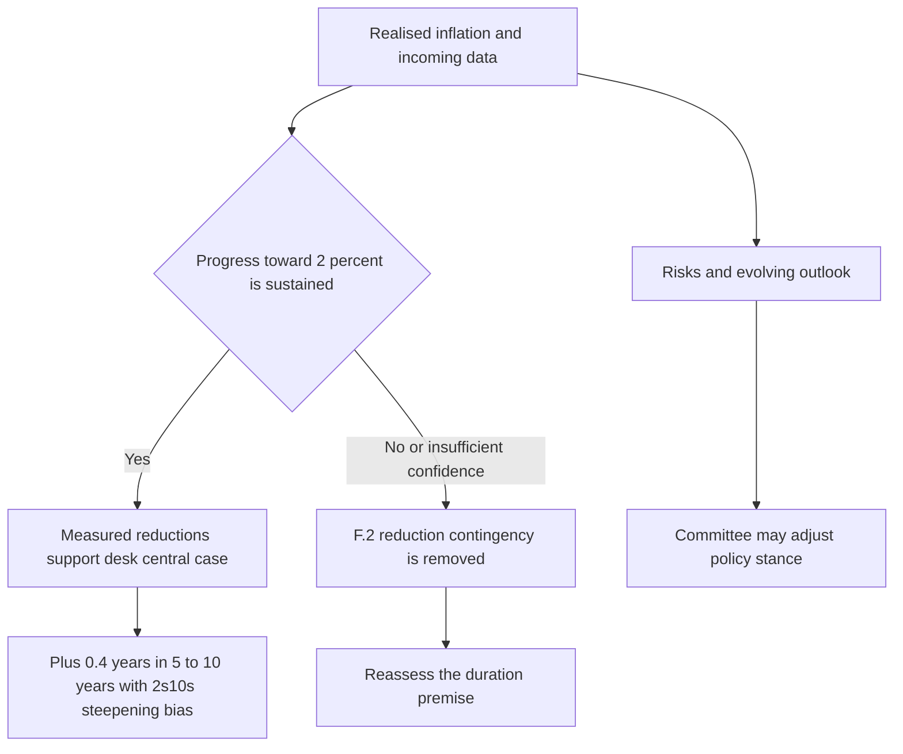

# US Duration and Curve: 2026-01 View

## Decision summary

US Fixed Income Research recommends a **modest +0.4-year duration position versus benchmark**, expressed in the **five-to-ten-year** sector. The position applies to positions taken on or after **2026-02-01**. It is paired with a **steepening bias between two and ten years (2s10s)** rather than a parallel extension of duration.

This is deliberately a small tactical deviation, not a high-conviction call: the desk assumes three policy-rate reductions over the coming 12 months versus 2.5 reductions implied by the market. The 0.5-reduction difference is the entire basis for the duration recommendation.

## Policy premise: conditional, not promised

The central case follows the Federal Reserve's January 2026 guidance. **FED Statement 2026-01 F.2** says reductions are expected at a measured pace *contingent on continued progress toward the inflation objective*; it also says no further reduction is expected to be appropriate until the Committee has greater confidence that inflation is moving sustainably toward 2%. F.2 further states that projections are conditional on the realised inflation path and are not a commitment.

Consequently, “three reductions” is the research desk's scenario assumption, not a Federal Reserve forecast or a mechanically implied schedule. **FED Statement 2026-01 F.4** preserves the Committee's ability to assess incoming data and the outlook and adjust policy if risks threaten its objectives. Balance-sheet runoff continues at the previously announced pace under F.3, with no announced pace change; it is not an additional rate-cut signal.

This decision logic separates the desk's conditional scenario from a committed Federal Reserve rate path.

## Expression and curve mechanics

- **Sector:** Add duration only in the five-to-ten-year part of the curve.
- **Curve shape:** Express the view with a 2s10s steepening bias. The desk expects continued steepening between two and ten years, so the recommendation is not a parallel duration extension.
- **Size:** Keep the exposure at +0.4 years versus benchmark. The modest size is an invariant of the view because its support is only the half-reduction difference between the desk and market assumptions.

## Why the long end is excluded

The desk regards term premium as fair to cheap after its re-establishment, but does not expect compression within 12 months. Heavy long-end supply remains and the desk sees no catalyst for such compression. A long-end duration position would therefore be a term-premium view the desk does not hold. The recommendation explicitly excludes using the long end to express duration.

## Risk and contingency management

The primary invalidating event is a sequence of inflation prints that removes the F.2 contingency. In that case, do not treat the three-reduction assumption as durable policy guidance; reassess the duration premise.

Two further stated risks are a fiscal event that raises long-end supply beyond current projections and a disorderly repricing of term premium. The latter can hurt the +0.4-year position even though its expression is front-loaded rather than at the long end. These risks explain both the limited position size and the long-end exclusion.

## Scope and relationships

This is a research view, not a Federal Reserve communication. The [Federal Reserve policy-path overlay](/openwiki/regulatory/fed-policy-path.md) records the policy-source boundary and the distinction between F.2's contingency and the desk's assumption. For portfolio-control context, see the [global multi-asset bands](/openwiki/guidance/allocation/global-multi-asset-bands.md).

## Source basis

- **Position, sizing, curve expression, long-end rationale, and risks:** `research/FI/US/DURATION-PATH/2026-01.md`, sections D.1–D.5.
- **Conditional policy guidance and inflation contingency:** `bulletins/FED/2026-01-policy-rate-path-statement.md`, especially F.2; see also F.3 for balance-sheet treatment and F.4 for data dependence.
