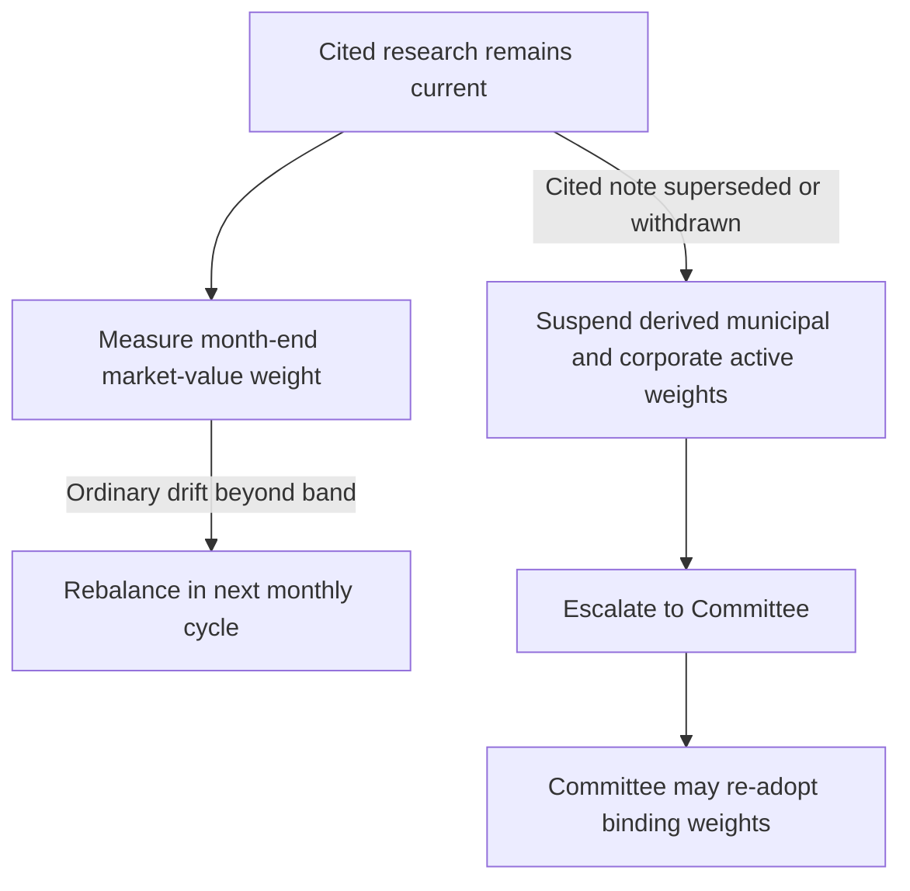

## Research view: valuation, not a deterioration call

**FI-US-IG-SPREADS edition 2025-09** was published on 2025-09-18 and applies to positions taken on or after 2025-10-01. US Fixed Income Research changed its recommendation from neutral to **underweight** US investment-grade corporate credit because spreads are inside the tenth percentile of their 20-year range and offer limited compensation for cyclical risk. [IG Spreads, title and G.1](repo://research/FI/US/IG-SPREADS/2025-09.md#L1-L18)

The case is valuation-led. Option-adjusted spreads are near their tightest level since 2007; the index's improved average rating and shorter average duration narrow, but do not eliminate, the perceived richness. In contrast, index-level leverage is stable and interest coverage comfortable, so the recommendation is not a forecast of imminent or broad-based credit deterioration. [IG Spreads, G.2–G.3](repo://research/FI/US/IG-SPREADS/2025-09.md#L20-L26)

The desk's recommended expression is an underweight of approximately four percentage points within the taxable fixed-income sleeve, with proceeds available for a higher-conviction position elsewhere in the sleeve rather than cash. This is a research recommendation; it does not itself select a binding portfolio weight. [IG Spreads, G.5](repo://research/FI/US/IG-SPREADS/2025-09.md#L32-L34) [Allocation Guide, standing](repo://guidelines/allocation/us-taxable-fixed-income.md#L7-L11)

## Binding expression and paired funding

The **US Taxable Account Fixed Income Allocation Guide funds** the top-federal-bracket municipal overweight with the investment-grade corporate underweight: it sets corporate credit at a 28% target against 32% neutral and municipal credit at 22% against 18% neutral. The guide makes the corporate four-point underweight the municipal overweight's funding source; the research note separately identifies the same approximate four-point corporate expression and directs its proceeds to another sleeve position. Thus the guide—not FI-US-IG-SPREADS—owns the binding target and account-specific implementation. [Allocation Guide, A.3 and A.5](repo://guidelines/allocation/us-taxable-fixed-income.md#L17-L23) [Allocation Guide, A.5](repo://guidelines/allocation/us-taxable-fixed-income.md#L33-L37) [IG Spreads, G.5](repo://research/FI/US/IG-SPREADS/2025-09.md#L32-L34)

The municipal active allocation is limited to clients in the top federal marginal bracket. For clients below that bracket, the guide assigns the 18% municipal neutral weight and excludes the private-activity concentration. [Allocation Guide, A.3](repo://guidelines/allocation/us-taxable-fixed-income.md#L17-L23)

The pairing is an invariant of the guide's active expression: if the municipal overweight is suspended under A.1, the corporate underweight is suspended with it and both return to neutral. The guide identifies the failure avoided by that rule: retaining the corporate underweight without the municipal use of proceeds would leave the sleeve structurally short credit without a stated reason. [Allocation Guide, A.5](repo://guidelines/allocation/us-taxable-fixed-income.md#L33-L37)

| Layer | Role |
| --- | --- |
| Research | FI-US-IG-SPREADS supplies the valuation-driven underweight view and approximate within-sleeve sizing. [IG Spreads, G.1–G.5](repo://research/FI/US/IG-SPREADS/2025-09.md#L16-L34) |
| Allocation control | The Investment Policy Committee's guide supplies the default binding targets and paired funding relationship for its stated taxable-account scope. [Allocation Guide, introduction and A.1](repo://guidelines/allocation/us-taxable-fixed-income.md#L1-L11) |
| Portfolio manager | May apply a stated default weight; may not re-derive a suspended weight or turn replacement research into a binding weight. [Discretion Matrix, D.4](repo://guidelines/authority/discretion-matrix.md#L31-L37) |

## Risks to the research view

Liability-driven-investor demand has been the dominant technical for six quarters and shows no sign of reversal; its persistence beyond the desk's expectation is the principal challenge to the underweight. A growth acceleration that validates prevailing spreads is another stated risk. [IG Spreads, G.4 and G.6](repo://research/FI/US/IG-SPREADS/2025-09.md#L28-L30) [IG Spreads, G.6](repo://research/FI/US/IG-SPREADS/2025-09.md#L36-L38)

The position is carry-negative. Accordingly, a prolonged range-bound spread market costs money even if spreads do not widen. [IG Spreads, G.6](repo://research/FI/US/IG-SPREADS/2025-09.md#L36-L38)

## Control lifecycle and operating treatment

A guide-derived weight remains current only while the cited research note remains current. When a cited note is superseded or withdrawn, the guide suspends the derived weight rather than carrying it forward, pending Committee re-adoption against a replacement note; the manager must escalate. The guide is reviewed quarterly and out of cycle when a cited note is reissued or withdrawn. [Allocation Guide, A.1](repo://guidelines/allocation/us-taxable-fixed-income.md#L7-L11) [Allocation Guide, A.8](repo://guidelines/allocation/us-taxable-fixed-income.md#L49-L51) [Discretion Matrix, D.4](repo://guidelines/authority/discretion-matrix.md#L31-L37)

This flow distinguishes ordinary target drift from the superseded-or-withdrawn research control path. [Allocation Guide, A.1 and A.5–A.6](repo://guidelines/allocation/us-taxable-fixed-income.md#L7-L11) [Allocation Guide, A.5–A.6](repo://guidelines/allocation/us-taxable-fixed-income.md#L33-L43) [Discretion Matrix, D.4](repo://guidelines/authority/discretion-matrix.md#L31-L37)

For ordinary operation, each target has a ±2-percentage-point month-end market-value band, and drift beyond it is rebalanced in the next monthly cycle. A breach caused by an A.1 suspension is not ordinary drift and must not be mechanically rebalanced, because the appropriate successor weight is a Committee decision. [Allocation Guide, A.6](repo://guidelines/allocation/us-taxable-fixed-income.md#L39-L43)

For the related after-tax municipal research, see [US Municipal Credit](/openwiki/research/fixed-income/municipal-credit.md). For the cross-cutting distinction between historical research, binding controls, overlays, and escalation, see [Position Assembly: Editions, Regulatory Changes, and Escalation](/openwiki/position-assembly/supersession-and-escalation.md).

## Source basis

- [FI-US-IG-SPREADS 2025-09](repo://research/FI/US/IG-SPREADS/2025-09.md#L1-L40) — recommendation, valuation rationale, expression, and risks.
- [US Taxable Account Fixed Income Allocation Guide](repo://guidelines/allocation/us-taxable-fixed-income.md#L1-L51) — binding weights, paired funding, bands, suspension, and review.
- [Portfolio Manager Discretion and Escalation Matrix](repo://guidelines/authority/discretion-matrix.md#L31-L37) — superseded-note escalation and Committee ownership of re-adoption.
